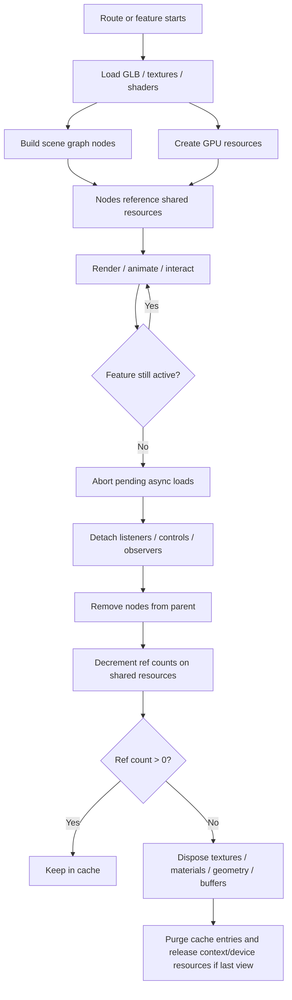
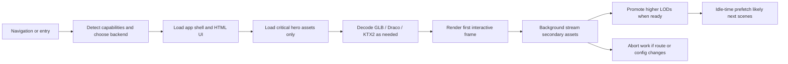

# Production Browser 3D

## Executive summary

For most production web experiences that render real-time 3D in the browser, the strongest default architecture is: use glTF/GLB as the canonical asset format, compress textures with KTX2/Basis where supported, use geometry compression selectively, track resource ownership explicitly, run a hybrid render loop that idles when nothing changes, and treat recovery from context/device loss as a first-class requirement rather than an edge case. Three.js is usually the best fit when you want maximum flexibility and a huge ecosystem without committing to an engine architecture; Babylon.js is the best fit when you want a fuller rendering/game engine with more built-in systems and optimization aids; PlayCanvas is strongest when editor-centric workflows, GLB-first authoring, and team collaboration matter; raw WebGL or WebGPU is justified when you need the highest degree of control and are willing to absorb substantially more engineering complexity. citeturn23search0turn23search1turn23search2turn21search0turn39view0

The most important practical finding is that library choice matters less than scene architecture. In production, performance is usually dominated by draw-call count, shader cost, texture bandwidth, canvas resolution, culling quality, streaming policy, and leak-free teardown. Official guidance across the consulted sources strongly converges on batching draw calls, estimating and enforcing a VRAM cap, using mipmaps in 3D, using compressed textures where feasible, and deleting/destroying resources eagerly instead of waiting for garbage collection. citeturn33view0turn33view1turn33view2turn33view3turn33view4

The relevant standards and best-practice material come primarily from the entity["organization","Khronos Group","standards consortium"] for glTF, KTX, WebGL registries, and related extensions, and from the entity["organization","World Wide Web Consortium","web standards body"] for WCAG accessibility requirements. In the consulted official sources, two things remain materially unspecified: there is no portable universal GPU memory limit for the web, and there is no standardized cross-engine benchmark that allows one absolute performance ranking across Three.js, Babylon.js, PlayCanvas, raw WebGL, and raw WebGPU. Those two areas must be resolved by profiling representative scenes on your actual device matrix. citeturn33view1turn21search0turn20search2turn3view8

**Confidence:** 89/100. The recommendations below are well-supported by official documentation and specifications. The least certain part is any fixed numeric budget beyond conservative mobile-safe baselines, because official sources emphasize device-specific limits and profile-driven tuning rather than universal thresholds. citeturn33view1turn34view3

## Selecting the rendering stack

The table below compares the main options on the dimensions that matter most in production: abstraction level, maturity, ecosystem shape, learning curve, performance posture, and typical use case.

| Stack | What it is | Strengths | Main costs | Typical best fit | Evidence |
|---|---|---|---|---|---|
| Three.js | Lightweight, general-purpose 3D library with WebGL and WebGPU renderers plus explicit addons | Flexible architecture, very large examples/docs/manual surface, easy to start, easy to integrate into custom app architectures | You design more of the engine policy yourself: asset ownership, batching strategy, scene lifecycle, memory discipline, editor/tooling choices | Product viewers, marketing sites, custom visualization tools, apps that need bespoke architecture more than engine conventions | citeturn23search0turn23search8turn23search12turn31search3turn32search1 |
| Babylon.js | Full rendering/game engine in a friendly JS framework | More batteries included, built-in optimization features, scene optimizer, asset containers, KTX2 support, ES6 packages aimed at tree shaking | Larger conceptual/API surface, more engine conventions, potentially heavier than a minimal library setup | Games, digital twins, configurators, XR-heavy apps, teams that want more engine-level systems out of the box | citeturn23search1turn23search5turn40search0turn40search3turn11search3turn11search5 |
| PlayCanvas | Open-source engine with strong editor-first workflow, GLB-first asset pipeline, and WebGL2/WebGPU runtime | Excellent team workflow, strong GLB guidance, runtime/editor integration, good mobile-oriented docs, additive scene loading and asset streaming patterns | Best experience is tied more closely to the PlayCanvas ecosystem and tooling model; engine-only workflows are perfectly possible but are not its only design center | Team-produced interactive experiences, games, visualizations, playable ads, apps with artist/developer collaboration | citeturn23search2turn24search2turn18search0turn34view2turn35search0turn34view4 |
| Raw WebGL | Low-level graphics API for canvas rendering | Broad maturity and compatibility, maximal control over buffers, textures, draw submission, and lifetime management | Highest engineering burden, explicit state management, explicit loss handling, highest risk of subtle bugs and leaks | Specialized renderers, engines, or cases where you need behavior frameworks abstract away | citeturn25search1turn37view0turn20search4turn20search1 |
| Raw WebGPU | Successor API with explicit device/pipeline/resource model and compute capability | Better compatibility with modern GPU architectures, general-purpose GPU compute, cheaper CPU-side rendering for many workloads, more advanced features | Limited availability, secure-context-only, feature/limit negotiation required, explicit lifetime/error/device-loss handling | High-end rendering engines, compute-heavy pipelines, forward-looking architectures with fallback plans | citeturn39view0turn17view0turn23search7turn38search1turn38search2 |

A few analytical conclusions follow from that comparison.

Three.js offers the best “control-to-simplicity” ratio when you do not want a full engine. Its stated aim is to be easy-to-use, lightweight, cross-browser, and general-purpose, which is why it remains the default choice for many non-game web 3D applications. The trade-off is that architecture discipline is your responsibility: there is no built-in policy engine telling you how to partition scenes, evict caches, structure ownership, or phase loading. That is a benefit for custom apps and a cost for teams that want stronger conventions. citeturn23search0turn23search12turn32search1

Babylon.js shifts the balance toward a more opinionated engine. The consulted official sources show explicit support for asset containers, a scene optimizer geared toward target frame rates, instance-based optimization material, KTX2 compressed textures, and ES6 package support intended to reduce bundle size. That makes Babylon.js especially strong when you want more engine-level help around scene management, optimization, and rendering subsystems. citeturn23search1turn40search0turn40search3turn40search5turn11search2turn11search5

PlayCanvas differentiates itself less by raw API shape and more by workflow. Its own documentation recommends GLB as the preferred exchange format, supports additive scene loading, and documents preload-versus-streaming behavior directly. That is an unusually production-oriented posture for teams that ship whole experiences, not just rendering demos. It also makes PlayCanvas especially appealing when artists and developers need a shared pipeline instead of a code-only setup. citeturn18search0turn34view2turn35search0turn34view4turn35search8

Raw WebGL and raw WebGPU should be chosen for reasons of necessity, not fashion. WebGL is mature and widely available, but the official best-practice material exists precisely because the API is easy to misuse. WebGPU is more modern and often more scalable architecturally, but the MDN documentation still marks it as limited availability and non-Baseline, and the spec/explainer makes clear that you must explicitly manage features, limits, device loss, and object destruction. If your product cannot tolerate that engineering cost, use an engine. citeturn25search1turn39view0turn17view0

One thing should be stated plainly: **absolute performance ranking across these choices is unspecified in the consulted official sources**. There is no authoritative same-scene, same-hardware, same-feature-set benchmark in the consulted primary documentation. The robust conclusion is more modest and more useful: raw APIs maximize control; engines reduce development cost; and performance at shipping time is dominated mostly by how well you batch, cull, stream, compress, and clean up resources. citeturn33view1turn33view4turn5view3

## Scene architecture and resource lifecycle

The scene graph should not be your resource manager. In production, it is safer to treat transforms, visibility, and parenting as one system, and GPU-backed assets as another. glTF itself models scenes as node hierarchies that reference meshes, cameras, skins, materials, textures, and buffers by index; that is already an argument for keeping “node hierarchy” conceptually separate from “resource lifetime.” Three.js’s cleanup guidance reaches the same destination from the opposite direction: it recommends explicit tracking of geometries, materials, textures, and loaded hierarchies, then disposing them deliberately when a feature or file unloads. citeturn26search4turn21search0turn4view3turn5view0

A robust production pattern is to create one ownership boundary per independently unloadable feature. In practice that means one tracker/container per route, product configuration, modal scene, or streamed asset group. Three.js explicitly suggests one `ResourceTracker` per loaded file when several files may be loaded and freed independently. Babylon.js exposes `AssetContainer` and scene-moving methods for grouping and removing assets together. PlayCanvas documents complete scene switches and additive loading as separate modes, which maps well to feature-level ownership. citeturn4view3turn13search6turn13search2turn34view4

You should also minimize per-frame CPU churn. PlayCanvas’s optimization guidance explicitly warns that repeated object allocation in update loops increases dynamic allocation cost and triggers garbage collection freezes. The correct interpretation is broader than PlayCanvas alone: animation state, picking results, temp vectors, matrices, and culling work buffers should generally be pooled or reused in any engine. citeturn5view3

Wherever repeated content exists, prefer structural reuse over duplication. MDN’s WebGL guidance recommends batching draw calls and texture atlasing; Babylon’s documentation highlights instances as a major optimization path; and low-end mobile budgets in PlayCanvas are explicitly draw-call sensitive. In production terms, that means: reuse materials; instance identical meshes; batch static scenery; separate “material variants” from geometry duplication; and avoid letting every product option become a new mesh-material pair. citeturn33view4turn11search2turn5view3

The lifecycle below is a good model for how to reason about resource ownership.



This diagram is a synthesis of glTF’s node/resource separation, Three.js resource tracking, Babylon’s asset container model, and the explicit deletion/destruction guidance in WebGL/WebGPU docs. citeturn26search4turn5view0turn13search6turn33view0turn17view0

### Common leak sources

The most common leak class in browser 3D is removing a node from the scene without disposing the resources that node references. Three.js’s cleanup guide is explicit that loaded hierarchies require walking geometry, materials, children, and textures, not just removing the root node. MDN’s WebGL guidance likewise recommends deleting objects eagerly instead of waiting for GC to discover that their JS handles are unreachable. citeturn5view0turn4view5turn33view0

A second common leak source is **shared resources without explicit ownership accounting**. If ten meshes share one material and one atlas texture, disposing those resources when the first mesh goes away causes correctness bugs; never disposing them causes leaks. None of the consulted standards can solve that for you automatically. In production, the right answer is a small reference-count registry keyed by semantic asset identity, not by scene node identity. That is an architectural inference from the official guidance, but it follows directly from how shared materials/textures appear in glTF and how engines expose explicit `dispose()`/`destroy()` calls. citeturn21search0turn32search1turn38search1turn38search2

A third leak source is stale asynchronous work. The Khronos WebGL lost-context guidance calls out outstanding asynchronous image requests explicitly: requests that complete after teardown or after restore can repopulate resources you believed were gone. The same production hazard exists for route changes, tab backgrounding, or product-configuration swaps even when context loss never occurs. Loading work needs an abort/epoch mechanism. citeturn37view0

A fourth, engine-specific issue in Three.js is image-bitmap lifetime. `GLTFLoader` warns that `ImageBitmap`s are not automatically garbage-collected when no longer referenced and need special handling during disposal. If your image source is an `ImageBitmap`, a production-safe release path should `dispose()` the texture and call `close()` on the underlying bitmap where applicable. citeturn32search1turn32search3

### Concrete disposal pattern

The code below shows a practical disposal approach for scene-graph-based engines. It is intentionally conservative: it removes nodes, disposes geometries, traverses materials for textures, closes bitmaps when present, and assumes a separate ref-counting layer for shared resources.

```js
class RefRegistry {
  constructor() {
    this.map = new Map(); // key -> { count, resource }
  }

  retain(key, resource) {
    const row = this.map.get(key);
    if (row) {
      row.count += 1;
      return row.resource;
    }
    this.map.set(key, { count: 1, resource });
    return resource;
  }

  release(key, finalizer) {
    const row = this.map.get(key);
    if (!row) return;
    row.count -= 1;
    if (row.count <= 0) {
      try {
        finalizer?.(row.resource);
      } finally {
        this.map.delete(key);
      }
    }
  }
}

function disposeTexture(tex) {
  if (!tex) return;
  const bitmap = tex.source?.data;
  tex.dispose?.();
  if (bitmap && typeof bitmap.close === "function") {
    bitmap.close();
  }
}

function disposeMaterial(mat) {
  if (!mat) return;

  for (const value of Object.values(mat)) {
    if (value && value.isTexture) disposeTexture(value);
  }

  if (mat.uniforms) {
    for (const entry of Object.values(mat.uniforms)) {
      const v = entry?.value;
      if (v?.isTexture) disposeTexture(v);
      if (Array.isArray(v)) {
        for (const item of v) {
          if (item?.isTexture) disposeTexture(item);
        }
      }
    }
  }

  mat.dispose?.();
}

function disposeSubtree(root) {
  if (!root) return;

  root.traverse?.((obj) => {
    if (obj.geometry) obj.geometry.dispose?.();

    if (obj.material) {
      const materials = Array.isArray(obj.material) ? obj.material : [obj.material];
      for (const mat of materials) disposeMaterial(mat);
    }
  });

  root.removeFromParent?.();
}
```

This pattern is directly aligned with the Three.js cleanup guidance to track children, geometry, material arrays, and textures, plus the GLTFLoader warning about `ImageBitmap` disposal. citeturn5view0turn4view5turn32search1

For lower-level APIs, the lifetime rules are even more explicit.

| Resource class | Safe production release pattern | Evidence |
|---|---|---|
| WebGL buffers/textures/programs/framebuffers/renderbuffers | Call the explicit `delete*` function when you are done, and do not rely on JS GC for timely release | citeturn38search0turn38search3turn38search4turn38search7turn38search16turn33view0 |
| WebGPU `GPUBuffer` / `GPUTexture` / `GPUQuerySet` | Call `.destroy()` as soon as the object is no longer needed; for mapped buffers, `unmap()` before use by GPU and before final teardown when relevant | citeturn38search1turn38search2turn38search8turn38search9turn17view0 |
| Whole WebGPU device | Destroy the device only when the final owning view tears down; destroying the device also destroys device-created resources | citeturn38search12 |
| Babylon asset groups | Use `AssetContainer`-style grouping, remove/move groups together, and enable `useMaterialMeshMap` when disposal speed matters in large scenes | citeturn40search0turn40search1turn40search5 |

## Render loops, performance budgets, and resilience

Render-loop policy is one of the most consequential production decisions because it controls CPU wakeups, battery drain, thermals, and how quickly you can respond to interaction.

| Strategy | Best for | Benefits | Risks | Evidence |
|---|---|---|---|---|
| Continuous loop | Games, physics-heavy scenes, video textures, live simulation, XR | Simplest mental model; always current; ideal when state changes every frame | Wastes CPU/GPU when idle; worse battery and thermal behavior | citeturn40search2turn39view0 |
| On-demand loop | Product viewers, paused editors, static configurators | Excellent idle efficiency; minimal unnecessary work | You must render on every meaningful state change: controls, resize, async load completion, UI changes, animation start/stop | citeturn5view1turn5view2 |
| Hybrid loop | Most production web 3D | Continuous only while animating/interacting/streaming, demand-driven otherwise; best balance for UX and efficiency | Requires explicit invalidation/dirty-state design | citeturn5view1turn35search8turn40search3 |

Three.js’s rendering-on-demand example is the clearest published statement of the on-demand pattern: request a frame only if one is not already pending, and trigger it from camera controls, resize handlers, and UI changes. MDN adds one important low-level rule: if you are not using `requestAnimationFrame`, explicitly `flush()` queued WebGL work. citeturn5view1turn5view2

A production-friendly hybrid loop looks like this:

```js
let rafId = 0;
let scheduled = false;
let animating = false;
let activeInteractions = 0;
let dirty = true;

function needsContinuousFrames() {
  return animating || activeInteractions > 0;
}

function markDirty() {
  dirty = true;
  scheduleFrame();
}

function scheduleFrame() {
  if (!scheduled) {
    scheduled = true;
    rafId = requestAnimationFrame(frame);
  }
}

function frame(time) {
  scheduled = false;

  if (!dirty && !needsContinuousFrames()) return;

  // update animations / controls / streams
  // render(scene, camera)

  dirty = needsContinuousFrames();

  if (dirty) scheduleFrame();
}

// examples of invalidation sources:
window.addEventListener("resize", markDirty);
controls.addEventListener("change", markDirty);

function startAnimation() {
  animating = true;
  markDirty();
}

function stopAnimation() {
  animating = false;
  markDirty(); // render final settled state once
}
```

This is conceptually the same pattern as the Three.js manual’s `requestRenderIfNotRequested` approach, extended to support animation and interaction state. citeturn5view1

### Performance budgets and targets

Official sources are strongest on **conservative, broad-compatibility budgets**, not on large desktop “stretch” targets. The table below separates those two ideas deliberately.

| Budget item | Conservative shipping target | Stretch target for stronger desktops | Notes | Evidence |
|---|---|---|---|---|
| Frame rate | 60 FPS target; degrade gracefully toward 30 FPS under load | 60 FPS sustained, with adaptive quality before frame collapse | 60 FPS implies ~16.7 ms/frame; 30 FPS implies ~33.3 ms/frame. Use adaptive degradation before user-visible instability | citeturn40search3turn25search1 |
| Draw calls | **Low-end mobile:** ~100–200 draw calls | **Desktop heuristic:** 300–1000 may be feasible, but this is profile-driven rather than standardized | The sourced official number is explicitly a rough target for low-end mobile. There is no portable official desktop number in the consulted sources; keep desktop targets profile-driven | citeturn5view3turn33view4 |
| Triangle count | **Broad-compat baseline:** ≤100,000 triangles | Higher is possible on desktops, but exact portable desktop limits are unspecified | The sourced 100k figure comes from conservative asset-creation guidance used by the default glTF Asset Auditor profile; treat larger targets as scene- and hardware-specific | citeturn29search6turn29search7 |
| Texture size | Default to 1K–2K for most maps; 2K normal maps are reasonable; use 4K only for hero assets | 4K only after verifying device caps, memory, and visual need | One official source recommends 1K/2K maps and 2K normals; another notes 4096 is widely supported while 2048 is the safest universal choice | citeturn29search6turn34view3turn34view1 |
| Texture memory | No universal MB limit; use an app-level cap based on a **per-pixel VRAM budget** | Increase caps only from device-lab measurements | Official guidance explicitly recommends a per-pixel VRAM budget because portable max-VRAM queries do not exist | citeturn33view1 |
| Canvas resolution | Prefer dynamic back-buffer scaling over unconditional full DPR | Full DPR only when profiling proves it is affordable | Reducing the back buffer is an officially recommended quality-for-speed tradeoff | citeturn33view4 |

The most rigorous interpretation of the official material is this: **treat mobile as the hard constraint and desktop as a profiling opportunity, not a license to ignore discipline**. If you can stay inside low-end mobile draw-call discipline, 1K/2K texture discipline, and explicit VRAM caps, you usually gain desktop robustness “for free.” citeturn5view3turn29search6turn33view1

### WebGL context loss handling and recovery

Context loss is not theoretical. The Khronos guidance explicitly notes that GPU resets, too many resources across pages, graphics-card switching, and driver updates can all trigger it. By default, once a WebGL program loses context, it does not recover unless you handle the events correctly. The recovery contract is straightforward but strict: prevent the default on `webglcontextlost`, stop the render loop, ignore stale async work, and on `webglcontextrestored` recreate **all** resources and reset **all** GL state because the browser has reset state to defaults and all previously allocated resources are invalid. citeturn37view0turn20search4turn20search1

```js
let gl;
let rafId = 0;
let generation = 0;
const pendingLoads = new Set();

function createGL() {
  gl = canvas.getContext("webgl2") || canvas.getContext("webgl");
  if (!gl) throw new Error("WebGL unavailable");
}

function startLoop() {
  const tick = () => {
    rafId = requestAnimationFrame(tick);
    drawFrame();
  };
  rafId = requestAnimationFrame(tick);
}

function handleLost(event) {
  event.preventDefault();
  generation += 1;
  cancelAnimationFrame(rafId);

  for (const ctrl of pendingLoads) ctrl.abort();
  pendingLoads.clear();

  detachInputHandlers();
  detachObservers();
}

async function handleRestored() {
  createGL();
  rebuildProgramsBuffersTextures(); // recreate ALL GPU resources
  restoreGLStateDefaults();         // blend/depth/clear color/etc
  await reloadVisibleAssets();
  attachInputHandlers();
  startLoop();
}

canvas.addEventListener("webglcontextlost", handleLost, false);
canvas.addEventListener("webglcontextrestored", handleRestored, false);
```

Two extra rules from the Khronos guidance are easy to miss and matter a lot in production. First, code that checks shader/program compile status should ignore those failures when `isContextLost()` is true. Second, stale closures and event listeners can keep referencing old uniform/program objects after restore, so any handlers that capture GPU-resource handles should be recreated on restore. citeturn37view0turn38search20

You should also test the recovery path deliberately. The `WEBGL_lose_context` extension exists specifically so you can simulate loss and restore in development. Three.js additionally exposes renderer helpers to force context loss or restore for testing and teardown scenarios. citeturn20search18turn20search11turn20search12turn41search0turn41search3

For WebGPU, the analogous primitive is not a canvas event but `device.lost`. The official explainer recommends attaching a loss handler, and the model is even more explicit than WebGL: the device is the root owner of resources it creates, and device loss means you must renegotiate features/limits and recreate the device-backed object graph. citeturn17view0turn39view0

## Asset pipeline and loading

glTF/GLB should be the default interchange and delivery format unless you have a very specific reason otherwise. The glTF 2.0 specification defines a JSON scene description plus binary resources for geometry, animation, and images, and explicitly aims for compact size, fast loading, and runtime independence. PlayCanvas directly recommends GLB whenever possible, and Three.js’s `GLTFLoader` supports a wide range of current glTF extensions including `KHR_draco_mesh_compression` and `KHR_texture_basisu`. citeturn21search0turn34view2turn32search1

Geometry compression should be used selectively. `DRACOLoader` documentation says Draco-compressed geometry can be significantly smaller, but with additional decoding time on the client. The glTF Draco extension documentation emphasizes streaming compressed geometry rather than shipping raw data. The correct production policy is therefore not “compress everything,” but “compress the geometry where transfer savings matter enough to justify decode time and decoder delivery.” citeturn15search1turn22search0

Texture compression is even more important than geometry compression for most web scenes because textures dominate both download weight and GPU memory. The `KHR_texture_basisu` extension adds KTX v2 images with Basis Universal supercompression to glTF to improve transmission efficiency and reduce GPU memory footprint, while KTX 2.0 itself is a general texture container for GPU APIs including WebGL. Three.js’s `KTX2Loader` is built around this model and explicitly notes the required WASM transcoder. PlayCanvas’s texture-compression documentation goes further and shows why this matters in practice: GPU memory, mobile bandwidth, and even browser-tab stability are directly affected by texture format choice. citeturn22search1turn20search2turn15search0turn34view0turn3view7

Mipmaps are not optional for 3D textures unless you know the texture will never be minified. MDN’s official guidance is explicit: use mipmaps for any texture you will see in 3D, because sampling smaller mip levels improves cache locality and performance, and the memory overhead is usually only about 30%. Put differently: if you skip mipmaps on world textures, you often pay the cost later in shimmering, cache miss rates, and fragment throughput. citeturn33view2turn21search3

Streaming policy should be phased, not monolithic. PlayCanvas’s asset documentation is unusually clear here: preload only what you need immediately, let referenced and dependent assets load when needed, and use staged loading so the user gets something interactive before the full experience is resident. Their load-time guidance even suggests a three-phase structure in which the preloader gets the initial shell live, a title/customization phase appears next, and the heavy main content loads in the background. That same pattern generalizes well to any engine. citeturn35search0turn35search8turn34view1

Specific LOD thresholds are **unspecified** in the consulted standards, but the production need is not. If a mesh or texture occupies little screen space, swap to a lower cost representation. Use mesh LODs, material simplification, or texture-size reduction based on projected screen coverage and measured perceptual impact. This is particularly important because the official sources consistently push you toward draw-call reduction, texture discipline, and VRAM budgets rather than toward “max everything and hope.” citeturn33view1turn33view4turn34view1

The following loading flow is a good shipping template.



That timeline is grounded in the phased asset-loading rules in PlayCanvas docs, the decoder/transcoder setup in Three.js loaders, and the glTF/KTX focus on runtime-efficient delivery. citeturn35search0turn35search8turn15search0turn15search1turn21search0

### Lazy-loading critical decoder/transcoder code

A production rule that saves both bundle size and startup time is simple: **do not ship Draco/KTX2/WASM code on pages that do not need those assets**.

```js
async function loadHeroModel(url, renderer, signal) {
  const [{ GLTFLoader }, { DRACOLoader }, { KTX2Loader }] = await Promise.all([
    import("three/addons/loaders/GLTFLoader.js"),
    import("three/addons/loaders/DRACOLoader.js"),
    import("three/addons/loaders/KTX2Loader.js"),
  ]);

  if (signal?.aborted) throw new DOMException("Aborted", "AbortError");

  const draco = new DRACOLoader();
  draco.setDecoderPath("/wasm/draco/");

  const ktx2 = new KTX2Loader();
  ktx2.setTranscoderPath("/wasm/basis/");
  ktx2.detectSupport(renderer);

  const loader = new GLTFLoader();
  loader.setDRACOLoader(draco);
  loader.setKTX2Loader(ktx2);

  const gltf = await loader.loadAsync(url);

  if (signal?.aborted) {
    // caller is responsible for subtree disposal if added to scene
    throw new DOMException("Aborted", "AbortError");
  }

  return {
    scene: gltf.scene,
    disposeLoaders() {
      draco.dispose?.();
      ktx2.dispose?.();
    }
  };
}
```

This snippet follows the official loader model: `GLTFLoader.loadAsync()`, optional Draco decoding, KTX2 transcoding, and WASM-based decoder/transcoder dependencies. citeturn16search1turn15search0turn15search1turn32search1

## Accessibility and delivery footprint

Accessibility for 3D web content should be approached with one central principle: **the 3D canvas is rarely the semantic interface**. The practical task interface should usually live in HTML, with the canvas acting as the visual viewport. WCAG 2.2 is technology-agnostic, so it applies to 3D experiences the same way it applies elsewhere on the web: every meaningful task still needs programmatic labels, keyboard operability, focus visibility, sufficient target size, and motion controls where needed. citeturn3view8turn7view0turn10view0turn10view2

The most relevant WCAG requirements for 3D experiences are the following:

| Accessibility concern | Practical implication for 3D experiences | Evidence |
|---|---|---|
| Non-text alternatives | Provide a textual summary of what the 3D scene conveys or what the task is; hotspots and important states need text, not just visuals | citeturn6view0 |
| Keyboard access and no keyboard trap | Camera controls, object selection, mode switches, and dialogs must be operable by keyboard, and focus must be escapable | citeturn7view0 |
| Motion and moving content | Auto-rotating models, continuously moving viewports, or animated UI affordances need pause/stop/hide controls; interaction-triggered motion should be disableable when practical | citeturn7view2turn7view1 |
| Focus visibility | If you overlay HTML controls on top of the 3D canvas, they need visible, unobscured focus indicators with sufficient contrast | citeturn10view0 |
| Pointer gesture alternatives | Drag-only orbit, pinch-only zoom, or path-based gestures need single-pointer or keyboard alternatives where the gesture is not essential | citeturn10view1turn10view2 |
| Touch target sizing | UI targets associated with the 3D scene should generally meet the 24×24 CSS pixel minimum | citeturn10view2 |

One uncertainty should be called out explicitly: **WCAG does not provide a fully specific semantic model for arbitrary 3D scene internals**. That detail is effectively unspecified. The practical answer in production is to expose the user task layer in semantic HTML: labeled buttons, forms, lists, dialogs, captions, and descriptive text surrounding the canvas. The 3D scene should enrich that layer, not replace it. citeturn3view8turn6view0turn7view0

### Bundle-size strategy

Good browser 3D delivery is as much about code weight as asset weight.

Three.js supports explicit addon imports, which is exactly what you want for tree-shaking and route-level code splitting: import core only where possible, and load controls, post-processing passes, loaders, and helper libraries only on the routes that need them. Babylon.js documents ES6 package support specifically for tree shaking. PlayCanvas supports ESM builds, import maps, and CDN-hosted builds, and its production guidance recommends pinning versions rather than using floating `@latest` imports. citeturn31search3turn31search12turn11search5turn31search5turn31search8

A strong production bundle policy looks like this:

- Put the rendering shell in the initial chunk, but split out heavy optional modules such as loaders, post-processing, XR support, physics, and editor/debug tooling into route- or intent-level dynamic imports. citeturn31search3turn31search12turn11search5
- Lazy-load WASM decoders and transcoders such as Draco and Basis/KTX2 only when the asset manifest proves they are needed. Both Three.js loader docs make clear that these paths are separate dependencies, which is a natural split point. citeturn15search0turn15search1
- Do not preload assets that are not needed immediately. PlayCanvas’s docs say this directly for runtime asset policy, and the same applies broadly to large model/texture bundles. citeturn34view1turn35search0
- If you use CDN delivery for engine builds or external modules, pin exact versions in production instead of floating newest tags. PlayCanvas explicitly recommends this for CDN/import-map workflows. citeturn31search5turn31search8
- Use import maps only when they simplify module resolution meaningfully; do not let them become a reason to ship giant monolithic dependencies. PlayCanvas import-map guidance is useful here: external modules must be ESM-compatible and CORS-accessible, and only one import map can be active. citeturn19search6turn31search2

## Shipping checklist

Before shipping a production browser-3D experience, this is the checklist that most directly follows from the official guidance and the analysis above.

- Choose the stack intentionally. Use Three.js for flexibility, Babylon.js for fuller engine support, PlayCanvas for workflow-centric production, and raw WebGL/WebGPU only when the extra control is genuinely required. Treat absolute performance ranking as unspecified until you profile your own workloads. citeturn23search0turn23search1turn23search2turn39view0
- Define budgets before content production begins: target 60 FPS, keep low-end mobile around 100–200 draw calls, start from conservative triangle and texture-size baselines, and enforce a per-pixel VRAM budget rather than an arbitrary universal memory number. citeturn5view3turn29search6turn34view3turn33view1
- Use GLB/glTF as the default content format; compress textures with KTX2/Basis where possible; use Draco selectively where transfer savings justify decode cost; generate mipmaps for 3D textures. citeturn21search0turn22search1turn15search0turn15search1turn33view2
- Partition scene ownership by feature or route. Keep one unload boundary per asset group, and never treat “removed from scene” as equivalent to “freed from GPU.” citeturn4view3turn13search6turn34view4
- Implement explicit disposal for geometry, materials, textures, framebuffers, buffers, and bitmaps. For shared assets, dispose only at ref-count zero. citeturn5view0turn32search1turn38search0turn38search3turn38search1turn38search2
- Prefer a hybrid render loop. Render continuously only while animating, streaming, or interacting; otherwise render on demand from invalidation events. If you render outside RAF in raw WebGL, flush. citeturn5view1turn5view2
- Add adaptive degradation hooks: lower back-buffer resolution first, then selectively reduce effects or LOD, rather than letting frame time collapse unpredictably. citeturn33view4turn40search3
- Handle WebGL context loss and WebGPU device loss explicitly, including stale async work, stale closures, and full resource/state rebuild on restore. Test the path with the loss simulator or engine test hooks. citeturn37view0turn20search18turn41search0turn17view0
- Put semantics in HTML, not in wishful thinking about a canvas. Ensure keyboard navigation, visible focus, motion controls, pointer alternatives, and target sizes meet WCAG expectations. citeturn6view0turn7view0turn7view2turn10view0turn10view2
- Keep the initial bundle lean. Tree-shake engine code, dynamically import heavy addons, and lazy-load WASM decoders/transcoders and noncritical assets. Pin CDN versions in production. citeturn11search5turn31search3turn31search5turn31search8turn15search0turn15search1

The shortest rigorous recommendation, if you need one, is this: **ship with conservative mobile-safe budgets, explicit ownership and disposal, phased asset loading, a hybrid render loop, compressed textures, and a tested loss-recovery path.** Everything else is secondary. citeturn5view3turn33view1turn35search8turn37view0