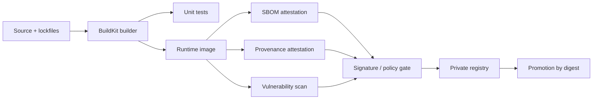

# Production Docker Image Best Practices for Production Services

Platform, language, orchestrator, CI provider, and registry are unspecified. The report therefore favors portable defaults, calls out where the answer changes by environment, and treats Linux-specific hardening separately from Windows-specific behavior.

## Executive Summary

For most production services, the strongest default is: build with BuildKit and multi-stage Dockerfiles, keep the build context small, order instructions from stable inputs to volatile source code, ship a minimal runtime image, pin externally sourced inputs by digest or lockfile, emit SBOM and provenance attestations at build time, sign the pushed image digest, and deploy from a private registry with immutable release tags. That combination improves build speed, reduces image size and attack surface, and gives you an auditable trail from source revision to running workload. citeturn7view0turn7view1turn7view2turn30view0turn18view0turn14view6turn14view7turn17view2turn17view3

The main strategic trade-off is **reproducibility versus automatic freshness**. Pinning digests and using deterministic build settings makes outputs repeatable and auditable, but it also opts you out of silently receiving upstream fixes. The best operating model is not “always float” or “always pin forever”; it is **pin for production, then automate refresh** on a defined cadence with rebuilds that intentionally pull newer trusted bases and re-run policy gates. citeturn15view2turn29view4turn29view5turn14view8turn15view0turn15view1

The second major trade-off is **minimalism versus operability**. Distroless and hardened minimal images materially reduce attack surface, but they also remove many interactive debugging conveniences. The right answer is usually to keep production images lean and maintain a separate debug target or debug image path for diagnosis rather than shipping shells, compilers, and package managers in the production artifact itself. citeturn13view3turn23view3turn23view4turn13view2turn33view1

A concise default blueprint for an unspecified environment is:

- **Image construction:** BuildKit, multi-stage, `.dockerignore`, cache mounts, stable-to-volatile layer ordering, and explicit runtime-only final stages. citeturn7view0turn7view1turn30view0turn14view1
- **Base image:** start with an official slim/minimal base or a supported vendor-minimal image; move to distroless or hardened curated images once you have a debugging plan; use `scratch` only for truly static binaries. citeturn13view0turn13view1turn13view3turn24search0turn33view1
- **Supply chain:** attach SBOM and provenance, use OCI referrers, sign with entity["organization","Sigstore","software signing project"]/cosign or an equivalent modern signer, and verify before deploy. citeturn14view6turn14view7turn17view2turn17view3turn17view4turn17view6
- **Runtime posture:** non-root, `allowPrivilegeEscalation: false`, drop capabilities, seccomp/AppArmor defaults, resource requests/limits, probes, read-only root filesystem where workable, and secret mounts instead of baking secrets into images. citeturn32view3turn32view4turn25view0turn25view1turn31search0turn7view8turn8search4turn15view4
- **Registry policy:** immutable release tags, digest-based deploys, retention plus garbage collection, least-privilege access, scan-on-push or continuous scanning, and replication for production tiers. citeturn13view4turn13view5turn13view6turn13view7turn13view8turn26search0turn28search1turn35view2

## Image Construction

The construction phase should optimize for three things simultaneously: **small final artifacts, fast rebuilds, and deterministic provenance**. The official guidance from entity["company","Docker","container platform company"] is to use multi-stage builds, keep the build context small, leverage cache effectively, and order Dockerfile instructions so that less-frequently changed inputs appear earlier and more volatile inputs later. BuildKit reinforces this by skipping unused stages, parallelizing independent stages, and incrementally transferring only changed files in the build context. citeturn7view0turn7view1turn7view2turn30view0

A production image should contain **only what is needed to run**. That usually means separate build, test, and runtime stages; no editors or compilers in the runtime image; one clear concern per container; and an image layout that assumes the runtime container is ephemeral and replaceable. This is also the right mental model for filesystem layout: copy only runtime artifacts into the final stage, assume writes may need to go to mounted storage or ephemeral writable directories, and avoid embedding mutable operational state in the image. citeturn29view0turn29view1turn29view2

Reproducibility requires more than pinning application dependencies. Base-image tags are mutable, so same-tag rebuilds are not guaranteed to produce the same artifact unless you pin digests. BuildKit also supports deterministic timestamp handling through `SOURCE_DATE_EPOCH` and exporter timestamp rewriting, and its provenance model can record whether the build is intended to be byte-for-byte reproducible. The trade-off is explicit: digest pinning and fixed timestamps improve reproducibility and auditability, but they must be paired with a deliberate update program so that “reproducible” does not become “stale.” citeturn29view5turn15view2turn14view8turn15view0turn15view1turn14view7

Traceability is worth treating as a first-class construction output. The entity["organization","Open Container Initiative","container standards body"] annotation namespace reserves metadata keys such as `org.opencontainers.image.revision`, and Buildx can attach OCI annotations directly at build time with `--annotation`. In practice, every production image should carry enough metadata to answer: *what source revision built this, when, from what inputs, using what builder*. citeturn22search0turn34view0turn14view7

```dockerfile
# syntax=docker/dockerfile:1.10
ARG BUILDER_BASE=<builder-base>
ARG RUNTIME_BASE=<runtime-base>

FROM ${BUILDER_BASE} AS deps
WORKDIR /src

# Copy only dependency manifests first, so this layer stays cacheable
COPY <dependency-manifests> ./

RUN --mount=type=cache,target=<package-manager-cache-dir> \
    <install-dependencies>

FROM deps AS build
COPY . .

RUN --mount=type=cache,target=<build-cache-dir> \
    <run-tests> && <build-artifacts-into-/out>

FROM ${RUNTIME_BASE} AS runtime
WORKDIR /app

COPY --from=build /out/ /app/

USER 65532:65532
EXPOSE 8080
HEALTHCHECK CMD ["/app/healthcheck"]
ENTRYPOINT ["/app/service"]
```

This skeleton captures the durable pattern: dependency manifests before application source, cache mounts for package managers and compilers, a strict artifact handoff from build stage to runtime stage, a non-root runtime user, and exec-form process instructions. Replace the placeholders with language-specific commands and paths; the pattern itself is portable even when the build system is not. citeturn14view1turn14view5turn29view5turn13view3

## Base Image Selection

Base-image choice is not just a size decision. It drives compatibility, update cadence, debugging ergonomics, CVE surface area, provenance, and how easily you can verify upstream trust. The most useful lens is not “smallest wins,” but **smallest image that still satisfies compatibility, support, and operational needs**. Docker’s own guidance favors minimal bases that meet requirements, official or otherwise trusted publishers, and separate build/runtime bases; Docker Official Images are reviewed and maintained collaboratively, while Docker has also formally advised users to move from retiring Docker Content Trust toward modern signing systems such as Sigstore or Notation. citeturn13view0turn29view5turn18view9

| Base-image option | Advantages | Main liabilities | Best fit | Primary references |
|---|---|---|---|---|
| Official full distro base | Best compatibility, broad package ecosystem, easiest debugging and troubleshooting | Larger size, more packages, broader CVE surface | Complex native dependencies, migration periods, operationally heavy services | citeturn13view0turn29view5 |
| Official slim/minimal distro base | Good default balance of compatibility, maintainability, and smaller footprint | Still includes shell/package manager and more userland than distroless | General-purpose services where operability matters | citeturn29view5turn13view1 |
| Distroless runtime | Contains only app plus runtime dependencies; no shell or package manager; published `nonroot` and `debug` variants; keyless-signed | Harder interactive debugging; shell-form entrypoints break | Mature services with good observability and controlled debug workflow | citeturn13view3turn23view3turn23view4turn33view0 |
| `scratch` | Absolute minimum filesystem start point; strongest size minimization for static binaries | Only suitable when you provide every needed file yourself; not pullable/runnable as a normal base | Truly static binaries with very tight control over runtime contents | citeturn24search0turn24search3 |
| Curated minimal/hardened vendor images | Small footprint plus explicit supply-chain or enterprise support features; some vendors publish dev/runtime variants | Vendor coupling and policy differences; feature sets vary | Regulated or security-sensitive estates that want stronger provenance and support guarantees | citeturn13view2turn33view1turn10search18 |

The most common source of unexpected pain in “minimal image” migrations is the libc boundary. Guidance from entity["company","Chainguard","container security company"] is useful here: glibc- and musl-based environments differ in compatibility, Python packaging behavior, and some native-library expectations. A smaller image can still be the wrong image if it changes ABI assumptions or forces expensive source builds for common dependencies. For unspecified polyglot services, a glibc-based slim or vendor-minimal base is usually the safer default unless you have explicitly tested musl behavior end to end. citeturn33view2

A practical selection ladder for unspecified environments is: **official slim/minimal first**, then **distroless or curated hardened minimal** when the service is stable and your team has observability plus a debug path, and **scratch** only for static binaries that truly need it. That sequence gives a much better balance than jumping directly to the smallest possible base for every service. citeturn29view5turn13view3turn24search0turn33view1

## Build Performance and CI/CD

Build performance in production pipelines is mostly a function of **cache design**, not raw CPU. BuildKit’s major advantages are precisely the ones that matter in CI: it can skip unused stages, parallelize stages that do not depend on one another, and transfer only changed files in the build context. Build cache performance further improves when the build context is small, when dependency installation happens before source-copy steps that change frequently, and when package-manager/compiler caches are mounted explicitly. citeturn7view2turn7view1turn30view0

In CI/CD, external cache storage is usually essential because runners are often ephemeral. BuildKit can export cache to inline, local, registry, or GitHub Actions backends, and Docker’s docs call external cache “almost essential” for CI/CD environments with little persistence between runs. For large monorepos or target graphs, Bake gives you a declarative way to coordinate builds, tests, and artifacts instead of maintaining hand-written shell orchestration. citeturn18view0turn18view2

Multi-platform builds deserve a special performance note. A single invocation can produce an OCI manifest list for multiple architecture/OS combinations, but the build strategy matters: QEMU emulation is the easiest to set up, while native multi-node builders or cross-compilation are generally preferable for heavy compile or compression workloads because emulation is materially slower. citeturn18view3turn24search5

A secure high-throughput build flow typically looks like this: build once with BuildKit, attach provenance and SBOM at build time, push the image and its OCI-attached metadata to the registry, then scan and sign the pushed digest before promotion. OCI 1.1 referrers and modern signing ecosystems were designed to support exactly that workflow. citeturn14view6turn14view7turn17view2turn17view3



A concrete GitHub Actions pattern for secure production builds is shown below. It assumes your runner installs or already contains `trivy` and `cosign`, and it promotes by **digest**, not by floating tag. The important parts are BuildKit cache export/import, `--sbom`, `--provenance`, and verification against the pushed digest. citeturn18view1turn17view7turn17view6turn17view4

```yaml
name: build-sign-scan

on:
  push:
    branches: [main]

permissions:
  contents: read
  packages: write
  id-token: write

jobs:
  image:
    runs-on: ubuntu-latest
    env:
      IMAGE: ghcr.io/acme/service
    steps:
      - uses: actions/checkout@v5

      - uses: docker/setup-buildx-action@v3

      - name: Log in to registry
        run: |
          echo "${{ secrets.REGISTRY_PASSWORD }}" | \
            docker login ghcr.io -u "${{ github.actor }}" --password-stdin

      - name: Build and push
        id: build
        run: |
          docker buildx build \
            --platform linux/amd64,linux/arm64 \
            --pull \
            --push \
            --cache-from type=registry,ref=${IMAGE}:buildcache \
            --cache-to type=registry,ref=${IMAGE}:buildcache,mode=max \
            --provenance=mode=max,version=v1 \
            --sbom=true \
            -t ${IMAGE}:${GITHUB_SHA} \
            -t ${IMAGE}:main \
            .

          DIGEST=$(docker buildx imagetools inspect ${IMAGE}:${GITHUB_SHA} \
            --format '{{json .Manifest.Digest}}' | tr -d '"')
          echo "digest=${DIGEST}" >> "$GITHUB_OUTPUT"

      - name: Vulnerability gate
        run: |
          trivy image \
            --ignore-unfixed \
            --severity HIGH,CRITICAL \
            --exit-code 1 \
            ${IMAGE}@${{ steps.build.outputs.digest }}

      - name: Sign pushed digest
        run: |
          cosign sign --yes ${IMAGE}@${{ steps.build.outputs.digest }}

      - name: Verify signature
        run: |
          cosign verify \
            --certificate-oidc-issuer https://token.actions.githubusercontent.com \
            ${IMAGE}@${{ steps.build.outputs.digest }}
```

A comparable GitLab pipeline uses the same core model even if the registry or auth variables differ. GitLab’s registry docs explicitly support CI authentication flows, token scopes such as `read_registry`/`write_registry`, and cleanup/retention policies at the registry layer. citeturn35view0turn35view1turn35view2

```yaml
stages:
  - build
  - scan
  - sign

variables:
  DOCKER_BUILDKIT: "1"
  IMAGE: "${CI_REGISTRY_IMAGE}/service"

build:
  stage: build
  image: docker:27
  services:
    - docker:27-dind
  script:
    - echo "$CI_REGISTRY_PASSWORD" | docker login "$CI_REGISTRY" -u "$CI_REGISTRY_USER" --password-stdin
    - docker buildx create --use
    - >
      docker buildx build
      --pull
      --push
      --platform linux/amd64,linux/arm64
      --cache-from type=registry,ref=${IMAGE}:buildcache
      --cache-to type=registry,ref=${IMAGE}:buildcache,mode=max
      --provenance=mode=max,version=v1
      --sbom=true
      -t ${IMAGE}:${CI_COMMIT_SHA}
      -t ${IMAGE}:main
      .
```

## Supply-Chain Security and Provenance

Modern image supply-chain practice is built around **OCI-native attached metadata**. OCI 1.1 added a `subject` relationship in image manifests and the registry referrers API so that signatures, SBOMs, provenance, and other metadata can be attached to an image digest without changing the image itself. Sigstore’s registry support documentation states directly that cosign signatures are stored using the OCI 1.1 referrer specification. That is the right storage model because it makes metadata portable with the registry artifact rather than leaving it trapped inside a CI database. citeturn17view2turn17view3

Build-time provenance should be created by the builder, not reconstructed later if you can avoid it. Docker’s build attestation docs state that BuildKit generates provenance attestations by default in `mode=min`, wraps attestations in in-toto JSON, and can also emit SBOM attestations with `--sbom`. The richer `mode=max` provenance includes build parameters and environment details, while the default minimal mode is designed to avoid leaking sensitive build-environment information. SLSA’s build requirements then provide the larger operating model: choose a build platform capable of the desired level, follow a consistent build process, and distribute provenance to consumers. citeturn14view6turn14view7turn7view6turn15view6

Signing should be tied to **identity plus transparency**, not just possession of a long-lived key. Sigstore’s model is explicit: a cosign client can sign with ephemeral keys via OIDC-backed identity, bind that identity into a certificate, and record signing events in Rekor’s append-only transparency log. Verification then checks the artifact signature, expected identity, chain of trust, and transparency-log inclusion. This is substantially stronger operationally than “we have some signing keys somewhere,” and it fits modern CI very well because the CI workflow identity itself becomes part of the trust story. citeturn17view5turn17view6turn17view4

Scanning should be treated as a **policy input**, not as self-executing truth. Docker Scout can analyze newly pushed images, extract SBOM and image metadata, and continuously re-evaluate those snapshots as advisory data changes; Amazon ECR supports enhanced scanning and continuous scan rules; Harbor can scan with Trivy and schedule scans. At the same time, Docker’s own docs note that vulnerability findings often require contextual exceptions, and Trivy documents caveats when scanning externally generated SBOMs. The right pattern is therefore: scan early, scan on push, re-scan or continuously evaluate when advisories change, and maintain an explicit exception/VEX process for accepted risk or false positives. citeturn15view7turn13view6turn27search2turn27search7turn4search11turn18view6

Tools are easiest to choose when you separate **generation**, **scanning**, and **signing/verification**:

| Tool | Primary role | Best use in a production pipeline | Main caveat | Primary references |
|---|---|---|---|---|
| Docker Scout | Registry/local image analysis, policy evaluation, base freshness checks | Continuous image analysis, policy reporting, Docker-centric workflows | Tighter coupling to the Docker ecosystem and platform services | citeturn15view7turn15view6 |
| Syft | SBOM generation | Generate SBOMs from images/filesystems as build output | SBOM generator, not a full vulnerability decision engine by itself | citeturn18view4 |
| Grype | Vulnerability scanning for images/filesystems/SBOMs | CI gating and recurring vulnerability evaluation | Quality depends on the underlying advisory data and matching | citeturn18view5 |
| Trivy | Broad scanner for images, SBOMs, configs, and Kubernetes | Good one-tool breadth across image and cloud-native checks | External SBOM scans may be less accurate than Trivy-native SBOMs in some cases | citeturn15view8turn18view6 |
| Cosign | Signing and verifying images and attestations | Sign pushed digests; verify identity, signatures, and attestations before deploy | Requires disciplined identity policy and registry support planning | citeturn17view5turn17view6turn17view4turn16search10 |

Two final supply-chain recommendations are load-bearing. First, **pin dependencies and base images wherever the package ecosystem allows it**, because provenance without stable inputs is only partially useful. Second, prefer registries and tools that speak OCI natively so signatures, SBOMs, and attestations remain attached to the same distribution path as the image itself. citeturn15view2turn17view2turn17view3

## Runtime Posture and Development Parity

For Linux containers, the baseline runtime posture should be close to the restricted side of the Kubernetes Pod Security Standards even if you are not running on Kubernetes: run as non-root, do not set UID 0, set `allowPrivilegeEscalation: false`, drop all capabilities and add back only the smallest required set, use the runtime default seccomp profile, and prefer the runtime default AppArmor profile or an approved localhost profile. Kubernetes documents these controls individually and also codifies them in its restricted policy set, which is a useful cross-platform benchmark for container runtime hardening. citeturn32view3turn32view4turn25view0turn25view1turn25view2

Read-only root filesystems are an excellent hardening move when the application supports them, but they are operationally meaningful, not cosmetic. If a service writes PIDs, temp files, or logs under the container root, you must redirect those paths to writable mounts or application-owned writable directories. Also note that some controls are platform-specific: Kubernetes documents that POSIX capabilities and read-only root filesystem semantics differ on Windows, so Linux-oriented hardening guidance should be applied as Linux-specific unless the platform is explicitly Windows-aware. citeturn31search0turn31search10

Resource policy and health signaling belong in the runtime contract, not just the image. Kubernetes supports container CPU, memory, and ephemeral-storage requests/limits, and it distinguishes liveness, readiness, and startup probes so that the orchestrator can restart a deadlocked process, delay traffic until warm-up completes, or keep an otherwise healthy process out of rotation until dependencies are ready. Docker’s `HEALTHCHECK` is still useful, but there can only be one per image and its semantics are not equivalent to orchestrator-native readiness or startup behavior. citeturn7view8turn8search4turn14view5

Secrets handling should be split into **build-time** and **runtime** concerns. For builds, Docker explicitly warns that build arguments and environment variables are inappropriate for secrets because they are exposed in the final image; instead, use BuildKit secret or SSH mounts. For runtime, distinguish non-secret config from secrets: environment variables remain an excellent cross-platform mechanism for ordinary deploy-time config, but secret material should usually come from a dedicated secret store or mounted secret files with least-privilege access and encryption at rest where the platform supports it. Kubernetes documents that Secrets are stored unencrypted in etcd by default unless encryption at rest is configured. citeturn15view4turn14view0turn14view1turn14view3turn17view9turn25view5turn25view6

Development parity is best understood as **behavioral parity, not identical tooling**. The Twelve-Factor config guidance remains sound: keep deploy-specific configuration outside code, usually via environment variables. Docker Compose is a strong default for development, CI, staging, and single-host production cases because the same service topology definition can be reused across environments, with environment-variable precedence and environment-specific files kept explicit. When your production behavior depends heavily on Kubernetes-native semantics such as admission policy, init containers, probes, or service-account/RBAC behavior, a local Kubernetes cluster with a tool such as kind or minikube is the better parity mechanism than trying to simulate those semantics with Compose. citeturn14view2turn14view3turn14view4turn20view2turn20view3

Fast inner-loop rebuilds are a separate optimization problem. For local Kubernetes development, tools such as Skaffold and Tilt exist precisely to shorten the edit-build-deploy loop through local-build modes, parallelism, build-avoidance/import behavior, and live-update workflows that avoid full rebuilds for every code change. Those tools are not mandatory, but they are often the cleanest answer once a team outgrows manual `docker build && kubectl apply`. citeturn21search1turn20view0turn20view1

```dockerfile
# Production runtime image
FROM gcr.io/distroless/base-debian13:nonroot AS runtime
COPY --from=build /out/service /app/service
USER nonroot:nonroot
ENTRYPOINT ["/app/service"]

# Debug target for break-glass troubleshooting, not normal production deploys
FROM gcr.io/distroless/base-debian13:debug-nonroot AS debug
COPY --from=build /out/service /app/service
USER nonroot:nonroot
ENTRYPOINT ["/app/service"]
```

This is a good pattern for services that want a lean distroless runtime without losing all debugging capability. Distroless publishes `debug` and `debug-nonroot` variants, and because distroless images do not contain a shell by default, entrypoints should stay in exec/vector form. citeturn23view3turn23view4

A hardened deployment flow should verify the pushed digest before runtime admission or promotion, then start the container under least privilege with probes, limits, and secret injection applied by the platform. citeturn17view4turn32view3turn7view8turn8search4


## Registry Hygiene and Production Readiness

Treat the registry as a **release control plane**, not passive blob storage. Docker documents that tags are mutable, and Amazon ECR documents the concrete difference between mutable and immutable tag modes. For production, the safest default is: immutable release tags, digest-based deployments, and only a very small set of intentionally mutable “channel” tags such as `main`, `latest`, or `canary` if your workflow truly needs them. Human convenience tags are fine; machine identity should still resolve to a digest. citeturn29view5turn13view4turn6search19

Retention and garbage collection need explicit policy. Amazon ECR lifecycle policies support preview before enforcement and automatically expire or archive reference artifacts tied to deleted or archived subject images; Harbor supports scheduled garbage collection; GitLab cleanup policies remove tags according to keep/remove logic and rely on garbage collection to reclaim unreferenced layers. In other words, deletion policy and space reclamation are related but not identical. Production operators should plan both. citeturn26search12turn26search0turn28search1turn35view2

Access control should be least-privilege and split by role. Amazon ECR distinguishes registry-level and repository-level policies and explicitly advises against wildcard `ecr:*` registry permissions when narrower actions suffice. Harbor supports role-based permissions and external authentication modes such as OIDC, and GitLab documents token scopes such as `read_registry` and `write_registry`. A robust production posture typically separates build/push credentials from runtime pull credentials and avoids reusing broad human credentials inside automated systems. citeturn13view7turn13view8turn28search3turn28search2turn35view0

Scanning, replication, and auditability belong to registry hygiene too. ECR supports enhanced scanning and continuous scan rules; Docker Scout continuously re-evaluates stored image metadata as advisory data changes; Harbor can schedule scans and replicate artifacts to or from remote registries; Harbor also maintains audit logs. Good registries are increasingly policy engines as much as storage systems. citeturn13view6turn15view7turn27search7turn27search4turn28search13

| Registry policy dimension | Recommended default | Why | Example implementations |
|---|---|---|---|
| Release tags | Immutable | Prevent overwrite, preserve audit trail, reduce rollback ambiguity | ECR immutability; Harbor tag immutability tooling citeturn13view4turn28search0 |
| Deploy identifier | Digest, not floating tag | Deterministic rollout and verification target | Docker image references support `@digest` citeturn6search19 |
| Retention | Keep N recent channel tags and all release tags for a defined period; preview before apply | Control storage without surprise deletions | ECR lifecycle preview and rules; GitLab cleanup policies citeturn26search12turn26search0turn35view2 |
| Garbage collection | Scheduled and observable | Reclaims unreferenced storage after tag cleanup | Harbor scheduled GC; GitLab GC after cleanup citeturn28search1turn35view2 |
| Access control | Repo-level least privilege; separate push and pull roles | Limits blast radius and credential misuse | ECR repo/registry policies; GitLab token scopes; Harbor RBAC/OIDC citeturn13view7turn13view8turn35view0turn28search2turn28search3 |
| Scanning | Scan on push plus continuous/recurrent evaluation | CVE data changes after image publication | ECR enhanced scanning; Docker Scout; Harbor scheduled scans citeturn13view6turn15view7turn27search7 |
| Replication | Cross-region or cross-account for production tiers | Resilience, locality, and disaster recovery | ECR replication; Harbor replication endpoints/rules citeturn13view5turn28search9turn27search4 |
| Auditability | Enable audit logs and promotion records | Forensics, compliance, change accountability | Harbor audit log; CI-based promotion metadata citeturn28search13 |

A production-readiness checklist for unspecified environments should, at minimum, answer **yes** to the following:

- The Dockerfile uses multi-stage builds, BuildKit features, a small build context, and explicit cache strategy. citeturn7view0turn7view1turn7view2turn18view0
- Every external image input is pinned by digest for production builds, with an explicit refresh cadence. citeturn15view2turn29view5
- The final runtime image contains no unnecessary packages or build tooling. citeturn29view2turn29view5
- OCI metadata, SBOM, and provenance are attached to pushed images. citeturn14view6turn14view7turn17view2
- The pushed image digest is signed and the signature/attestations are verified before deployment or promotion. citeturn17view4turn17view5turn17view6
- Vulnerability policy is explicit: severity gates, accepted-risk workflow, and re-evaluation on updated advisories. citeturn15view7turn13view6turn4search11
- Runtime uses non-root execution, no privilege escalation, tight capability policy, and seccomp/AppArmor defaults on Linux. citeturn32view3turn32view4turn25view0turn25view1turn25view2
- Resource requests/limits and health probes are defined by the deployment platform. citeturn7view8turn8search4turn14view5
- Secrets are not passed through build args or baked into the image; runtime secret delivery is least-privilege and encrypted where supported. citeturn15view4turn14view0turn25view6
- Dev/prod parity is intentional: Compose where service-topology parity is enough, local Kubernetes where Kubernetes semantics matter, and a separate debug path exists for minimal production images. citeturn14view2turn14view4turn20view2turn20view3turn23view3
- Registry policy enforces immutable release tags, retention, garbage collection, least-privilege access, and replication appropriate to service criticality. citeturn13view4turn26search12turn28search1turn13view7turn13view5

The operationally strongest overall recommendation is therefore straightforward: **make the production image small, deterministic, attributable, and replaceable; make the registry trustworthy and policy-driven; and make the runtime boringly constrained**. Teams that do those three things consistently tend to get most of the practical value of container-image maturity without adopting every possible tool in the ecosystem. citeturn29view0turn29view5turn17view2turn17view6turn32view3turn13view4