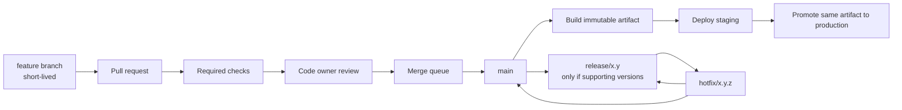

# GitHub as the System of Record for a Production Codebase

## Executive summary

**Conclusion:** If GitHub is your source of truth from commit through production deploy, the strongest default operating model is: a protected `main` branch, short-lived topic branches, mandatory pull requests, CODEOWNERS-backed review, required status checks, merge queue on busy repos, reusable GitHub Actions workflows, environment protection for deployments, OIDC-based cloud access, secret scanning plus push protection, dependency review plus Dependabot, release artifacts tied to tags, and artifact-first rollback. In practice, most production failures in this model come not from Git itself, but from weak branch protections, overbroad Actions permissions, long-lived branches, oversized pull requests, and missing deploy guardrails. citeturn1search1turn1search5turn2search9turn3search2turn7search1turn6search0

**Confidence:** 93/100. The underlying platform behaviors in this report come primarily from official GitHub documentation; the main opinionated parts are the recommended thresholds and operating defaults where GitHub exposes a capability but does not prescribe one universal policy. citeturn1search15turn2search0turn9search17turn13search21

If you have not specified constraints, the best default is this:

- **Repo model:** one repository per independently deployable system unless you have strong cross-service refactoring needs and tooling maturity for a monorepo. citeturn4search1
- **Branch model:** trunk-based development with short-lived branches; release branches only for supported versions or controlled stabilization windows. High-performing organizations are materially more likely to use trunk-based development than long-lived branching. citeturn5search2turn4search6turn4search3
- **Merge policy:** prefer **squash** as the default for application repos; allow **rebase** when preserving logical commit boundaries matters; avoid **merge commits** on `main` unless commit topology itself is operationally valuable. GitHub’s linear-history protections require squash or rebase. citeturn12search17turn12search3turn9search7
- **CI/CD:** GitHub-hosted runners by default; larger runners when you need more CPU, static IP, or private networking; self-hosted only when you truly need specialized hardware, network adjacency, or regulatory isolation, and then only as autoscaled **ephemeral** runners. citeturn8search4turn8search1turn8search0
- **Security baseline:** enable required reviews, required status checks, required CODEOWNERS review, secret scanning, push protection, code scanning, dependency review, Dependabot alerts, 2FA enforcement, and SAML SSO where available. Restrict Actions usage and pin third-party actions by full commit SHA. citeturn1search11turn1search1turn3search2turn3search15turn3search7turn0search10turn1search3turn1search14turn10search0turn13search21

## Repository governance and hygiene

GitHub gives you the primitives for repository governance, but it does **not** prescribe one canonical naming scheme, one correct label taxonomy, or one correct topology. Those are local policy choices. The reliable pattern is to standardize aggressively at the organization level where possible and use repository-level exceptions sparingly. On GitHub Team and Enterprise plans, **rulesets** exist specifically to apply policy consistently across repositories; on lower tiers, you fall back more heavily to per-repo configuration. citeturn1search15turn9search8

For naming, use a human-parseable, regex-enforceable pattern such as `kebab-case`, ideally with bounded prefixes like `svc-`, `lib-`, `web-`, `infra-`, or `data-` when your fleet is large. GitHub repository policies can enforce repository-name patterns across an enterprise, and GitHub’s own examples use `kebab-case` regexes. My recommendation, if unspecified, is `kebab-case` plus a short domain prefix only when the org is large enough that bare names collide semantically. citeturn11search5turn11search9

Set the default branch to **`main`** unless you have a migration constraint. GitHub lets you define default naming for new repositories and change the default branch later, but in production the important point is not the name itself; it is that the default branch should be the single integration branch with the strongest protection posture. citeturn1search17turn1search2

Protect, at minimum, `main`, `release/*`, and `hotfix/*`. Use **rulesets** when available because they are easier to target and scale across multiple repositories, and because they also support push rules such as file-size and file-extension restrictions. For production repositories, the target state is: no direct pushes to protected branches, required pull-request reviews, required status checks, optionally required deployments before merge, and no force-pushes except through tightly controlled break-glass paths. citeturn1search1turn9search0turn11search18turn11search2

### Repository topology choices

The following table is a synthesis of platform capabilities and the most credible independent guidance on topology. GitHub does not mandate one answer; this is a decision about coupling, ownership, and CI economics. citeturn4search1turn11search1

| Option | Best when | Advantages | Main costs | Default recommendation |
|---|---|---|---|---|
| **Monorepo** | Many components share code, tooling, release practices, or need frequent coordinated refactors | Easier code sharing, easier repo-wide standards, simpler global search/discovery, easier atomic refactors across components citeturn4search1 | Larger CI graph, greater merge pressure, harder ACL boundaries, requires selective builds and path-based ownership at scale citeturn4search1turn11search1 | Choose if you can invest in path-based CI, strict ownership, and selective test execution |
| **Multi-repo** | Components deploy independently and need stronger ownership or access isolation | Clear service ownership, easier access control, fewer broad refactors affecting unrelated systems, simpler repository mental model per team citeturn4search1 | Harder cross-cutting changes, more duplicated workflow logic, more coordination across repos, version skew in shared libraries citeturn4search1 | Choose if systems are independently deployable and organizational boundaries matter more than atomic refactors |

If you own the full lifecycle for **one production system**, the practical default is often: keep the application code, deployment automation, and product-facing docs together; keep platform-wide shared actions, IaC modules, and cross-cutting libraries in separate well-governed repos unless frequent atomic changes across them justify a monorepo. That is a pragmatic compromise between system-of-record cohesion and access-boundary cleanliness. This recommendation is opinionated, because GitHub exposes the primitives but does not define a universal topology. citeturn4search1turn11search17

Use **CODEOWNERS** for path-based accountability. GitHub only auto-requests code owners when the `CODEOWNERS` file is on the **base branch** of the pull request, which means stale or branch-specific ownership files quietly fail your intended governance model. In production repos, require code-owner review on sensitive paths such as infrastructure, auth, payments, migrations, CI, and incident-response automation. citeturn1search0turn1search11

A minimal `CODEOWNERS` example:

```text
# Global owners
*                     @platform-team

# Service areas
/services/api/        @backend-team
/services/web/        @frontend-team
/infra/               @platform-team @security-team
/.github/workflows/   @platform-team @security-team
/db/migrations/       @backend-team @dba-team
```

Standardize labels, but keep the vocabulary small. GitHub lets you manage one shared label set for issues and pull requests in a repository, but it does not prescribe a taxonomy. A production-friendly baseline is: `type/*`, `priority/*`, `area/*`, `risk/*`, `incident`, `security`, `release-blocker`, and `dependencies`. Small label vocabularies age better than elaborate taxonomies that nobody maintains. citeturn1search13turn11search15

Use **issue forms** for intake and **pull-request templates** for change quality; GitHub issue forms are explicitly **not** supported for pull requests, so you need both mechanisms. The highest-value templates are: bug, incident/regression, feature request, tech debt, and a PR template that forces authors to spell out risk, rollback, test evidence, and deployment notes. citeturn2search0turn2search8turn2search12turn11search11

A concise issue form example:

```yaml
name: Bug report
description: Report a production or pre-production defect
labels: ["type/bug"]
body:
  - type: textarea
    id: summary
    attributes:
      label: Summary
      description: What happened?
    validations:
      required: true
  - type: textarea
    id: impact
    attributes:
      label: User impact
      description: Scope, severity, affected users or systems
    validations:
      required: true
  - type: textarea
    id: reproduction
    attributes:
      label: Reproduction
      description: Steps, logs, links, screenshots
  - type: input
    id: version
    attributes:
      label: Affected version or commit
```

Treat large files as a governance problem, not a storage convenience problem. GitHub blocks files larger than **100 MiB** in normal Git history, and the repository-limits guidance recommends keeping single objects substantially smaller than that. Push rulesets can proactively block large files, specific file extensions, paths, and path lengths before they become repository-health problems. The right production stance is: store source in Git, store **build artifacts** and big generated outputs elsewhere, and use Git LFS only for versioned assets that are genuinely part of the source-of-truth history. citeturn13search0turn13search2turn11search2turn13search1

Git LFS is appropriate for design assets, large fixtures, or model files that need versioned co-evolution with code; it is the wrong answer for container images, compiled packages, transient deploy bundles, or data exhaust. GitHub also lets you include or exclude LFS objects from repository archives, so decide deliberately whether release archives should resolve to LFS payloads. citeturn13search1turn0search7

Use a formal archival policy. GitHub archival makes a repository **read-only** and signals that it is not actively maintained. A good production archive policy is:

- archive only after all production dependencies are retired or redirected,
- leave a clear README pointer to the successor repo or service,
- preserve final signed tag(s), release notes, and SBOM,
- export critical metadata before archiving if compliance or migration requires it. citeturn11search0turn7search0turn6search0

## Branching and merge policy

For production systems, the best default is **trunk-based development with short-lived branches**. The platform mechanics and the industry evidence point in the same direction: small batches, frequent integration, and aggressive automation outperform long-lived branch structures for delivery speed and operational clarity. DORA’s research has repeatedly associated trunk-based development with higher delivery performance, and GitHub’s merge protections, status checks, and merge queue all align naturally with that model. citeturn5search2turn4search6turn1search1turn1search5

Use long-lived branches only for **supported release lines** or hard stabilization windows. Avoid Git Flow-style persistent `develop` branches unless you have a specific compliance or release-management constraint that truly requires a separate long-lived integration branch. Long-lived branches always tax you later in merge complexity, drift, and defect attribution. citeturn4search6turn4search3turn5search21

A practical comparison:

| Model | Strengths | Weaknesses | When to use |
|---|---|---|---|
| **Trunk-based / GitHub Flow** | Fast integration, simpler automation, smaller merge conflicts, better fit for CI/CD and merge queue citeturn4search6turn5search2 | Requires discipline: small changes, feature flags, strong CI | Default for most production services |
| **Release branch model** | Lets you stabilize a version while `main` continues, useful for multiple supported versions citeturn4search9 | Branch drift, extra cherry-picking, more operational ceremony | Use when you support more than one live version or need a hardening window |
| **Git Flow style** | Familiar to many teams, explicit release/hotfix structure | Too many long-lived branches for most modern CI/CD teams, slower integration | Usually avoid for services that deploy continuously |

GitHub does **not** prescribe a pull-request size limit. My operational recommendation, when unspecified, is to optimize for **reviewability in one sitting** rather than an arbitrary line count: one coherent concern, small enough that a reviewer can reason through it quickly, usually within a few dozen minutes. This aligns with Google’s explicit guidance to write **small changes** because they are reviewed more quickly, reviewed more thoroughly, and are easier to merge; Google also recommends a first review response within **one business day** at most. citeturn5search1turn5search14turn5search0

### Merge strategies

GitHub supports **merge commit**, **squash and merge**, and **rebase and merge** for pull requests. A true Git **fast-forward** is a Git concept, not a separate pull-request merge button on GitHub; the closest GitHub UI behavior is **rebase and merge**, which keeps history linear without a merge commit. GitHub’s linear-history protections explicitly require squash or rebase. citeturn9search7turn12search15turn12search3turn12search17

| Strategy | What it preserves | Advantages | Costs | Recommended use |
|---|---|---|---|---|
| **Squash** | One commit per PR | Clean history, easier revert at unit-of-change level, better for noisy intermediate commits citeturn9search6turn12search17 | Loses internal commit chronology inside the PR branch | **Default for most application repos** |
| **Rebase and merge** | Individual commits, linear history | Keeps meaningful commit boundaries while avoiding merge commits citeturn12search3 | Rewrites commits on the base branch; noisier history if contributors commit poorly | Use when commit-by-commit history is valuable |
| **Merge commit** | Full branch topology | Useful when branch structure is itself meaningful, e.g. supervised release trains | Non-linear history, harder blame/revert at scale on busy repos | Avoid on `main`; consider for release branches only |
| **Fast-forward only** | Existing commit chain, no merge commit | Very clean in raw Git terms citeturn12search15 | Not a first-class GitHub PR merge mode; operationally approximated via rebase discipline | Treat as a Git concept, not a GitHub baseline policy |

My default policy, if unspecified, is:

- **Disable merge commits on `main`**
- **Allow squash**
- **Allow rebase** only if contributors understand clean commit hygiene
- **Require linear history** on `main`
- Keep merge commits available only on special repos where topology matters, such as release-management repos or infrastructure change aggregators. citeturn12search17turn12search7turn12search10

Use **required status checks** aggressively. At minimum, gate merges on build, unit tests, lint/format, dependency review, and security analysis appropriate to the language stack. GitHub’s required status checks and required reviews are designed for exactly this. If the repository is busy enough that “update branch and rerun CI” becomes a tax, turn on **merge queue** and make sure your workflows also trigger on `merge_group`; otherwise required checks will not run for the queue and merges will stall. citeturn1search1turn1search20turn1search5turn10search7

A strong protected-branch target state is therefore:

- require pull requests,
- require conversation resolution,
- require status checks,
- require CODEOWNERS review,
- require linear history,
- optionally require deployments to staging before merge,
- optionally require merge queue for busy branches. citeturn1search11turn6search7turn12search17turn1search5

A branch model that works well in production:



## Code review operating model

The right mental model for review is not “approval ceremony”; it is **change control**. Google’s engineering guidance is blunt: essentially every change is reviewed, reviewers should focus on the health of the codebase over time, and the practical best practices are small changes, good descriptions, few reviewers, and automation where possible. That maps directly onto production GitHub usage. citeturn5search0turn5search4turn5search9

The reviewer assignment pattern that scales best is: **CODEOWNERS for mandatory path ownership**, plus team-level review routing where appropriate, plus a small number of actual humans on each review. Do not spray requests broadly. Google’s guidance to “keep reviewers to a minimum” is operationally sound: too many reviewers increase latency while diffusing responsibility. citeturn1search0turn1search4turn5search9

For SLAs, set an explicit expectation that the **first review response happens within one business day**, with urgent production fixes faster than that. If you want fast delivery, this must be treated as an operational expectation, not a social aspiration. Small PRs are what make that SLA realistic. citeturn5search14turn5search1

My recommended approval policy, where you own the full path to production:

- **1 approval** for low-risk application changes with no security, migration, or deploy-automation impact.
- **2 approvals** for infrastructure, CI/CD, auth, payments, data migrations, production incident-response automation, and high-blast-radius changes.
- **Required CODEOWNERS approval** on owned paths.
- **No self-approval**, even for paired work.
- Use environment protection on production deploys so deploy authorization is distinct from code-merge authorization. citeturn1search11turn6search3turn10search10

Pair programming is valuable for design quality and knowledge transfer, but it should not eliminate independent review on production-critical changes. The clean rule is: pairing can reduce review friction, but at least one non-author still approves high-risk changes before merge, and protected production environments still require an authorized deployment reviewer if you use protected environments. citeturn6search3turn10search10

Use a review checklist that forces operational thinking, not just code-style thinking. A good PR template:

```markdown
## Summary
What changed and why?

## Risk
- [ ] Low
- [ ] Medium
- [ ] High

## Validation
- [ ] Unit tests
- [ ] Integration or smoke test
- [ ] Security implications reviewed
- [ ] Observability/alerting updated if needed

## Deployment
- [ ] Safe for rolling deploy
- [ ] Feature flag included if needed
- [ ] Backward-compatible DB/API changes
- [ ] Rollback plan included

## Linked work
Closes #
```

Automation should remove everything that does **not** require human judgment. Formatting, linting, unit tests, dependency review, secret scanning, code scanning, and basic policy checks belong in CI. Humans should spend their time on design fit, risk, security implications, roll-forward/rollback viability, and whether the change is coherent. citeturn5search9turn15search?