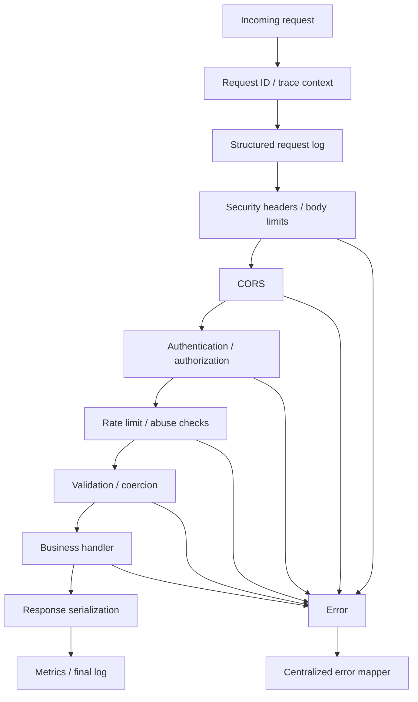

# Production HTTP Services in JavaScript and TypeScript

## Executive summary

For most greenfield HTTP APIs that will run on servers or containers, the strongest default is **Fastify on Node.js**: its official docs emphasize schema-driven validation and serialization, built-in Pino logging, lifecycle hooks, TypeScript type providers, and a large plugin ecosystem, and its own framework-overhead benchmark continues to place it well ahead of Express, Koa, and Hono on simple Node workloads. If you need stronger architectural conventions, governance, and enterprise team scaling, **NestJS with the Fastify adapter** is usually the best compromise: you keep Nest’s DI/module/pipes/filters model while avoiding the lower-throughput default Express adapter. If compatibility, hiring, and long-tail middleware matter more than raw overhead, **Express 5 remains a rational production choice**—especially now that v5’s release explicitly prioritizes security and maintenance and supports rejected Promises in middleware and route handlers. citeturn29view0turn30view0turn9view11turn14view0turn4view3turn4view5

For edge or multi-runtime deployments, **Hono** is the standout: its docs position it as a Web-standards framework that runs on Node.js, Bun, Deno, Cloudflare Workers, Lambda, and other runtimes, with built-in middleware for CORS, secure headers, request IDs, and logging. For Deno-first full-stack work, **Fresh** is notable because it is built on Web Standards, supports middleware, ships with built-in OpenTelemetry support, and documents deployment to Deno Deploy, Docker, `deno compile`, and Cloudflare Workers. On the platform side, entity["company","Cloudflare","internet company"] Workers scale globally with no general requests-per-second limit, but they do impose runtime-specific limits such as memory and subrequest ceilings; entity["company","Deno","js runtime company"] Deploy is a serverless platform for JavaScript/TypeScript with built-in telemetry support. citeturn4view6turn9view1turn9view2turn9view3turn21view0turn21view1turn9view5turn9view7turn9view8turn20search2

The most important tradeoff is that **framework speed matters less than operational correctness** once a service becomes I/O-bound. Database calls, caches, downstream HTTP, queues, and authorization checks usually dominate latency. That means migrations to a “faster” framework are often unjustified when your current stack already has stable middleware, observability, security controls, test coverage, and team expertise. Fastify’s own benchmark page explicitly warns that its numbers are synthetic “hello world” overhead tests and that the right answer is to benchmark your own application. citeturn29view0turn10search0

**Bottom line:** choose **Fastify** for performance-centric server APIs, **NestJS on Fastify** for large teams and structured services, **Express 5** when compatibility and migration cost dominate, **Hono** when runtime portability or edge deployment is a first-class requirement, and **Koa** only when you deliberately want a minimal onion-middleware core and are comfortable assembling more of the stack yourself. **Confidence: high (about 90%)**.

## What production services should optimize for

A production HTTP service should optimize for **correctness under bad inputs, predictable behavior under load, operability under partial failure, and maintainability over years**, not just peak requests per second. In practice that means: clear request contracts, centralized error mapping, structured logs, distributed traces, rate limits, safe defaults for headers and CORS, streaming that respects backpressure, readiness/liveness separation, and tests that exercise protocol boundaries rather than only implementation details. Official docs from Express, Fastify, NestJS, Hono, Fresh, Node.js, OpenTelemetry, and OWASP all reinforce pieces of that model even though they present them through different APIs. citeturn4view1turn4view2turn9view12turn9view13turn9view9turn21view1turn16view0turn40view0turn40view3

Framework selection should be driven by a weighted set of criteria: **performance characteristics, TypeScript experience, plugin/middleware ecosystem, deployment targets, maturity, security posture, and observability fit**. The right weighting changes by environment. A server/container service with stable Node tooling often values ecosystem depth and operational familiarity. An edge service values portability across Fetch/Web Streams runtimes and small cold-start/cognitive footprint. A multi-team platform values strong conventions, DTOs, validation pipes, and module boundaries more than absolute router speed. citeturn29view0turn30view0turn4view6turn21view0turn9view7turn9view5

Two scenarios regularly justify *not* adopting a newer or faster framework. First, if you already have a mature service platform around Express or NestJS—shared middleware, auth integrations, SDK assumptions, dashboards, runbooks, platform templates, and engineers trained around those abstractions—the migration cost often outweighs overhead gains. Second, if your latency budget is dominated by storage or downstream services, a framework migration changes the least important part of the request path. That is an inference from the benchmark caveats and from the fact that several frameworks explicitly position themselves around architecture, portability, or extensibility rather than raw throughput alone. citeturn29view0turn9view11turn30view0turn4view6turn21view0

## Framework landscape and comparison

The table below synthesizes official documentation, official ecosystem pages, and primary benchmark materials where available. Where no authoritative benchmark exists for a specific framework/runtime combination, the cell is intentionally qualitative or marked as workload-dependent.

| Framework | Architecture overview | TypeScript experience | Performance characteristics | Plugin / middleware ecosystem | Deployment targets | Pros | Cons | Typical use-cases | Sources |
|---|---|---|---|---|---|---|---|---|---|
| **Express 5** | Minimal, linear middleware stack over Node HTTP | Good, but via community typings like `@types/express`, not a type-driven core | Lower framework-overhead in official comparisons than Fastify/Hono/Koa; good enough for many I/O-bound services | Extremely broad middleware ecosystem | Node servers, containers, serverless adapters | Battle-tested, huge community, easiest compatibility story | Less opinionated structure, weaker native typing, lower raw overhead efficiency | Existing platforms, legacy migrations, broad middleware compatibility | Docs/TS/release: citeturn32search0turn9view11turn14view0turn4view1turn4view2 |
| **Fastify** | Plugin-encapsulated architecture with hooks, schemas, serializers | Strong: official TS reference and type providers | Official benchmark page shows ~46.7k req/s vs Hono ~36.7k, Koa ~35.1k, Express ~9.4k in synthetic overhead tests; docs stress measuring your own app | Large official/community ecosystem including auth, CORS, helmet, throttling, AWS Lambda, health plugins | Node servers, containers, Lambda/API Gateway | High performance, schema-first validation/serialization, built-in Pino integration, good operational ergonomics | More concepts than Express; best results typically come from leaning into schemas and plugins | High-throughput APIs, internal platforms, microservices | Docs/benchmarks/ecosystem: citeturn29view0turn9view12turn4view3turn31search0turn4view5 |
| **Hono** | Web-standards, middleware-first framework around Fetch API | Strong; TS-first ergonomics and runtime portability | Official docs highlight strong router/runtime benchmarks, especially on Workers/Deno/Bun; Node numbers vary by adapter/runtime | Growing built-in and third-party middleware catalog | Node.js, Bun, Deno, Workers, Lambda, Vercel, Netlify, Fastly, more | Best portability, small mental model, edge-native fit, built-in secure headers/CORS/request ID/logger | Newer ecosystem, less operational standardization than Express/Nest/Fastify in many orgs | Edge APIs, multi-runtime services, lightweight APIs | Docs/benchmarks/middleware: citeturn4view6turn28view0turn9view0turn9view1turn9view2turn9view3turn31search9 |
| **Koa** | Minimal async onion middleware; router separate | Moderate; simple APIs, less type-centric ecosystem than Fastify/Hono | Official docs do not center on performance marketing; Fastify’s benchmark page places Koa materially above Express in hello-world overhead tests | Smaller, choose-your-own stack | Node servers and containers | Elegant middleware composition, transparent async flow, minimal core | More assembly work, less convention, smaller ecosystem footprint | Small custom stacks, teams who want explicit composition | Guide/error handling/benchmarks: citeturn22view0turn4view10turn29view0 |
| **NestJS** | Opinionated modular framework with DI, controllers, pipes, guards, interceptors, filters | Excellent; framework is built with and fully supports TypeScript | Adapter-dependent: Express by default, Fastify optional; exact delta is workload-specific, so benchmark locally | Rich official feature surface for validation, security, microservices, OpenAPI, queues | Node servers, containers, serverless patterns via adapters | Best structure for large teams, strong conventions, DTO/pipes/filter model, broad official guidance | More abstraction, more framework tax, less suitable for tiny services | Enterprise APIs, multi-team platforms, complex business domains | Intro/platform/pipes/filters/security: citeturn9view9turn30view0turn4view11turn4view12turn40view4turn40view5 |
| **Fresh** | Deno-first full-stack framework on Web Standards with middleware and islands architecture | Excellent in Deno environments | Not primarily sold on raw benchmark numbers; optimized for server-rendered web apps and Web APIs | Smaller than Express/Fastify; built-in CORS/CSP/CSRF plugins | Deno Deploy, Docker, `deno compile`, Cloudflare Workers | Deno-native TS, built-in OTel, straightforward middleware, good edge/full-stack fit | Not right for SPA-first apps; smaller ecosystem for generic Node backends | Deno-first web apps and APIs | Intro/middleware/plugins: citeturn21view0turn21view1turn21view2turn20search7 |
| **Edge runtimes** | Fetch/Web Streams execution environments rather than classic Node servers | Varies: Hono/Fresh make TS ergonomic; Bun and Deno run TS directly | Great for latency-sensitive stateless logic close to users; platform limits matter | Framework-level ecosystem depends on Hono/Fresh or raw runtime APIs | Workers, Deno Deploy, Bun server, other edge/serverless runtimes | Geographic proximity, Web-standard primitives, simplified global distribution | Different runtime constraints, weaker compatibility for some Node-centric libraries, less control over process lifecycle | Auth edges, request filtering, geo-aware personalization, lightweight APIs | Platform docs: citeturn19view2turn19view4turn9view5turn20search0turn33search2turn9view4 |

### Express

Express remains the **safest ecosystem choice** when you need maximum compatibility and minimum migration drama. Its docs still describe it as minimal and flexible; the production guides focus on security, reverse proxies, exception handling, clustering, and health checks rather than on a novel architecture. The Express v5 release is important because the core team explicitly framed it as a security/maintenance release, and the v5 error-handling guide now documents automatic `next(value)` behavior for rejected Promises in route handlers and middleware. That narrows one of the historical ergonomics gaps with Koa/Fastify. citeturn32search10turn4view2turn9view11turn14view0

The main limitation is structural: Express does not give you a strong module system, schema-compiled validation path, or deeply integrated type story out of the box. TypeScript support is typically added through `@types/express`, and validation/logging/security are package-driven decisions. That is not inherently bad, but it means production quality depends more heavily on your team’s platform standards. citeturn32search0turn4view1turn23search0turn25search0

### Fastify

Fastify is the strongest server-side choice when you care about **throughput, predictable plugin boundaries, and schema-driven request/response handling**. Its docs recommend JSON Schema for route validation and response serialization, compiled into highly performant functions, and its ecosystem includes first-party plugins for common production concerns such as CORS, helmet, AWS Lambda, and rate limiting. Its benchmark page still shows a large synthetic overhead gap versus Express, while explicitly warning not to treat that as a substitute for workload-specific benchmarking. citeturn9view12turn4view5turn24search10turn37view3turn37view4turn29view0

Fastify also has a notably strong TypeScript story through generic request typing and official type providers, including TypeBox and Zod integrations. In practice, the framework rewards teams that are willing to **treat schemas as first-class artifacts** rather than as optional annotations. If you only use Fastify in an Express-like style, you keep some speed but miss much of the operational and type-safety upside. citeturn4view3turn31search0turn31search2

### Hono

Hono’s defining advantage is **runtime portability**. Its docs describe it as a small, ultrafast framework built on Web Standards that runs unchanged across Node.js, Bun, Deno, Cloudflare Workers, Lambda, and more. It also ships built-in middleware for CORS, secure headers, logging, request IDs, and a thin validation layer designed to combine with third-party validators like Zod. That makes it unusually attractive when “write once, deploy to multiple runtimes” is a real requirement rather than a vague aspiration. citeturn4view6turn31search1turn9view0turn9view1turn9view2turn9view3

Where Hono is weaker is not syntax but **organizational maturity and depth of standard operational patterns**. Its docs expose many deployment targets and middleware choices, but large organizations often still have more battle-tested internal practice around Express, Fastify, or NestJS. So Hono is ideal when portability and edge fit outrank ecosystem inertia; it is less obviously the right choice when your organization mostly runs long-lived Node container services and already has platform conventions elsewhere. That is an inference from the documented runtime spread and middleware model, not a claim that Hono is unsuitable for production. citeturn4view6turn31search9turn28view0

### Koa

Koa is still the cleanest expression of **onion middleware** in the Node ecosystem. Its guide makes the request/response flow explicit: code before `await next()` is the “capture” phase and code after it is the “bubble” phase. That model is excellent for response timing, transaction scopes, and layered transforms; the default error handler is effectively a `try/catch` at the top of the middleware chain. citeturn22view0turn4view10

Koa’s tradeoff is that minimalism is real: you choose more of the stack yourself, including the router and many operational conventions. For teams that enjoy assembly and want transparency, that is a feature. For teams that want a batteries-included production path, it is usually a negative. citeturn22view0

### NestJS

NestJS is the best fit when the service is no longer “just an HTTP API” but a **team-scale application platform**. Official docs emphasize TypeScript, modular architecture, DI, validation pipes, exception filters, multiple transports, OpenAPI, and first-party security modules. Its platform abstraction matters: Nest supports both Express and Fastify out of the box, with Express as the default and Fastify as the high-performance option. citeturn9view9turn30view0turn4view11turn4view12turn40view4turn40view5

The critical tradeoff is that Nest’s value lies in abstraction and conventions, not minimal overhead. If you need a tiny service with two routes and no shared platform concerns, Nest is often too much framework. If you need clear architectural seams, DTO-centric validation, policy enforcement, interceptors, and team-readable modules, it is often exactly the right amount. citeturn30view0turn35search0

### Edge-oriented options

Edge runtimes are appropriate when requests are mostly **stateless, latency-sensitive, and compatible with Fetch/Web Streams execution models**. Workers docs explicitly note that streams help avoid buffering large payloads in memory and that Workers can export logs and traces through OpenTelemetry-compatible endpoints. Deno Deploy documents itself as a serverless platform for JavaScript/TypeScript, while Deno runtime docs now document built-in OpenTelemetry and first-class TypeScript. Bun supports TypeScript out of the box and provides a fast built-in HTTP server, but its server docs also note an `idleTimeout` default that can matter for long-lived responses. citeturn19view2turn19view3turn19view4turn9view5turn20search0turn20search4turn33search2turn9view4

The main reason *not* to go edge-first is compatibility and lifecycle control. If you depend heavily on Node-specific libraries, connection pooling assumptions, or long-lived process hooks, a conventional Node service is usually simpler and less surprising. That is an operational inference from the platform docs and runtime differences, and it is why many teams end up with a split architecture: containerized core APIs plus edge front-door logic. citeturn4view6turn19view2turn9view5turn33search5

## Middleware, validation, and errors

The central rule for middleware architecture is: **put cheap, universally applicable checks first; put expensive or domain-specific work later; put failure normalization last**. In most services the ordering should be: request ID / trace context → structured request logging → security headers → CORS and body size limits → authn/authz → rate limit / anti-abuse → request validation and coercion → business handler → response serialization / metrics → centralized error handling. Fastify, Koa, Hono, Fresh, and NestJS all support this shape, but with different primitives: Fastify uses lifecycle hooks and encapsulated plugins, Koa uses onion middleware, Hono/Fresh use Fetch-style middleware, and NestJS splits concerns across middleware, guards, pipes, interceptors, and filters. citeturn4view4turn22view0turn21view1turn4view12turn4view11



### Composition, ordering, and async propagation

Koa’s guide is the clearest reference for onion composition: middleware explicitly invokes downstream work with `await next()` and resumes afterward, which makes response transforms natural. Express is more linear, but Express 5 materially improves async ergonomics because rejected Promises from route handlers and middleware automatically call `next(value)`. Fastify catches synchronous and async handler failures and routes them through the default or custom error handler; hook failures also terminate the request correctly. That means the main engineering question is less “can the framework catch async errors?” and more “have you kept error semantics centralized and transport-friendly?” citeturn22view0turn14view0turn9view13

A key edge case is **late failure after headers are sent**. Express explicitly documents that if you call `next(err)` after you have started writing the response—for example while streaming—the default handler closes the connection, and custom handlers must delegate when `res.headersSent` is already true. The operational implication is simple: if you stream, decide your status and headers early, and treat later errors as stream termination events, not as opportunities to emit a fresh JSON error envelope. citeturn14view0

### Request validation

Request validation in production should be **runtime validation at the I/O boundary**, even in TypeScript. TypeScript does not validate untrusted network data. The choice is between **schema-first/design-first**, **code-first**, or a hybrid. The OpenAPI specification defines a language-agnostic contract for HTTP APIs, which is why schema-first approaches are especially valuable when multiple services, teams, SDKs, or partner consumers need a shared contract. Code-first approaches are usually faster for internal teams and can still generate OpenAPI if tooling is disciplined. citeturn35search4turn35search1turn35search2

For libraries, the production tradeoff is straightforward. **Ajv** is the strongest fit when you want standards-based JSON Schema or JTD and high-performance compiled validation. **Zod** is the strongest fit when TypeScript-first inference and developer ergonomics dominate. **Joi** remains useful when you need a rich schema language with expressive runtime rules and extensions, especially in JavaScript-heavy codebases, but it is less naturally aligned with TypeScript inference than Zod. Fastify’s official model leans heavily into Ajv and compiled JSON Schema; Hono intentionally provides only a thin validator and expects composition with third-party tools; NestJS documents DTO + `ValidationPipe` as the common path. citeturn37view8turn37view7turn37view9turn9view12turn31search1turn35search0

The performance tradeoff is usually this: **Ajv / JSON Schema / TypeBox for hot paths and shared contracts; Zod for team speed and local correctness; Joi for highly expressive runtime logic**. If request rate is high and payload shapes are stable, schema compilation usually wins. If your bottleneck is developer error rate and iteration speed, Zod often wins. A good compromise in Fastify is TypeBox + Ajv, because Fastify type providers let you keep strong static types while staying on the compiled schema path. citeturn9view12turn31search0turn37view8turn37view7

One best practice matters more than library choice: **do not perform async I/O inside the first-pass validator**. Fastify’s docs are explicit that using async Ajv features or database access during initial validation can create denial-of-service risk; do cross-record or database-backed checks in a later hook or service layer. That is a generally sound rule across frameworks. citeturn7search0turn9view12

```ts
// Zod-based boundary validation with typed errors
import { z } from "zod";

const CreateUser = z.object({
  email: z.email(),
  name: z.string().min(1).max(100),
  age: z.number().int().min(13).optional(),
});

class HttpError extends Error {
  constructor(
    public status: number,
    public code: string,
    message: string,
    public details?: unknown,
  ) {
    super(message);
  }
}

export function parseCreateUser(input: unknown) {
  const result = CreateUser.safeParse(input);
  if (!result.success) {
    throw new HttpError(400, "VALIDATION_ERROR", "Invalid request body", {
      issues: result.error.issues,
    });
  }
  return result.data;
}
```

### Error handling

Production services should normalize failures into **typed application errors** and map them centrally to HTTP. The practical categories are: validation (400/422), authentication (401), authorization (403), missing resource (404), conflict/idempotency (409), upstream timeout/unavailable (502/503/504), and unexpected internal failure (500). NestJS formalizes this with exception filters; Fastify with `setErrorHandler`; Express with final error middleware; Koa with an outer `try/catch`; Hono with exception handling middleware patterns. citeturn4view11turn9view13turn14view0turn4view10

Retries belong **outside** the central error handler except for cases where your own service is the client of a downstream dependency. The HTTP layer should map errors and attach metadata such as retryability, request ID, and safe public detail. The client or an internal resilience layer should decide whether to retry, with idempotency and timeout budgets enforced explicitly. That separation keeps transport behavior deterministic. This is an engineering recommendation, supported by the framework error models rather than by a single framework doc. citeturn14view0turn9view13turn4view11

```ts
// Express 5-style centralized error mapping
import type { Request, Response, NextFunction } from "express";

class AppError extends Error {
  constructor(
    public status: number,
    public code: string,
    message: string,
    public expose = true,
    public details?: unknown,
  ) {
    super(message);
  }
}

export function errorHandler(
  err: unknown,
  req: Request,
  res: Response,
  next: NextFunction,
) {
  if (res.headersSent) return next(err);

  const e =
    err instanceof AppError
      ? err
      : new AppError(500, "INTERNAL_ERROR", "Internal Server Error", false);

  res.status(e.status).json({
    error: {
      code: e.code,
      message: e.expose ? e.message : "Internal Server Error",
      details: e.expose ? e.details : undefined,
      requestId: req.get("x-request-id"),
    },
  });
}
```

## Observability, security, and traffic governance

Structured logging should be considered part of the service contract with operators. Fastify uses Pino as its default logger; Pino’s official docs and ecosystem pages emphasize transports, redaction, child loggers, and web-framework integrations; `pino-http` documents both performance and request/response serializers. The practical recommendation is to emit JSON logs with stable keys, include service name, environment, route, status, duration, user-safe identifiers, and correlation fields, and redact secrets aggressively. Do not log request bodies by default. citeturn39search0turn25search2turn25search8turn39search4turn25search0

Correlation IDs should be propagated consistently across logs, traces, and downstream calls. In Node, `AsyncLocalStorage` is the right primitive: Node’s docs explicitly recommend it as a performant, memory-safe implementation for request-scoped context propagation and even show a request-ID logging example. Hono also ships a built-in request-ID middleware; Nest has an Async Local Storage recipe; Cloudflare Workers and Deno increasingly support OTel/native telemetry paths, though the mechanics differ by runtime. citeturn38view0turn9view3turn25search3turn19view4turn20search4

OpenTelemetry should be the default tracing substrate for new production services. The Node SDK docs show a `NodeSDK` setup with `getNodeAutoInstrumentations()`, and the sampling docs note that JavaScript defaults to sampling all traces unless configured otherwise, with `TraceIdRatioBasedSampler` as the common head sampler. In practice, a good default is **head sampling in the app** for cost control plus **tail sampling in the collector/backend** for error/latency-based retention where your platform supports it. citeturn16view0turn18search0turn18search1

```ts
// OpenTelemetry bootstrap for a Node service
import { NodeSDK } from "@opentelemetry/sdk-node";
import { getNodeAutoInstrumentations } from "@opentelemetry/auto-instrumentations-node";
import { OTLPTraceExporter } from "@opentelemetry/exporter-trace-otlp-http";
import { resourceFromAttributes } from "@opentelemetry/resources";
import { ATTR_SERVICE_NAME, ATTR_DEPLOYMENT_ENVIRONMENT_NAME } from "@opentelemetry/semantic-conventions";
import { TraceIdRatioBasedSampler } from "@opentelemetry/sdk-trace-node";

const sdk = new NodeSDK({
  resource: resourceFromAttributes({
    [ATTR_SERVICE_NAME]: "users-api",
    [ATTR_DEPLOYMENT_ENVIRONMENT_NAME]: process.env.NODE_ENV ?? "development",
  }),
  traceExporter: new OTLPTraceExporter({
    url: process.env.OTEL_EXPORTER_OTLP_TRACES_ENDPOINT,
  }),
  instrumentations: [getNodeAutoInstrumentations()],
  sampler: new TraceIdRatioBasedSampler(0.1), // 10% head sampling
});

await sdk.start();
```

### Security headers and CORS

For security headers, the correct posture is **deny-by-default, then loosen intentionally for known needs**. Helmet’s docs say it sets headers such as `Content-Security-Policy` and `Strict-Transport-Security`; NestJS documents Helmet integration; Hono ships `secureHeaders`; Fresh ships `csp()` and related plugins. OWASP recommends HSTS for HTTPS-only access, `X-Content-Type-Options: nosniff`, and a restrictive framing policy, while also noting that CSP’s `frame-ancestors` supersedes `X-Frame-Options` in supporting browsers. OWASP’s CSP cheat sheet frames CSP as defense in depth, especially against XSS. citeturn37view5turn40view5turn9view2turn21view1turn40view0turn40view1turn40view2turn40view3

For APIs specifically, remember the nuance: **some browser-facing headers matter mainly for browser-rendered content, not JSON alone**. For a pure JSON API, CSP and `X-Frame-Options` are less central than HSTS, `nosniff`, cookie flags, correct content type, CORS, and authentication hardening. For mixed API + admin UI services, you almost certainly want the full header set. citeturn40view1turn40view2turn40view3

```ts
// Express / Nest style
import helmet from "helmet";
app.use(helmet({
  contentSecurityPolicy: {
    useDefaults: true,
    directives: {
      defaultSrc: ["'self'"],
      objectSrc: ["'none'"],
      frameAncestors: ["'none'"],
    },
  },
  hsts: { maxAge: 63072000, includeSubDomains: true, preload: true },
}));

// Fastify
await fastify.register(import("@fastify/helmet"), {
  global: true,
});

// Hono
import { secureHeaders } from "hono/secure-headers";
app.use("*", secureHeaders());
```

CORS should also be default-deny. Reflecting arbitrary origins is the most common unforced error. Hono, Fresh, NestJS, Express middleware, and `@fastify/cors` all support explicit origin policies. If you use credentials, do **not** combine them with wildcard origins. Prefer exact allowlists, environment-specific configuration, explicit methods/headers, and a sensible preflight `maxAge`. Fastify’s CORS plugin is also notable because it lets you choose *which hook* injects/validates CORS, which matters in complex middleware orderings. citeturn9view1turn21view2turn4view15turn37view4

```ts
// CORS examples
app.use(cors({
  origin: ["https://app.example.com"],
  methods: ["GET", "POST", "PATCH", "DELETE"],
  allowedHeaders: ["content-type", "authorization", "x-request-id"],
  credentials: true,
  maxAge: 600,
}));

await fastify.register(import("@fastify/cors"), {
  origin: ["https://app.example.com"],
  hook: "onRequest",
});

app.use("*", cors({
  origin: "https://app.example.com",
  allowMethods: ["GET", "POST", "PATCH", "DELETE"],
  allowHeaders: ["content-type", "authorization", "x-request-id"],
  credentials: true,
}));
```

### Rate limiting

Rate limiting has two layers: **upstream volumetric protection** and **application-level semantic protection**. Upstream controls at CDN/API gateway/load balancer are better for DDoS-ish traffic. Application-level controls are better for login, OTP, invite creation, or expensive query routes. entity["company","Redis","database company"] documents Redis as a natural fit for rate limiting because of atomic counters and TTL, and its tutorial explicitly compares multiple algorithms. citeturn37view0

Algorithmically, use **fixed window** only when simplicity is more important than fairness, **sliding window** when you want smoother boundaries, and **token bucket / leaky bucket** when burst handling matters. In-process limiters are fine for single-instance or best-effort controls, but **distributed services need distributed state** or an upstream authoritative limiter. Common Node choices are `express-rate-limit` for simple Express cases, `@fastify/rate-limit` for Fastify, `@nestjs/throttler` for NestJS, and `rate-limiter-flexible` when you want more explicit distributed/backing-store control. Fastify’s limiter can use Redis and emits standard rate-limit headers; Nest’s docs explicitly point to `@nestjs/throttler`. citeturn23search1turn37view3turn40view4turn37view1

```ts
// Express with Redis-backed limiter
import { rateLimit } from "express-rate-limit";
import { RedisStore } from "rate-limit-redis";
app.use(rateLimit({
  windowMs: 60_000,
  limit: 100,
  standardHeaders: "draft-7",
  legacyHeaders: false,
  // store: new RedisStore({ sendCommand: (...args) => redis.sendCommand(args) }),
}));

// Fastify
await fastify.register(import("@fastify/rate-limit"), {
  max: 100,
  timeWindow: "1 minute",
  // redis: new Redis({ host: "127.0.0.1" }),
});

// NestJS
ThrottlerModule.forRoot([{ ttl: 60_000, limit: 100 }]);
```

## Streaming and lifecycle management

For streaming, the governing principle is: **never buffer what you can stream, and never ignore backpressure**. Node’s stream docs say `stream.pipeline()` abstracts backpressure and backpressure-related errors; the Node backpressure guide explains that streams are the core flow-control mechanism that prevents fast producers from overwhelming slower consumers. Cloudflare Workers docs make the same operational point from the edge side: Streams API usage avoids buffering large request/response bodies in memory and allows processing multi-gigabyte payloads within platform memory limits. citeturn36search1turn36search0turn19view2

Use streaming when the response is inherently incremental or large: file transfer, proxying, SSE, chunked NDJSON, AI inference tokens, CSV export, or long-running reads. Avoid streaming when clients require atomic JSON documents and partial results would be confusing or semantically invalid. Koa’s guide includes an SSE example with `PassThrough`; Workers and Hono are aligned with Web Streams; Bun’s server docs warn that inactivity can trigger connection closure via `idleTimeout`, which matters for long-lived streaming if you do not emit data. citeturn22view0turn19view2turn9view4

```ts
// Node streaming with backpressure-safe pipeline
import { pipeline } from "node:stream/promises";
import fs from "node:fs";

app.get("/download", async (req, res, next) => {
  try {
    res.setHeader("content-type", "application/octet-stream");
    res.setHeader("content-disposition", 'attachment; filename="data.bin"');

    await pipeline(
      fs.createReadStream("/srv/data.bin"),
      res
    );
  } catch (err) {
    next(err); // if headers already went out, Express will terminate the stream
  }
});
```

### Graceful shutdown

Graceful shutdown is not optional in production. Express’s guide says a process manager will typically send `SIGTERM`, after which the app should stop accepting new requests, finish ongoing ones, clean up resources, and exit. Node’s HTTP docs add the details that matter in practice: `server.close()` stops accepting new connections and, in modern Node, closes idle connections; `server.closeIdleConnections()` is still useful for backward compatibility; `server.closeAllConnections()` is forceful and should be used carefully, after `server.close()`, to avoid races. Node also documents `keepAliveTimeout`, which affects how long sockets stay open. citeturn9view10turn15view2turn15view0turn15view1turn15view3

A robust shutdown sequence is: mark readiness false, stop admitting traffic, close the listener, drain idle connections, wait for in-flight requests up to a deadline, close DB/queue/telemetry exporters, then force-close if the deadline expires. This must be tested in staging under keep-alive and streaming conditions. citeturn9view10turn15view2turn15view3

```mermaid
flowchart TD
    A[SIGTERM / SIGINT] --> B[Set readiness false]
    B --> C[Stop accepting new connections]
    C --> D[server.close()]
    D --> E[Drain idle keep-alive connections]
    E --> F[Wait for in-flight requests]
    F --> G[Close DB / queues / telemetry]
    G --> H[Exit 0]
    F --> I[Deadline exceeded]
    I --> J[server.closeAllConnections()]
    J --> K[Exit 1 or forced exit]
```

```ts
import http from "node:http";
import express from "express";

const app = express();
let shuttingDown = false;

app.get("/ready", (_req, res) => {
  res.status(shuttingDown ? 503 : 200).json({ ok: !shuttingDown });
});

const server = http.createServer(app);
server.keepAliveTimeout = 5_000;

server.listen(3000);

async function shutdown(signal: string) {
  shuttingDown = true;
  console.info({ signal }, "shutdown started");

  const forceTimer = setTimeout(() => {
    console.error("force closing remaining connections");
    server.closeAllConnections();
    process.exit(1);
  }, 30_000).unref();

  server.close(async (err) => {
    clearTimeout(forceTimer);
    if (err) {
      console.error(err, "error during server close");
      process.exit(1);
      return;
    }

    try {
      // await db.close();
      // await queue.close();
      // await otelSdk.shutdown();
      process.exit(0);
    } catch (e) {
      console.error(e, "cleanup failed");
      process.exit(1);
    }
  });

  // Useful for Node <19 support
  server.closeIdleConnections();
}

process.on("SIGTERM", () => void shutdown("SIGTERM"));
process.on("SIGINT", () => void shutdown("SIGINT"));
```

## Testing strategy and recommendations

A production testing strategy should validate **behavioral contracts at the HTTP boundary**, not just internal function outputs. The minimum stack is: unit tests for pure business logic and validators; integration tests that boot the app in-process and exercise real routing, middleware, and serialization; contract tests for provider/consumer compatibility; and load tests that check latency distributions, saturation points, and rate-limit behavior. **Vitest** is a strong default test runner for TypeScript backends, **Supertest** is a pragmatic way to drive in-process HTTP assertions, **Pact** is the standard consumer-driven contract-testing option, and **k6** or **autocannon** cover load testing depending on whether you want broader performance scenarios or a very fast Node-native benchmark tool. citeturn26search0turn26search1turn26search2turn26search3turn27search0

Mocking should be used sparingly. The most valuable backend tests tend to mock **network edges and rare failure conditions**, not internal services wholesale. If every test heavily mocks your router, validator, serializer, logger, and downstream clients, you stop testing the real failure surfaces that dominate production incidents. A better pattern is adapter seams: fake HTTP servers for downstreams, temporary databases or containerized dependencies for integration environments, and golden-contract tests around OpenAPI or Pact artifacts. citeturn26search2turn26search10turn35search4

For performance testing, distinguish **micro-benchmarking** from **service benchmarking**. Framework pages and `autocannon` are useful for overhead baselines; `k6` is better for scenario-driven load, stress, soak, and spike testing. Track p50, p95, p99 latency, error rate, CPU/memory, event-loop delays, and downstream saturation—not just requests per second. Fastify’s own benchmarking guide reinforces the need to benchmark from the perspective of the real user/application rather than relying only on abstract framework comparisons. citeturn11search17turn26search3turn27search0

### Concrete recommendations

If I were standardizing a new production service portfolio today, I would use the following defaults:

- **General-purpose server APIs:** Fastify + TypeBox/Ajv + Pino + OpenTelemetry + Redis-backed rate limit. This yields a strong blend of performance, typing, validation, and operations. citeturn9view12turn31search0turn39search0turn16view0turn37view0
- **Large-team / enterprise domain services:** NestJS on the Fastify adapter, with DTOs and `ValidationPipe`, exception filters, and platform-level conventions. citeturn30view0turn35search0turn4view11
- **Existing Express estates:** Stay on Express 5 unless you have measured framework overhead as a material cost driver and have a migration-safe platform path. Add Helmet, structured logging, OTel, and better shutdown handling before chasing framework swaps. citeturn9view11turn14view0turn37view5turn16view0turn9view10
- **Edge-first or multi-runtime APIs:** Hono. Use it when portability to Workers/Bun/Deno/Node is part of the design, not just a speculative future possibility. citeturn4view6turn31search9turn28view0
- **Deno-first full-stack + API work:** Fresh, especially when you want built-in Deno ergonomics and OpenTelemetry. citeturn21view0turn21view1turn20search0
- **Bun adoption:** reasonable for targeted workloads, but validate long-lived connection behavior, library compatibility, and ops/tooling fit first; do not choose it solely from headline speed. citeturn33search2turn9view4

### Decision checklist

Before committing to a framework, answer these questions in writing:

- Do you primarily deploy to **Node servers/containers**, or do you need **edge/runtime portability** from day one? citeturn4view6turn9view5turn9view7
- Is your bottleneck realistically **framework overhead**, or is it databases, caches, and downstream APIs? Benchmark your own workflows. citeturn29view0turn11search17
- Do you want **schema-first contracts** and compiled JSON Schema, or **TypeScript-first code ergonomics**? citeturn35search4turn37view8turn37view7
- Does your team need **strong architecture and conventions** or a **minimal core**? citeturn30view0turn22view0
- Is your observability baseline already defined around **Pino + OTel + correlation IDs**? citeturn39search0turn16view0turn38view0
- Do you have a plan for **security headers, explicit CORS, and distributed rate limits**? citeturn37view5turn40view0turn40view1turn40view2turn37view0turn37view3
- Can you explain how the service handles **streaming, backpressure, SIGTERM, and keep-alive draining**? citeturn36search1turn36search0turn9view10turn15view2
- Are you adding a new framework because it is strategically better, or because a synthetic benchmark chart was persuasive? Fastify’s own docs say not to stop at the chart. citeturn29view0

The decision that emerges from those questions is usually the right one. The wrong one is almost always optimizing for framework novelty while under-investing in contracts, observability, security, shutdown, and testability—the things that actually decide whether a service is production-grade. citeturn29view0turn16view0turn40view3turn9view10