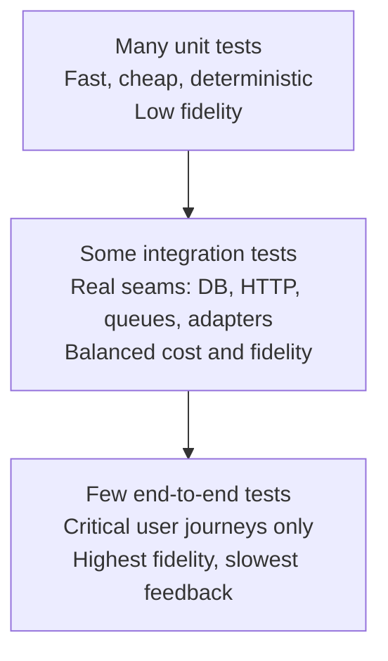
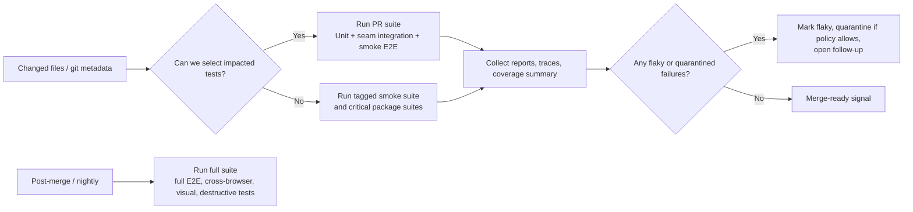
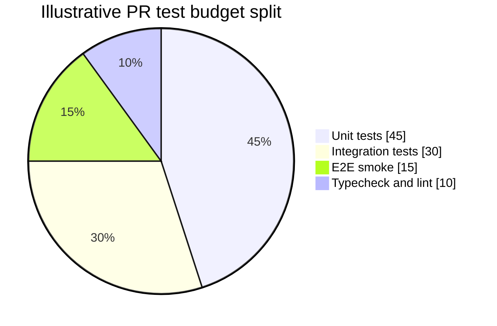

# Best Practices for Testing a Production JavaScript and TypeScript Codebase

## Executive summary

For most production JavaScript and TypeScript teams, the strongest default is a **two-runner strategy**: use **Vitest** or **Jest** (or the built-in **Node** runner for lean Node-only packages) for unit and integration tests, and keep **Playwright** for end-to-end browser flows. Vitest is the best default for modern Vite and ESM-first repos because it reuses the Vite pipeline, has strong TypeScript ergonomics, supports Jest-compatible snapshots and mocks, and provides modern filtering, projects, and coverage features. Jest remains a sound choice when you already have a large suite built around its transforms, custom reporters, watch plugins, or ecosystem conventions. The Node runner is attractive for Node-first services and libraries because it gives you a lean in-core runner with mocking, snapshots, watch mode, sharding, and rerun-failures support, but its TypeScript support is intentionally lightweight and it does not replace the richer frontend-oriented tooling offered by Jest or Vitest. Playwright should normally remain your browser-fidelity runner, not your primary unit-test runner. citeturn8view0turn8view1turn8view4turn8view5turn5view6turn5view7turn31search12turn19view0

At the portfolio level, treat the **test pyramid as a heuristic, not a quota**. The most durable suites put **most assertions in fast unit and seam-level integration tests**, and keep a **small, business-critical E2E layer** for flows that truly require a browser or a deployed stack. entity["people","Martin Fowler","software author"] argues that debates about fixed percentages are less important than whether tests are expressive, quick, reliable, and useful, while entity["organization","Google","technology company"]’s recent SMURF model sharpens the trade-off: small tests win on speed, maintainability, utilization, and reliability; broader tests win on fidelity. That is the right lens for production systems. citeturn35view0turn36view0turn5view16

The practical implication is straightforward: **mock selectively, not reflexively**; use **real dependencies or containerized ones** at important seams; treat **coverage as a signal, not proof**; keep snapshots **small and reviewable**; design for **isolation and determinism first**; and make CI enforce **runtime budgets, artifact quality, and flake visibility**. Recent large-scale CI observations from entity["company","Trunk","developer tools company"] reinforce that flaky tests should be prioritized by developer impact and often quarantined rather than silently ignored or permanently disabled. citeturn10view0turn5view13turn12view1turn5view17turn27view0

## Framework selection

The four tools in scope are not interchangeable. They overlap, but they optimize for different centers of gravity.

| Framework | Best fit | Performance profile | TypeScript support | Mocking and snapshot support | Migration and ecosystem notes | Primary sources |
|---|---|---|---|---|---|---|
| **Jest** | Legacy or mixed repos, especially webpack/CommonJS suites and teams already invested in Jest-specific tooling | Worker-based parallelism and transform caching are mature; cache matters materially, and disabling it makes runs “at least two times slower” on average according to the CLI docs. Changed-file and related-test execution are built in. | TypeScript works via Babel or `ts-jest`; Babel mode transpiles only and does **not** type-check during the run. ESM support is still labeled experimental in the current docs. | Excellent mocking surface (`jest.fn`, manual mocks, class mocks), strong text snapshots, inline snapshots, property matchers, interactive snapshot review in watch mode. | Still the safest choice when migration risk is high and the suite depends on custom transforms, watch plugins, or long-standing Jest conventions. The main technical drag points in modern stacks are transform overhead and ESM friction. | citeturn8view4turn8view5turn8view6turn5view0turn5view2turn16view0turn20search0turn20search3 |
| **Vitest** | Modern Vite, ESM-first web apps, full-stack TypeScript repos, and many monorepos | Reuses the Vite resolve and transform pipeline, supports instant watch, runs files in multiple processes by default, and can use worker threads for more speed in some suites. Filtering, changed-file runs, related-tests, sharding, and projects are first-class. | Out-of-box ESM, TypeScript, and JSX support; coverage defaults to V8 and Vitest states that V8 coverage now remaps identically to Istanbul reports. | `vi.fn`, `vi.spyOn`, `vi.mock`, Jest-compatible snapshots, inline snapshots, file snapshots, visual and ARIA snapshots in browser mode. | Best default when your app already lives in Vite. Jest migration is often straightforward, but not zero-cost: globals are off by default, module-mock factories differ, and `mockReset` semantics differ from Jest. | citeturn8view0turn8view1turn5view3turn5view4turn26view0turn30view0turn17view0turn33view0turn33view1 |
| **Node built-in test runner** | Node libraries, CLIs, services, and packages where lean tooling and runtime closeness matter more than broad plugin support | Very lean: built into the runtime, supports process isolation, configurable concurrency, watch mode with affected-test reruns, sharding, and rerun-failures state. | Native TypeScript support is intentionally lightweight: stable type stripping for erasable syntax, **no type checking**, and `tsconfig`-dependent features such as path aliases/transforms are intentionally unsupported. | Built-in mocks (`mock.fn`, method/property mocks, timers, dates), snapshots, reporters, and coverage; coverage is still marked experimental in current docs. | Strong choice for Node-first code that stays close to the platform. Poor fit when you need a Jest-like DOM ecosystem, broad matcher/plugin conventions, or heavy compile-time transforms. | citeturn5view6turn5view7turn6view0turn6view1turn9view1turn9view2turn9view4turn13view0 |
| **Playwright Test** | Browser E2E, smoke suites, cross-browser confidence, and high-fidelity browser-level integration | Highest per-test cost because it drives real browsers, but mitigates that with worker parallelism, isolation by browser context, sharding, retries, tags, last-failed reruns, HTML reports, and traces. | TypeScript works out of the box, but the docs explicitly recommend running `tsc --noEmit` separately because Playwright does not serve as a type-checking step. | Network interception and API mocking, fixture system, screenshot-based visual assertions, traces with DOM snapshots, and strong post-failure artifacts. | Use it for browser truth, not as a substitute for the base of the suite. It is excellent at user-visible behavior and browser fidelity; it is too expensive to carry the full weight of unit coverage. | citeturn31search12turn8view3turn5view10turn5view11turn5view9turn19view0turn14view0turn19view1turn34search2 |

The shortest recommendation is this:

- Choose **Vitest** by default for **modern TypeScript application repos**.
- Keep or adopt **Jest** when **legacy investment, custom transforms, or coverage of existing plugins** outweigh the benefits of migration.
- Use the **Node** runner for **Node-only packages and services** that benefit from staying close to the platform.
- Use **Playwright** for **browser E2E and smoke flows** even if the rest of your suite uses another runner. citeturn8view0turn8view4turn5view6turn31search12

A subtle but important point: **separate type checking from test execution**. Jest via Babel, the Node runner’s type stripping, and Playwright all explicitly do not give you full type-checking during the run. In practice, production CI should keep `tsc --noEmit` as an independent gate. citeturn8view4turn5view7turn8view3

## Strategy across unit, integration, and end-to-end tests

A useful operational definition is:

- **Unit tests** verify a small piece of behavior in isolation: a pure function, validation rule, mapper, serializer, or a class/module with collaborators replaced where doing so materially simplifies the test.
- **Integration tests** verify meaningful seams with real collaborators: HTTP adapters with a real request pipeline, repositories against a real or containerized database, queues, filesystem layers, auth middleware, or an API client against a contract or test server.
- **End-to-end tests** verify user-critical flows through the real UI or a near-production deployment boundary. In browser systems, that usually means a real browser plus the deployed app stack or a controlled staging environment. citeturn10view0turn5view16turn28search2

There is **no authoritative universal ratio** that all teams should adopt. The strongest primary-source guidance is more nuanced: Fowler’s pyramid remains a good default heuristic, but his later writing explicitly warns against getting stuck on percentages; the recent SMURF framing from Google explains why—test types optimize for different things, and the right balance depends on your architecture, failure modes, and cost profile. The defensible default is therefore **many small tests, some seam-level integration tests, and few but intentional E2E tests**. citeturn35view0turn36view0turn5view16



The right planning question is not “what percentage of tests should be unit tests?” but rather **“where is the cheapest layer that can detect this class of defect with acceptable fidelity?”**. That produces better suites than quota chasing. citeturn36view0turn35view0

### Recommended strategy matrix

The matrix below is a recommended starting point, synthesized from the framework docs and the modern test-shape guidance above. It intentionally uses **emphasis levels rather than fixed percentages**, because fixed ratios are not well supported by authoritative sources across different architectures. citeturn36view0turn35view0turn31search12turn8view0turn5view6

| Project type | Primary runner(s) | Unit emphasis | Integration emphasis | E2E emphasis | Recommended shape |
|---|---|---:|---:|---:|---|
| Node library / SDK / CLI | Node runner or Vitest; optionally Jest if already entrenched | High | Low to Medium | Very Low | Mostly unit tests, a thin seam layer for filesystem/process/network behavior |
| Node API / microservice | Vitest or Node runner; Playwright only if browser/admin UI exists | High | Medium to High | Low | Strong repository/API/queue integration layer, few workflow E2E tests |
| SPA / SSR web app | Vitest for unit/integration, Playwright for E2E | High | Medium | Low to Medium | Component/business-logic base, API seam tests, smoke E2E for core journeys |
| Full-stack monorepo | Vitest or mixed Vitest + Node, plus Playwright | High | High | Low | Per-package unit tests, contract/seam integration, thin E2E smoke layer |
| Design system / component library | Vitest browser mode or component tests, maybe Playwright component tests | High | Medium | Very Low | Component and visual regression focus, almost no full-app E2E |
| Legacy Jest-heavy app | Jest + Playwright, migrate selectively | High | Medium | Low | Stabilize first, then reduce slow UI-style Jest tests in favor of Playwright or seam tests |

A highly effective production cadence is usually:

- **PR suite**: type-check, lint, unit tests, key seam integrations, and a **smoke-tagged E2E subset**.
- **Post-merge suite**: broader integration plus full non-destructive E2E.
- **Nightly / scheduled**: cross-browser, visual, long-running, and destructive or expensive workflows. citeturn16view0turn17view0turn17view1turn19view0turn5view9turn9view1turn13view0

## Mocking discipline

Mocking is most useful when it removes **cost, nondeterminism, or irrelevance**. It is least useful when it merely mirrors your implementation structure. The Node testing guidance is unusually clear here: unit tests may mock own code, external code, or external systems; end-to-end tests should generally not mock the system under test. At the same time, Playwright’s E2E guidance says you should **avoid testing third-party dependencies you do not control**, and instead route or fulfill those responses yourself. Those are not contradictory rules. The synthesis is: **do not mock the behavior you are trying to prove**, but **do virtualize dependencies you do not own** when they would otherwise add noise, slowness, or uncontrollable failure modes. citeturn10view0turn12view0turn34search2

Over-mocking is one of the fastest ways to create a suite that is green but untrusted. The classic failure mode is a service test that mocks the repository, the queue publisher, the cache, the clock, the random source, and an HTTP client, then asserts call order on all of them. That kind of test tends to be brittle because it leaks implementation details into the test, becomes harder to read, and gives less assurance that the real system still works. Google’s long-standing guidance against overusing mocks remains correct: excessive mocks reduce understandability, increase maintenance cost, and drift away from real behavior. citeturn28search10turn10view0

The best rule set in practice is this:

- **Mock pure edges, not domain truth.** Mock clocks, randomness, outbound email/SMS, third-party HTTP, and costly infrastructure when the purpose of the test is not to validate those systems. citeturn10view0turn22search0turn12view0
- **Prefer real collaborators at important seams.** Use a real parser, serializer, repository, message broker, or DB in integration tests when those interactions are where production bugs actually occur. Google’s SMURF framing calls this the fidelity trade-off directly. citeturn36view0turn12view1
- **Use contract tests for service boundaries.** Pact’s guidance is especially important: contract tests should exercise the **actual consumer code**, not a generic HTTP client divorced from that code path, otherwise you can validate the contract and still miss a real runtime failure. citeturn5view14turn12view2
- **Use service virtualization when fidelity is unnecessary but stability matters.** For browser tests, intercept third-party requests with Playwright’s network API rather than depending on uncontrolled external services. citeturn12view0turn34search2
- **Prefer fakes or factories over elaborate mock choreography.** An in-memory fake or stateful fixture often yields a more truthful and more legible test than six stubs and a sequence of expectations. citeturn10view0turn28search10

A practical decision tree works well:

- If the dependency is **yours and cheap**, keep it real.
- If it is **yours and expensive**, move one layer down or containerize it.
- If it is **external and unstable**, virtualize it.
- If the risk is **schema or protocol drift**, add contract tests.
- If the risk is **user-visible browser behavior**, use Playwright, not mocks. citeturn36view0turn12view0turn5view14turn12view1

## Coverage and snapshot testing

Coverage is useful, but only when treated as **evidence of unexplored code paths**, not as a certification of quality. Google’s coverage guidance is explicit: high coverage does not guarantee high-quality tests, and pushing toward 100% can create a false sense of security and technical debt from low-value tests. Coverage tells you that code executed, not that the right assertions were made. citeturn5view13

That leads to a better coverage policy for production codebases:

- Set **baseline thresholds** that reflect current reality and raise them deliberately.
- Use **branch coverage** in logic-heavy code, not just line coverage.
- Include **uncovered source files** in the report, otherwise you only measure code that happened to run.
- Apply **stricter thresholds to riskier directories** rather than enforcing the same number everywhere.
- For legacy modules, consider **negative uncovered budgets** instead of arbitrary percentages.
- Track **changed-code coverage** on PRs and broader coverage post-merge. citeturn5view1turn30view0turn23view2turn17view1

Jest and Vitest both support sensible thresholding strategies. Jest supports global, glob, directory, and file-path thresholds, including negative thresholds that cap uncovered entities. Vitest likewise supports positive and negative thresholds, per-file checks, and glob-specific thresholds, with the important caveat that its glob-threshold behavior differs from Jest’s. citeturn5view1turn30view0

A sensible set of metrics to track is:

- **Coverage by lines and branches** for core packages.
- **Changed-code coverage** on PRs where your runner or CI tooling supports it.
- **Flake rate**, **retry rate**, and **quarantine count**.
- **Median and p95 runtime per suite layer**.
- **Snapshot count** and **average snapshot size** so snapshot sprawl becomes visible. citeturn17view1turn14view0turn5view17turn27view0

A minimal **Vitest** coverage setup that reflects these practices looks like this:

```ts
// vitest.config.ts
import { defineConfig } from 'vitest/config';

export default defineConfig({
  test: {
    globals: false,
    isolate: true,
    coverage: {
      provider: 'v8',
      include: ['src/**/*.{ts,tsx}'],
      exclude: ['src/generated/**', '**/*.d.ts'],
      reporter: ['text-summary', 'html', 'lcov'],
      reportOnFailure: true,
      thresholds: {
        lines: 85,
        functions: 85,
        statements: 85,
        branches: 80,
        'src/domain/**': {
          lines: 90,
          branches: 90,
        },
      },
    },
  },
});
```

Snapshot testing deserves much tighter scope than most suites give it. The docs for both Jest and Vitest support the right mitigations, and in practice the pitfalls are consistent:

- **Broad snapshots are review-hostile.** Large serialized trees or object dumps create habit-forming “update snapshot” behavior.
- **Nondeterministic fields make snapshots noisy.** IDs, dates, random values, ordering, and concurrent writes can break them.
- **Snapshots do not replace behavioral assertions.** Even Jest’s docs are explicit that snapshot testing is only one assertion style and should not replace more targeted tests.
- **Text snapshots are not visual regression tests.** If the risk is pixel output, use screenshot-based or visual comparison tooling instead. citeturn25view3turn25view0turn26view0

The right mitigations are equally clear:

- Prefer **small inline snapshots** for short structured values.
- Use **property matchers** for nondeterministic fields.
- Treat snapshots as **code under review**, committed alongside implementation changes.
- Fail CI on unreviewed snapshot changes; both Jest and Vitest already avoid auto-writing snapshots in CI-style flows.
- Use **file snapshots** or **visual assertions** when the artifact is a real file or rendered UI, not a small object. citeturn25view0turn25view1turn25view2turn26view0

A focused snapshot pattern looks like this:

```ts
import { expect, test } from 'vitest';

test('serializes the API response shape', () => {
  const result = {
    id: crypto.randomUUID(),
    createdAt: new Date().toISOString(),
    status: 'ok',
    featureFlags: ['billing-v2'],
  };

  expect(result).toMatchInlineSnapshot(
    {
      id: expect.any(String),
      createdAt: expect.any(String),
    },
    `
    {
      "createdAt": Any<String>,
      "featureFlags": [
        "billing-v2",
      ],
      "id": Any<String>,
      "status": "ok",
    }
    `,
  );
});
```

## Isolation, flakiness, and CI runtime

Most flakiness comes from one of a few root causes: **shared mutable state, time, randomness, network dependencies, async work that outlives the test, resource contention, fragile selectors, and parallelism assumptions**. The Node runner explicitly documents “extraneous asynchronous activity” that survives past test completion; Google’s flakiness guidance emphasizes the full environment stack, from the test itself to the SUT, dependencies, OS, and hardware; and Playwright’s docs repeatedly reinforce that isolation and resilient locators are central to reliable browser tests. citeturn29view0turn28search6turn5view10turn29view3turn34search2

The strongest anti-flake practices are mechanical, not philosophical:

- **Each test owns its state.** Fresh browser context, fresh data, no order dependencies. citeturn5view10turn34search2
- **Freeze or inject time and randomness.** Use fake timers or explicit clock sources. citeturn22search0
- **Avoid shared databases or records unless you can namespace and clean them deterministically.** citeturn12view0turn36view0
- **Use resilient locators tied to user-visible semantics, not CSS structure.** citeturn14view1turn34search2
- **Design tests to survive parallelism.** Playwright’s worker model assumes tests are independent; serial mode is discouraged unless you truly have no alternative. Vitest also isolates each file by default and warns that disabling isolation trades correctness for speed. citeturn14view0turn5view11turn8view1turn24search13
- **Collect failure artifacts that shorten diagnosis.** Trace files, HTML reports, JSON reports, focused diffs. citeturn5view8turn19view1turn31search4turn15search10

Playwright’s retry model is particularly instructive for broader suite design: it classifies outcomes as **passed**, **flaky**, or **failed**, and restarts the worker process when a test fails so contamination does not spread. That is not a license to ignore flakes; it is a good pattern for making flakes observable instead of ambiguous. citeturn14view0

A test suite becomes **trusted** when it has the following properties:

- **Fast enough to run during development**, not just in nightly CI.
- **Deterministic**: order-independent, time-controlled, and isolated.
- **Readable on failure**: precise assertions, focused snapshots, and good artifacts.
- **Maintainable setup**: fixtures encapsulate lifecycle; factories provide cheap data shapes.
- **Appropriate fidelity**: browser only when browser truth matters; real services when seam truth matters.
- **Low false-positive rate** and an explicit process for retry, quarantine, and repair.
- **Clear review culture** around snapshots, fixtures, and helper abstractions. citeturn36view0turn34search2turn34search3turn5view17turn27view0

A good CI design separates **selection**, **execution**, and **artifact review**:



On runtime budgets, there is no universally correct number, but the optimization strategy is very clear:

- **Use impacted-test selection** where possible: Jest `-o`, `--changedSince`, and `--findRelatedTests`; Vitest `related` and `--changed`; Playwright tags, file/title filters, projects, and `--last-failed`; Node rerun-failures and sharding support for horizontal execution. citeturn16view0turn17view0turn17view1turn19view0turn13view0turn9view1
- **Shard expensive suites**: Playwright and Node both support sharding; Vitest does as well. citeturn5view9turn9view1turn17view1
- **Exploit caches** rather than fighting them**.** Jest’s docs are explicit that disabling cache is materially slower. citeturn16view0
- **Split smoke from full suites** and enforce tags or projects for PR-time E2E. citeturn13view3turn13view2turn19view0
- **Run traces only where they buy the most value.** Playwright recommends first-retry tracing on CI, not always-on tracing, because it is performance-heavy. citeturn5view8turn32search2
- **Quarantine known flakes** instead of normalizing developer pain. Trunk’s large CI analysis argues for prioritizing the flaky tests that block the most PRs first. citeturn5view17turn27view0

An illustrative **PR-stage time distribution** often works better than a single wall-clock target:



For browser E2E, a production-oriented **Playwright** config often looks like this:

```ts
// playwright.config.ts
import { defineConfig, devices } from '@playwright/test';

export default defineConfig({
  testDir: './e2e',
  fullyParallel: true,
  forbidOnly: !!process.env.CI,
  retries: process.env.CI ? 2 : 0,
  workers: process.env.CI ? 2 : undefined,
  reporter: process.env.CI
    ? [['dot'], ['json', { outputFile: 'playwright-results.json' }], ['html', { open: 'never' }]]
    : 'list',
  use: {
    baseURL: process.env.BASE_URL ?? 'http://127.0.0.1:3000',
    trace: 'on-first-retry',
    screenshot: 'only-on-failure',
    video: 'off',
  },
  grepInvert: /@quarantine/,
  projects: [
    { name: 'chromium', use: { ...devices['Desktop Chrome'] } },
    { name: 'smoke', grep: /@smoke/, use: { ...devices['Desktop Chrome'] } },
  ],
});
```

## Fixtures, factories, and real services

The right test-data strategy is layered.

- **Factories** are best for **cheap, composable data shapes**. They keep tests terse and avoid brittle fixture files.
- **Fixtures** are best for **lifecycle-managed resources** such as authenticated browsers, seeded repositories, temporary directories, and service clients.
- **Real services** are best when the boundary itself is the risk: SQL behavior, migrations, locking, retry semantics, transaction boundaries, queue delivery, or serialization quirks.
- **Virtualized services** are best when the dependency is external or low-value for the purpose of the test. citeturn34search3turn15search9turn12view1turn12view0turn5view14turn36view0

A practical summary is:

| Approach | Strengths | Main risk | Use when |
|---|---|---|---|
| Factory | Fast, local, readable, composable | Can drift from real persistence constraints | Unit tests and many integration setups |
| Fixture | Encapsulates setup/teardown and cross-test reuse | Can become magical or overly global | Shared lifecycles, auth, temp resources, page objects |
| File fixture | Useful for stable large inputs/outputs | Harder to maintain if overused | Binary payloads, parsers, golden files |
| Virtualized external service | Stable and cheap | Can diverge from real protocol behavior | Third-party APIs, rate-limited providers |
| Contract test | Strong at API/schema drift | Narrow scope if over-relied upon | Internal/external service boundaries |
| Real service or containerized dependency | Highest seam fidelity | Slowest and operationally heavier | DB, queue, cache, search, migration, transaction behavior |

Recent primary guidance strongly favors **realistic but controlled** integration environments. Google’s SMURF model directly describes why: fidelity matters, especially at critical seams. Testcontainers then gives a pragmatic mechanism for getting that fidelity without making every developer manage bespoke infrastructure, using lightweight throwaway service instances in Docker. citeturn36view0turn12view1

In daily engineering terms:

- Use **factories** for objects.
- Use **fixtures** for lifecycles.
- Use **containers or real services** for seam truth.
- Use **virtualization** for dependencies you do not control.
- Use **contracts** when the failure mode is cross-service drift. citeturn34search3turn5view14turn12view1turn12view0

A simple factory pattern in TypeScript should be **override-friendly, deterministic where needed, and obvious**:

```ts
// test/factories/user.ts
type User = {
  id: string;
  email: string;
  role: 'member' | 'admin';
  createdAt: string;
};

export function makeUser(overrides: Partial<User> = {}): User {
  const seed = Date.now().toString(36);
  return {
    id: `user_${seed}`,
    email: `user_${seed}@example.test`,
    role: 'member',
    createdAt: new Date('2025-01-01T00:00:00.000Z').toISOString(),
    ...overrides,
  };
}
```

That pattern avoids hard-coded global fixtures, keeps setup local, and makes the test intent obvious.

## Migration checklist

Adopting these practices works best as a **sequence**, not a rewrite.

A disciplined migration plan is:

- **Inventory the current suite** by runtime, flake rate, ownership, and defect-finding value.
- **Choose runner topology deliberately**: one runner for unit/integration, Playwright for browser E2E; do not begin by migrating both layers at once.
- **Normalize naming and taxonomy**: `*.unit.test.ts`, `*.int.test.ts`, `*.e2e.spec.ts`, plus tags such as `@smoke`, `@slow`, `@quarantine`.
- **Fix isolation before tightening gates**. A fast flaky suite is still untrusted.
- **Introduce factories and lifecycle fixtures** before adding more tests; otherwise setup debt compounds.
- **Baseline coverage**, include uncovered source files, then set realistic thresholds and raise them gradually.
- **Shrink broad snapshots** into inline, file, or visual snapshots with explicit review expectations.
- **Split CI into PR smoke vs full post-merge coverage**.
- **Attach artifacts by default** for expensive suites: HTML reports, JSON outputs, and Playwright traces on retry.
- **Assign ownership** for shared fixtures, E2E domains, and quarantined tests so they do not become nobody’s problem. citeturn36view0turn34search3turn5view17turn27view0turn5view8turn19view1

If you are moving **from Jest to Vitest**, the highest-value audit points are the ones the Vitest migration guide itself flags: globals are off by default, module-mock factories differ, and `mockReset` behavior differs. Also recheck assumptions about parallel execution and DOM cleanup when globals are disabled. Do this package by package, with dual-run validation on the most business-critical packages before cutting over completely. citeturn33view0turn33view1turn33view4

If you are moving **from Jest or Vitest to the Node runner**, scope that move narrowly at first: Node-only libraries, CLIs, or backend packages with minimal custom environment needs. The main migration cost is not the runner executable; it is the API and environment shift. You will need to replace Jest/Vitest-specific matchers and helpers, and you must ensure that your TypeScript stays within Node’s supported “erasable syntax” model or introduce an explicit loader/build step. citeturn5view6turn5view7turn10view1

If you are **staying on Jest**, that is still a defensible decision. The modernization path is then to reduce avoidable pain rather than swap tools: keep cache enabled, use changed-file and related-test execution, move browser-fidelity tests into Playwright, and treat ESM/TypeScript configuration as engineering work to be kept explicit rather than magical. citeturn16view0turn8view4turn8view5turn31search12

The most important migration principle is the same regardless of tool: **raise trust before you raise strictness**. In production suites, the trusted test suite is not the one with the most tests or the highest coverage; it is the one that developers believe when it fails. citeturn35view0turn36view0turn5view17