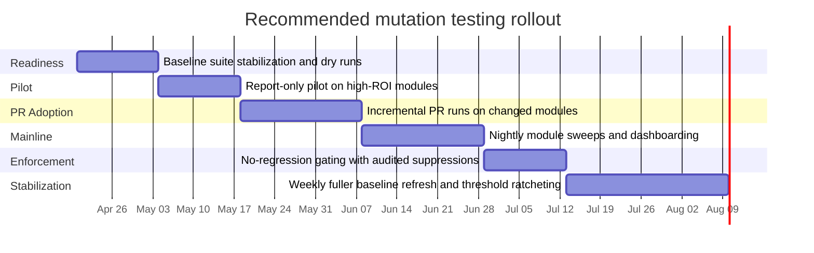

# Mutation Testing in Production Codebases

## Executive summary

Mutation testing is best used as a **test-suite sensitivity metric**: it asks whether your tests fail when production code is changed by small, systematic mutations. That makes it materially stronger than line or branch coverage for telling you whether executed code is *meaningfully checked*, not merely visited. It is not, however, a proof of correctness, a proof of requirement completeness, or a guarantee of real-fault detection. The research literature and industrial evidence are encouraging but explicitly incomplete: equivalent mutants exist, some real faults are not coupled to common mutation operators, and developer value collapses when tools surface too many mutants or run too slowly. citeturn19view3turn7view0turn17view0turn18view1

The practical conclusion is straightforward: **introduce mutation testing only after you already have a fast, deterministic unit-test layer**, then start in a small set of high-ROI modules and keep the first phase non-blocking. The most effective production pattern is usually **incremental on pull requests, fuller scans off the critical path**: mutate changed files or changed modules on PRs, run deeper module sweeps nightly, and refresh whole-repo baselines on a schedule. Modern tools support important runtime controls such as selective test execution, concurrency, incremental history files, and fine-grained scoping, but the controls differ a lot by ecosystem. citeturn11view0turn2view3turn2view4turn15view3turn12view2

For governance, the right unit of work is **not the repo-wide score** but the **surviving mutant**. Each survivor should be triaged into one of a few buckets: genuine test gap, spec gap, dead code, equivalent mutant, or intentionally unproductive mutant. Suppressions are sometimes justified, but they should be narrow, reviewable, and documented with owner, rationale, and expiry. Thresholds should be set **per module and by trend**, not as a single global vanity target. A good mature policy is usually “no regression on touched modules, plus periodic full-run trend monitoring,” with guardrails that audit exclusions and discourage implementation-shaped test overfitting. citeturn4view0turn8view0turn21view0turn20view2turn17view2

**Bottom line:** mutation testing is high ROI for domain logic that already has strong, fast unit tests; medium ROI for mixed modules with some testability constraints; and low or negative ROI for flaky, integration-heavy, generated, or observability-only code. **Confidence: high.**

## What mutation testing measures and what it does not

| Strong signal about | Weak or no signal about |
|---|---|
| Whether tests detect the classes of faults represented by the chosen mutators | Whether the product is “bug-free” in any global sense |
| Whether coverage is behaviorally meaningful rather than accidental | Whether requirements and specifications are correct or complete |
| Whether a changed line or module needs stronger assertions or sharper oracles | Whether non-functional properties such as performance, latency, or usability are protected, unless tests explicitly assert them |
| Whether some code lacks relevant tests at all | Whether a surviving mutant is equivalent, dead code, or an intentional behavior without human triage |
| Whether the current test suite reacts to selected first-order perturbations | Whether the suite will catch all real fault classes, especially ones not represented by traditional mutators |

This framing follows directly from the literature and the tool docs. Mutation score is defined as the ratio of killed mutants to non-equivalent mutants, and mutation testing is explicitly designed to assess the effectiveness of a test set at detecting faults represented by its mutation operators. That is why it is stronger than plain line coverage, which PIT notes can only show which code ran and cannot show whether tests would detect faults in executed code. The same literature is equally clear that equivalent mutants are unavoidable in practice and that complete automatic detection of them is impossible, so the score is useful but never absolute. citeturn19view2turn19view3turn7view0turn4view0

The theoretical foundation is also important for interpreting results correctly. The classic “coupling effect” argument is that tests strong enough to kill simple mutants also tend to detect many more complex faults; that is the historical reason first-order mutation can still be useful in production. But usefulness is not universality: the more recent industrial evidence still reports meaningful limits, including the finding that roughly 27% of real faults in prior studies were not coupled with commonly generated mutants. In other words, mutation testing is best treated as a **high-value proxy for test adequacy**, not a complete oracle of software quality. citeturn19view1turn18view1

A rigorous production posture, therefore, is to use mutation testing alongside—not instead of—ordinary test health signals. The most informative bundle is usually **mutation score or live-mutant count, ordinary coverage, flake rate, and escaped-defect review**. Mutation testing tells you whether tests react to controlled semantic perturbations; coverage tells you reach; defect review tells you what the chosen mutators are still missing. citeturn7view0turn18view1

## When to introduce it and how to scope it

The ideal time to introduce mutation testing is **after your team has a stable unit-test layer, but before coverage vanity or flaky integration suites have become the de facto quality story**. In practice, that means four readiness conditions: the test suite passes deterministically, unit tests can run independently and in random order when selective execution is used, module boundaries are clear enough to scope mutation targets, and the baseline suite is already fast enough that repetition will not destroy feedback loops. Stryker’s per-test coverage mode explicitly requires tests to run independently and in random order, and PIT’s dry-run mode exists precisely to help teams iron out test harness problems before paying the full mutation cost. Mutmut makes the same point from another angle: it warns that “incidentally tested” functions lead to slow mutation runs and poor test suites. citeturn11view0turn20view4turn6view1

Start where the economics are best. The highest-ROI early targets are usually **pure or nearly pure business logic**: calculations, validators, parsers, authorization rules, state machines, pricing, allocation logic, normalization rules, and small service methods with narrow dependency fan-out and dedicated unit tests. The lowest-ROI early targets are usually code whose semantics are either trivial, noisy, or dominated by integration context: generated files, configuration shells, migrations, logging and telemetry, static initializers, thin transport wrappers, DTO-only modules, and code that is exercised mainly by slow end-to-end tests. Tool documentation reinforces this break: Stryker says mutation scope should be production code rather than test files, exposes exact file and line-range scoping, and warns that static mutants can force all tests to run; PIT exposes `targetClasses`, `excludedClasses`, and logging-call avoidance; mutmut supports path scoping, file exclusion, and narrow whitelisting for cases like version strings or performance-only `break`/`continue` changes. citeturn10view3turn20view2turn8view4turn8view5turn8view6turn6view3turn21view0

A practical scoping heuristic is to score candidate modules across five dimensions: **business criticality, change frequency, unit-test speed, determinism, and oracle clarity**. If a module is high on the first two and acceptable on the last three, it belongs in the pilot. If it is low on criticality and high on incidental complexity, leave it out until the program is mature. A simple internal rubric that works well in practice is `ROI = criticality × change frequency × test determinism ÷ estimated mutation cost`. Use that rubric to rank modules and start with the top quartile, not the entire repo.

There are also scenarios where mutation testing is low ROI or actively harmful. If your fastest tests are still broad integration tests, if the baseline suite is flaky, if a module’s observable behavior depends on timing or randomness, or if the dominant output is logging/telemetry rather than correctness, mutation testing often teaches the wrong lesson: people either suppress broadly or write brittle tests that mirror implementation details. That risk is not hypothetical. The industrial literature explicitly notes that surfacing too many mutants is visually daunting and harms developer perception, and it also notes that some mutants “can but should not” be detected because doing so would encourage ineffective tests that hurt maintainability and test time. citeturn17view3turn18view1

## CI integration patterns, incremental mutation, and runtime control

For most production teams, the best execution model is **layered** rather than uniform. Pull requests should get **small-scope, incremental feedback**; mainline should get **deeper module sweeps**; and scheduled jobs should periodically refresh **full or near-full baselines**. This recommendation is strongly supported by the current tooling. StrykerJS can run in incremental mode and only mutation-test changed code while still producing a full report; PIT’s incremental analysis stores history to infer unchanged results; mutmut remembers prior work and can restart from where it left off; Cosmic Ray scales mainly as a batch system through worker distribution rather than as a tight PR loop. citeturn2view3turn2view4turn15view3turn12view0turn12view2

| Run type | Scope | Suggested cadence | Gate style | Why |
|---|---|---|---|---|
| Local developer run | One file, function, or module | On demand | None | Best place to reproduce and fix survivors without CI pressure |
| PR incremental run | Changed files, changed modules, or changed lines | Every PR | Report-only at first; later no-regression on touched scope | Keeps feedback near code review and bounds runtime |
| Nightly module sweep | Critical modules only | Nightly | Soft gate or dashboard alert | Refreshes deeper signal without blocking every PR |
| Full or near-full repo run | Whole repo or rotating slices | Weekly or scheduled | Trend monitoring, not day-one hard fail | Catches drift, stale histories, and exclusion gaming |

Runtime control is where production programs succeed or fail. The most important lever is **selective test execution**. Stryker’s default `coverageAnalysis: perTest` lets it run only the tests covering a given mutant and distinguish `Survived` from `NoCoverage`; PIT supports explicit target scoping, thread control, and incremental history; mutmut narrows execution with stack-depth control and optional coverage filtering of lines to mutate; Cosmic Ray’s scaling story is horizontal workers through its HTTP distributor. The unifying lesson is simple: **do not repeatedly run the entire relevant test universe for every mutant unless you have no alternative**. citeturn11view0turn8view2turn8view4turn6view1turn6view4turn12view0turn12view2

For incremental mutation on PRs, there are three good patterns. The safest is **per-module incremental**: mutate only modules directly touched by the change and run their dedicated unit tests. The fastest is **per-line or per-range mutation**: Stryker explicitly supports mutation ranges, and research on industrial continuous mutation found that surfacing one representative mutant per line is often enough because multiple mutants on the same line usually share the same fate. The broadest is **history-based incremental**: both Stryker and PIT preserve prior results and skip logically inferable work. My recommendation is to combine them: use changed-module or changed-line PR runs, then scheduled full or rotating runs to correct the blind spots of incremental inference. citeturn10view3turn2view3turn2view4turn18view1

Sampling can also be legitimate, but it must be framed honestly. The survey literature reports that random sampling of about 10% of mutants can retain much of the effectiveness of full sets, and industrial work supports representative selection rather than flooding developers with all possible mutants. The right way to operationalize this is not “pretend a sample is the truth,” but rather: **sample on the critical path, full or broader scans off the critical path**. If you sample in PRs, maintain regular fuller scans so the sample does not become the metric you optimize against. citeturn4view2turn18view1

Parallelization and timeouts deserve their own policy. Stryker defaults concurrency to roughly `n-1` logical cores and exposes timeout controls for infinite-loop risk. PIT exposes explicit thread counts, auto-thread configuration, timeout factors, and timeout constants. Cosmic Ray’s local mode runs one mutation at a time, while its HTTP distributor can fan work out to multiple workers that each hold their own copy of the code under test. In practice, teams should treat parallelism as the **default**, and serial execution as a debugging mode. Timeout spikes and suspicious mutants should be counted as test-suite health work, not quietly buried as mutation noise. citeturn10view2turn10view8turn8view2turn20view3turn12view1turn12view2

## Interpreting surviving mutants and building a triage workflow

A surviving mutant is not a verdict; it is a **diagnostic artifact**. The first distinction to make is between **`NoCoverage` or equivalent “never exercised” outcomes** and true survivors that were exercised by tests and still passed. Stryker’s docs make that distinction explicit: selective coverage analysis can report `NoCoverage` separately from `Survived`, which is a major interpretive improvement because it separates “nobody ran here” from “somebody ran here but nobody checked the behavior.” citeturn20view0turn20view1

A robust production triage workflow is:

1. **Reproduce narrowly.** Re-run a single module, file, or mutant locally. For Stryker, drop concurrency to `1` and use test-runner debug args if needed; for mutmut, the browse/apply workflow exists precisely so developers can inspect and retry a survivor in isolation. citeturn10view1turn15view3  
2. **Recheck baseline stability.** If tests are flaky without mutation, stop and fix that first. For PIT, dry-run mode is useful during setup to surface harness issues before running mutant executions; for selective Python workflows, mutmut explicitly offers a “rerun all” safeguard because subset selection can miss a killing test. citeturn20view4turn20view5  
3. **Classify the survivor.** The useful buckets are: weak/missing assertion, wrong test scope, spec gap, equivalent mutant, dead code, or harness pathology such as timeout or nondeterminism. Equivalent mutants must remain a first-class category because the literature treats them as an inherent barrier, not a corner case. citeturn4view0turn19view3  
4. **Act on the classification.** Missing assertion means improve the test; wrong scope means move or add more local unit tests; spec gap means decide whether the mutant exposed an underspecified behavior; dead code means delete or quarantine; equivalent or intentionally unproductive mutants mean suppress narrowly with rationale rather than gaming the score.  
5. **Verify the fix twice.** First rerun the mutant-scoped workflow, then rerun the broader relevant suite so the new test does not only “kill the mutant” but also remain stable in normal execution.

The hardest judgment call is telling **test quality gaps** from **spec gaps**. A good practical rule is this: if the mutant changes externally meaningful behavior that users or downstream systems could reasonably observe, treat it as a testing or product-spec problem; if killing it would require asserting on incidental internal details, performance micro-behavior, or observability-only statements, treat it as a likely unproductive mutant and review for suppression instead. The industrial evidence is encouraging here—tests written in response to surfaced mutants tended to improve later mutant survivability too—but it does not justify writing arbitrary implementation-shaped tests. citeturn17view1turn17view2turn18view1

Flaky tests deserve explicit policy. Mutation tools necessarily use timeout heuristics because mutated code can create infinite loops or massive slowdowns. Stryker and PIT both expose timeout tuning; mutmut also exposes timeout constants and multipliers in its unstable configs. A mutant that “survives” only under unstable timing is not a trustworthy adequacy signal; it is evidence that the underlying suite is too noisy for mutation gating. In mature programs, suspicious or flaky outcomes should be triaged under a separate “suite stability” queue and excluded from hard score gates until stabilized. citeturn10view8turn20view3turn21view0turn15view1

## Legitimate reasons to ignore or mark mutants and how to track them

Three suppression categories are clearly legitimate. The first is the **equivalent mutant**, where the mutant is behaviorally indistinguishable from the original program for all inputs. The second is **dead or intentionally unreachable code**, where the right fix is deletion, not more testing. The third is the **intentionally unproductive mutant**: a mutation whose detection would force brittle, low-value tests around non-correctness details such as version strings, logging, telemetry, or performance-only branch choices. The literature and the current tooling both recognize these categories, even if they label them differently. citeturn4view0turn18view1turn21view0turn8view6

Current tools give you several suppression mechanisms, and that diversity matters operationally. Stryker lets you scope mutation to exact files or line ranges, ignore static mutants that otherwise force all tests, and filter with checker plugins such as TypeScript validation. PIT lets you target and exclude classes or methods, avoid mutating calls to common logging packages, and configure class-level limits. Mutmut supports line-level pragmas, block suppression, region suppression, path scoping, file exclusions, and narrow whitelisting examples such as version strings. The best practice is to prefer the **narrowest possible mechanism**: line, block, or method first; file or whole-module last. citeturn10view3turn20view2turn10view4turn8view5turn8view6turn21view0turn21view1turn21view2

Suppressions should never be an invisible side channel. A good documentation template keeps, at minimum, the mutant location, mutator/operator, reason category, rationale, owner, creation date, and expiry or review date. If your tool supports inline suppression, pair it with a central ledger in the repo so suppressions can be audited over time. For example:

```yaml
- location: src/pricing/rules.ts:148
  operator: EqualityOperator
  reason: equivalent
  rationale: "Mutation changes syntactic form but not reachable behavior for any valid input domain."
  owner: team-core-checkout
  created: 2026-04-18
  review_by: 2026-07-01
```

The governance rule that prevents abuse is simple: **every suppression must have an owner and an expiry**, and any PR that adds a broad module exclusion should trigger the same level of review scrutiny as deleting tests. If you do not make suppressions reviewable, threshold gaming becomes inevitable.

## Setting mutation-score thresholds without gaming the metric

Thresholds are where many mutation programs become performative. PIT’s own docs explicitly warn that equivalent mutations may be present and that thresholds therefore require careful thought. Stryker’s configuration design points in the same direction: its `high` and `low` bands are informational, and the build-breaking `break` threshold can be left unset. Those defaults are a useful signal from the tools themselves: **hard failure should be earned, not assumed**. citeturn8view0turn10view0turn10view1

The best threshold policies are **per module, trend-aware, and sample-size aware**. A rigorous rollout usually looks like this:

| Stage | Recommended gate | Why |
|---|---|---|
| Pilot | Report only | Establish baselines and find noise before introducing pressure |
| Early enforcement | No regression on touched modules only | Prevents backsliding without punishing historically weak but improving modules |
| Mature enforcement | Per-module floor plus no-regression PR gate | Reflects different attainable ceilings across modules and mutator fit |
| Ongoing governance | Audit exclusions, suppressions, flake rate, and runtime alongside score | Prevents “winning by hiding work” |

For PR-scoped runs, use a **minimum sample rule**. If the run exercised only a small number of scored mutants—say fewer than 20 to 30—treat the result as informational rather than as a hard gate. Once the sample is larger, use a confidence-aware rule instead of a raw percentage. A sound pattern is:

- Let `k` be killed mutants and `n` be scored mutants in the PR scope.  
- Compute the **Wilson lower bound** for the kill rate.  
- Fail only if `n` is above your minimum sample and the lower bound falls below the touched module’s rolling baseline by a chosen margin.

This prevents tiny PRs from failing on one or two noisy survivors and makes the gate statistically defensible.

For full or scheduled runs, derive **module floors from history**, not from aspiration. A good policy is to take the last 8 to 10 green mainline runs per module, compute the rolling median, and initially set the module floor slightly below that median. Ratchet upward only after sustained improvement over multiple runs. This is more honest than declaring “90% everywhere” because the literature is explicit about equivalent mutants and imperfect fault coupling, and the tools themselves expose module-level targeting because codebases are heterogeneous. citeturn4view0turn18view1turn8view4turn11view3

Guardrails matter as much as the threshold itself. Do **not** reward teams on mutation score alone. Review tests added to kill mutants for externally meaningful assertions. Track excluded files, suppressed mutants, and runtime alongside score. Keep periodic fuller scans so changed-line or sampled PR runs cannot be gamed by moving logic across boundaries. And do not let mutation testing substitute for defect review: the research is favorable, but it still says that some real faults are not represented by common mutants and that some difficult-to-kill mutants are simply unproductive. citeturn18view1turn17view2

## Tooling landscape

The current open-source landscape is still **ecosystem-segmented**, not unified. The practical winners are not “the best mutation tool in the abstract,” but “the best tool for your language, build system, and test harness.”

| Tool | Supported languages | Strengths | Weaknesses | Integrations and reports | Performance characteristics | Recommended use-case |
|---|---|---|---|---|---|---|
| **Stryker** | JavaScript/TypeScript, C#, Scala | Strong developer ergonomics, rich reporting, dashboard support, exact file/range scoping, per-test coverage analysis in StrykerJS, configurable thresholds | Feature parity varies across StrykerJS, Stryker.NET, and Stryker4s; command-runner mode in JS loses coverage-analysis optimization; static mutants can force all tests; checker/type settings need care | HTML/JSON/dashboard reporting; official JS runner integrations include Mocha, Jasmine, Karma, and Jest; dashboard supports repo/module/version reporting | JS docs expose incremental mode, per-test coverage selection, concurrency defaulting roughly to `n-1` cores, and optional `ignoreStatic` for load-time mutants | Best default for teams in JS/TS, and strong family option for C# or Scala when you want polished developer-facing reports and staged CI adoption. citeturn9view0turn9view2turn11view0turn10view2turn10view3turn20view2turn9view4 |
| **PIT** | Java and the JVM | Mature production orientation, strong Maven/Gradle/Ant story, good targeting and exclusion controls, dry-run onboarding, HTML/XML/CSV outputs | Incremental analysis is explicitly experimental; cross-module setups need careful configuration and can yield duplicated/undefined reporting if aggregated carelessly; threshold setting must account for equivalent mutants | Works with Maven, Gradle, Ant; outputs HTML, XML, and CSV; supports class/method targeting and exclusions | Emphasizes fast/scalable operation; exposes threads, auto-threading, history files, timeout controls, and class-level limits | Best default for Java/JVM production codebases, especially modular services or monoliths already built around Maven or Gradle. citeturn7view0turn20view4turn2view4turn8view2turn8view3turn8view4turn8view5turn20view3turn8view0 |
| **mutmut** | Python | Very developer-centric triage flow, interactive TUI, easy apply/retest workflow, incremental/resumable runs, path scoping, coverage filtering, stack-depth control | Current docs are pytest-centric; current execution model is function-focused enough that docs suggest older mutmut if you need mutation outside functions; requires fork support, so Windows users need WSL; easier to misuse on wide fan-out utility functions | Interactive terminal UI; current docs focus on default pytest discovery and mutation-specific workflow rather than centralized dashboards | Docs emphasize parallel execution, remembered prior work, knowing which tests to execute, optional covered-line mutation, and stack-depth limits to reduce incidental test relevance | Best for small-to-medium Python codebases where developer workflow and survivor triage matter more than centralized reporting polish. citeturn15view3turn15view4turn6view1turn6view3turn6view4turn21view0 |
| **Cosmic Ray** | Python 3 | Flexible, explicit configuration model; arbitrary test commands; strong distributed execution concept through HTTP workers and session database | Less turnkey for day-to-day developer feedback; default local mode is sequential; distributed mode requires more operational plumbing and separate worker copies of the code | CLI-driven with configuration files, session database, local and HTTP distributors, flexible test-command invocation | Local execution runs one mutation at a time by default; HTTP distributor lets you scale horizontally to as many workers as you provision | Best for Python teams that want flexible orchestration, batch/distributed mutation execution, or a more research-friendly architecture than an opinionated developer UX. citeturn12view0turn12view1turn12view2 |

If you want one practical recommendation per ecosystem, it is this: **Stryker for JS/TS**, **PIT for Java/JVM**, **mutmut for Python when developer triage matters most**, and **Cosmic Ray for Python when distributed orchestration flexibility matters more than turnkey ergonomics**. There is no single, equally mature, cross-language open-source standard tool that spans all four ecosystems today; the sensible choice is to standardize your *policy* and let the actual tool vary by language. citeturn9view0turn7view0turn15view3turn12view2

## Recommended rollout plan, practical checklists, and concise CI examples

A staged rollout over roughly two to three months is usually safer than a “big bang.” That matches both the runtime realities in the tools and the industrial evidence that developer value comes from focused, ongoing exposure rather than from dumping entire mutant universes onto a team all at once. citeturn17view2turn17view3turn2view3turn2view4



A concise readiness checklist:

- [ ] Unit tests are deterministic enough that flaky failures are already exceptional.  
- [ ] At least one high-value module has fast, local unit tests with clear oracles.  
- [ ] You can name an explicit mutation scope without including tests or generated files.  
- [ ] You have a place to store reports, baselines, and suppression records.  
- [ ] The team agrees that the first phase is **report-only**, not score theater.

A concise survivor-triage checklist:

- [ ] Reproduce locally on the smallest useful scope.  
- [ ] Confirm baseline tests pass stably without mutation.  
- [ ] Classify the survivor: test gap, spec gap, equivalent, dead code, or harness issue.  
- [ ] If suppressing, document reason, owner, and expiry.  
- [ ] Re-run both narrow scope and broader relevant suite after the fix.

A concise suppression checklist:

- [ ] Is this the narrowest possible suppression?  
- [ ] Would killing this mutant require asserting on observable behavior or on implementation trivia?  
- [ ] Could the better fix be to delete dead code instead?  
- [ ] Is the rationale explicit and reviewable in the repository?  
- [ ] Is there a scheduled re-review date?

The GitHub Actions example below is intentionally conservative: it assumes Stryker is already configured in-repo with per-test coverage analysis, reporters, and thresholds, and it caches the incremental history file so PR runs stay bounded. Those capabilities are all directly supported in the Stryker docs. citeturn11view0turn2view3turn10view0turn9view4

```yaml
name: mutation-pr

on:
  pull_request:

jobs:
  stryker:
    runs-on: ubuntu-latest
    steps:
      - uses: actions/checkout@v4

      - uses: actions/setup-node@v4
        with:
          node-version: 20
          cache: npm

      - run: npm ci

      - uses: actions/cache@v4
        with:
          path: reports/stryker-incremental.json
          key: stryker-${{ runner.os }}-${{ github.base_ref }}
          restore-keys: |
            stryker-${{ runner.os }}-

      - run: npx stryker run --incremental

      - uses: actions/upload-artifact@v4
        if: always()
        with:
          name: stryker-reports
          path: reports/
```

The GitLab CI example below keeps the pipeline simple and pushes most configuration into `pom.xml`, which is usually the right place for PIT settings such as `targetClasses`, `excludedClasses`, `threads`, history files, and `mutationThreshold`. The job then becomes a thin runner plus artifact publisher. PIT’s docs support exactly that style of integration. citeturn7view0turn8view2turn8view4turn8view5turn8view0turn2view4

```yaml
stages:
  - mutation

pitest:
  image: maven:3.9-eclipse-temurin-21
  stage: mutation
  cache:
    key: maven
    paths:
      - .m2/repository
  rules:
    - if: '$CI_PIPELINE_SOURCE == "merge_request_event"'
    - if: '$CI_PIPELINE_SOURCE == "schedule"'
  script:
    - mvn -B test-compile org.pitest:pitest-maven:mutationCoverage
  artifacts:
    when: always
    paths:
      - target/pit-reports/
```

If I had to reduce the entire report to a single operating rule, it would be this: **treat mutation testing as a focused, incremental review system for the quality of important unit tests—not as a repo-wide score maximization project**. That framing aligns with the theory, the modern tooling, and the strongest available industrial evidence. citeturn19view3turn17view2turn17view3turn18view1