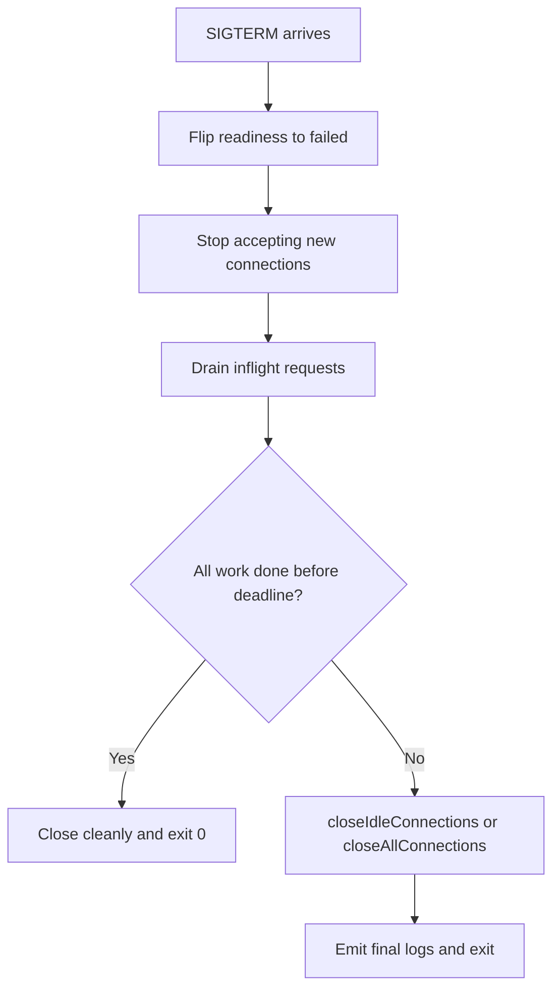

# Node.js Production Runtime Playbook

## Executive Summary

The best default for a new production Node service on April 18, 2026 is **Node 24.x Active LTS**. Use **22.x Maintenance LTS** only when you need short-term estate stability, and treat **20.x** as an urgent migration case because its end-of-life is **April 30, 2026**. Build your delivery policy around the Node release train itself: even-numbered majors ship in April, move to LTS in October, stay Active LTS for 12 months, then Maintenance for 18 months. citeturn26view1turn26view0turn26view2

At the runtime level, the high-order bits are straightforward. Prefer **one app process per container or supervised service**, scale out with the orchestrator first, add **worker threads only for CPU-bound work**, and use **cluster/PM2 cluster mode** only when you truly need multi-core fan-out inside one host. Shut down on `SIGTERM` by first failing readiness, then draining connections, then forcing closure at a deadline. Keep configuration out of code, validate it at startup, adopt feature flags through a vendor-neutral interface, run as non-root, drop capabilities, and use seccomp/AppArmor or Windows application controls around the process. For diagnostics, rely on built-in Node tooling first: heap snapshots, diagnostic reports, test runner sharding, and CLI memory flags. For observability, standardize on OpenTelemetry plus Prometheus-friendly metrics. citeturn8view5turn8view6turn23view2turn27view0turn27view1turn15view13turn17search0turn34search5turn22search10turn32search4turn21search2turn21search3turn29search3turn29search1

**Confidence:** High. The report below is mostly grounded in official Node, Kubernetes, OpenTelemetry, Prometheus, Docker, Microsoft, systemd, NGINX, AWS, and Envoy documentation.

## Release Management and Delivery

### LTS selection and upgrade cadence

Node’s release policy is regular enough that you should turn it into a standing platform rule rather than a case-by-case decision. As of today, the supported lines are: **24.x Active LTS**, **22.x Maintenance LTS**, **20.x Maintenance LTS ending on April 30, 2026**, and **25.x Current ending on June 1, 2026**. New even-numbered majors are cut each April, odd-numbered majors each October, and each even-numbered major becomes LTS after the next odd release lands. citeturn26view1turn26view2turn26view0

**Recommendation:** adopt a two-lane policy. New services start on the current **Active LTS**. Existing services may remain on the immediately previous LTS only if they already have a funded upgrade plan. Do not target a Current release for broad production use unless you explicitly need a new runtime feature and have extra test budget. This follows the release phases Node documents: Current is for new non-breaking work, Active LTS is the stable feature-bearing target, and Maintenance is mainly for critical fixes and security updates. citeturn26view1turn26view0

A practical cadence is:

| Decision | Default |
|---|---|
| New service | Current Active LTS |
| Existing service on prior LTS | Upgrade within 1–2 quarters of next Active LTS |
| Current release adoption | Only for justified feature demand |
| EOL window | Zero tolerance for remaining on line past EOL |

This table is a synthesis of Node’s published release phases and dates. citeturn26view1turn26view0

**Risk mitigation policy:** keep CI green on the production major and the next target major before you schedule the migration. Node’s built-in test runner now supports process isolation, sharding, rerun of failed tests, watch mode, and experimental coverage reporting, which makes “always-be-testing-the-next-major” feasible without adding another test runner purely for orchestration. citeturn21search0turn21search1

Concrete examples:

```bash
# Full suite on current production major
node --test

# Shard large suites in CI
node --test --test-shard=1/3
node --test --test-shard=2/3
node --test --test-shard=3/3

# Re-run only failures on subsequent attempts
node --test --test-rerun-failures=.test-state.json

# Collect coverage in CI
node --test --experimental-test-coverage
```

**Production readiness checklist**

- Standardize on Active LTS for all new services.
- Keep an inventory of runtime majors and their EOL dates.
- Run CI against both current prod major and next target major.
- Block releases when you are inside the last 90 days before Node EOL.
- Budget one platform upgrade sprint per year.

### Testing, CI/CD, canary, blue-green, and rollback

For delivery, treat a Node upgrade exactly like an application change. The safe order is: **test matrix → shadow or canary → progressive rollout → rollback path validated in advance**. Kubernetes Deployments already support rolling updates, rollout pause/resume, and rollback through `kubectl rollout undo`. Plain Deployments are enough for standard rolling replacement; advanced **blue-green** and **canary** strategies are better handled by progressive-delivery tooling such as Argo Rollouts. Argo’s own docs note that blue-green is simpler without a traffic manager, while advanced canaries usually assume finer traffic control. citeturn24search0turn24search1turn24search2turn24search6turn24search8turn25search1turn25search3turn25search9

**Recommendation:** use these release patterns:

- **Rolling update** for routine patch/minor releases and low-risk runtime upgrades.
- **Blue-green** for major Node jumps when startup behavior, module loading, or native addon compatibility may differ.
- **Canary** when you need production traffic validation before broad cutover.
- **Immediate rollback** if latency, error rate, RSS growth, or restart rate regresses.

Concrete commands:

```bash
kubectl rollout status deployment/my-service --timeout=10m
kubectl rollout pause deployment/my-service
kubectl rollout resume deployment/my-service
kubectl rollout undo deployment/my-service
```

A good CI/CD gate set for Node upgrades is:

1. unit/integration tests on old and new Node majors  
2. smoke test of startup and health endpoints  
3. dependency install/build test  
4. memory smoke under representative traffic  
5. canary analysis on latency, error rate, and restart count

**Trade-off summary**

| Strategy | Best use | Strength | Cost |
|---|---|---|---|
| Rolling update | normal releases | simple, native in Kubernetes | weaker isolation from bad startup/runtime changes |
| Blue-green | major runtime changes | instant cutover and easier rollback | double capacity during switch |
| Canary | uncertain behavioral changes | uses real traffic to lower risk | operational complexity and analysis burden |

This comparison synthesizes Kubernetes rollout behavior and Argo Rollouts’ documented strategy semantics. citeturn24search0turn24search1turn24search6turn24search8turn25search1turn25search3turn25search9

**Production readiness checklist**

- Upgrade rehearsed in a CI matrix before prod.
- Rollout uses readiness checks and observable SLO gates.
- Rollback command or action documented and practiced.
- Native addon compatibility verified if any addons are present.
- Canary success criteria written before release day.

## Modules, Packaging, and HTTP Client Surface

### ESM versus CJS

Node supports both CommonJS and ECMAScript modules, with explicit module markers via `.mjs`, `.cjs`, or `package.json` `"type"`. The package system also supports conditional exports, including separate `"import"` and `"require"` conditions. On newer Node lines, `require()` can load **synchronous** ESM, but not modules that use top-level `await`; the old `ERR_REQUIRE_ESM` path is deprecated because of that interop change. Also, `import.meta.dirname` and `import.meta.filename` are now stable on recent maintained lines, which materially reduces ESM friction for server code. citeturn15view5turn15view6turn7search0turn7search8turn7search2turn8view7

**Recommendation:** for a new server in 2026, prefer **ESM** unless you are constrained by older tooling or a heavy CJS-only dependency surface. For existing services, do not migrate “because standards”; migrate when it simplifies packaging, full-stack code sharing, or dependency alignment. For libraries, dual entry points are often justified; for applications, a single explicit module system is usually cheaper to maintain. This recommendation is an inference from Node’s current docs: the important operational differences are in resolution rules, interop semantics, and packaging conditions, not in any documented steady-state throughput advantage. citeturn8view7turn15view5turn15view6turn7search0turn7search2

| Dimension | ESM | CJS |
|---|---|---|
| Standards alignment | native JS standard | Node legacy default model |
| Package markers | `"type": "module"`, `.mjs` | `"type": "commonjs"`, `.cjs` |
| Interop | cleaner with browser/tooling, but import rules matter | huge ecosystem compatibility |
| `__dirname` ergonomics | use `import.meta.dirname` on recent Node | built in |
| Conditional exports | natural with `"import"` paths | natural with `"require"` paths |
| Top-level `await` | supported | unavailable |
| Migration risk | packaging and tooling edges | less future-facing for shared code |

This table synthesizes Node’s module, packages, and ESM documentation. citeturn8view7turn15view5turn15view6turn7search0turn7search2

**Migration steps that usually minimize pain**

First, make the current behavior explicit before changing it: set `"type"` deliberately, rename exceptional files to `.cjs` or `.mjs`, and add an `"exports"` map so external import paths stop depending on your internal folder structure. Then convert leaf modules first, especially stateless utility code. Move `require`-time side effects and cyclic dependencies later, because they are where interop tax concentrates. Finally, eliminate bundler ambiguity by testing both runtime entry and packaged artifact in CI. citeturn15view5turn15view6turn7search0turn7search2

Concrete packaging example:

```json
{
  "name": "my-service",
  "type": "module",
  "exports": {
    ".": {
      "import": "./dist/index.js",
      "require": "./dist/index.cjs"
    }
  }
}
```

Concrete ESM filesystem example for recent Node:

```js
import { readFile } from 'node:fs/promises';

const config = JSON.parse(
  await readFile(new URL('./config.json', import.meta.url), 'utf8')
);
```

**Production readiness checklist**

- `"type"` explicitly set in every package.
- `"exports"` map defined for published packages.
- Runtime tests cover both import path and packaged artifact.
- Any top-level `await` is intentional and reviewed.
- Native startup path tested with the exact production Node major.

### Native `fetch`, Undici, Axios, and standard library replacements

Node’s built-in `fetch()` is stable, browser-compatible, and powered by the bundled copy of Undici. It became available without the experimental flag in Node 18 and is no longer experimental from Node 21 onward. Node also exposes custom dispatcher hooks so you can change connection behavior; if you install Undici directly, you gain lower-level APIs such as `request`, `stream`, and `pipeline`, along with control over the global dispatcher and access to newer Undici releases than the one bundled into your Node binary. Axios remains attractive when you want interceptors, browser/server symmetry, and request/response transforms. citeturn18search0turn18search2turn5search1turn5search3turn5search10turn5search12

**Recommendation:** use **native `fetch`** for most application HTTP; use **Undici directly** when you need high-throughput streaming, pooling control, or newest client features; keep **Axios** when interceptors and cross-runtime consistency are decisive. Undici’s own README microbenchmark shows its lower-level APIs outperforming built-in fetch and Axios in that synthetic setup, but treat those numbers as workload-specific, not as a universal law. citeturn18search0turn18search2turn5search3turn5search10

| Client | Default choice when | Main upside | Main downside |
|---|---|---|---|
| Native `fetch` | general service-to-service HTTP | zero extra dependency, standards API | less control than direct Undici |
| `undici` | high-throughput or streaming-heavy paths | request/stream/pipeline APIs, pooling control | extra dependency, lower-level ergonomics |
| `axios` | interceptor-heavy or isomorphic codebases | rich middleware-style API | more abstraction, generally slower than low-level Undici APIs |

This comparison is grounded in Node’s global fetch docs, Undici’s docs and README, and Axios’ official docs. citeturn18search0turn18search2turn5search1turn5search3turn5search10

Concrete examples:

```js
// Native fetch with timeout via AbortSignal
const res = await fetch('https://api.internal.example/orders', {
  signal: AbortSignal.timeout(2_000),
});
```

```js
// Undici for lower-level streaming control
import { request } from 'undici';

const { body } = await request('https://api.internal.example/orders');
for await (const chunk of body) {
  // consume stream
}
```

A second simplification is to aggressively replace “tiny utility” packages with Node built-ins. Node now has mature promise-first APIs for files, timers, and streams; the WHATWG URL model; built-in `.env` parsing/loading; built-in fetch; and both classic crypto plus Web Crypto. citeturn19search0turn20search0turn20search1turn19search3turn20search5turn18search0turn19search9turn20search3

| Instead of | Prefer |
|---|---|
| `dotenv` for simple startup loading | `node --env-file`, `process.loadEnvFile()`, `util.parseEnv()` |
| `sleep-promise` / small delay libs | `node:timers/promises` |
| `pump` for promise pipelines | `node:stream/promises` |
| `node-fetch` on maintained Node | global `fetch` |
| ad-hoc URL parsers | WHATWG `URL` / `URLSearchParams` |
| small fs promise wrappers | `node:fs/promises` |

This replacement list is supported by the current Node docs for environment loading, timers/promises, stream/promises, fetch, URL, and fs/promises. citeturn20search5turn20search0turn20search1turn18search0turn19search3turn19search0

**Production readiness checklist**

- Pick one primary HTTP client.
- Set explicit timeouts and propagate cancellation.
- Use direct Undici only where the extra control is justified.
- Remove obsolete utility packages routinely.
- Assert client behavior under connection reuse, streaming, and proxy conditions.

## Configuration and Security Boundaries

### Environment, configuration, secrets, validation, and feature flags

The Twelve-Factor guidance is still the right baseline: store config in the environment, and keep build, release, and run as separate stages. Node now supports `.env` files natively through `--env-file`, `process.loadEnvFile()`, and `util.parseEnv()`, so you no longer need a dependency just to load simple startup configuration. citeturn6search0turn6search3turn6search1turn6search5turn20search5

**Recommendation:** build **once** per commit, promote the same artifact across environments, and vary only runtime configuration and secrets. Avoid per-environment builds unless the artifact itself must differ for platform or compliance reasons. That recommendation follows directly from the Twelve-Factor split between build/release/run and config-in-env. citeturn6search0turn6search3

For validation, fail fast on startup, not on the first request. Libraries such as Envalid and Zod are well-suited here: Envalid is purpose-built for environment validation, and Zod gives you schema-based validation plus typed parsed output. citeturn30search0turn30search3turn30search5turn30search17

Example startup validation:

```ts
import { z } from 'zod';

const Env = z.object({
  NODE_ENV: z.enum(['development', 'test', 'production']),
  PORT: z.coerce.number().int().min(1).max(65535),
  DATABASE_URL: z.string().url(),
  ENABLE_NEW_CHECKOUT: z.coerce.boolean().default(false),
});

export const env = Env.parse(process.env);
```

**Secrets guidance:** treat secrets differently from ordinary config. Keep them out of source, images, and baked bundles. On systemd-managed hosts, use service credential passing where possible. For feature flags, use a stable abstraction so the application does not hardwire to one vendor SDK; OpenFeature exists specifically to provide a common API, provider abstraction, and evaluation context model. citeturn13search2turn31search5turn31search8turn31search1

Example with built-in env loading:

```bash
node --env-file=.env --env-file=.production.env dist/server.js
```

**Trade-offs**

| Choice | Benefit | Cost |
|---|---|---|
| Runtime config via env | artifact promotion is simple | env sprawl if unmanaged |
| Startup schema validation | fail fast, typed config | one more boot gate |
| Feature flags via OpenFeature-style abstraction | lower vendor lock-in | extra abstraction layer |
| Per-env build | sometimes unavoidable for ABI/compliance | larger release matrix and drift risk |

These trade-offs are based on Twelve-Factor guidance, Node’s environment APIs, and OpenFeature’s provider/evaluation-context model. citeturn6search0turn6search3turn20search5turn31search5turn31search8turn31search1

**Production readiness checklist**

- Same artifact promoted through all environments.
- Runtime config loaded at startup, not deep inside request code.
- Startup validation blocks boot on missing or malformed config.
- Secrets kept outside repo and image layers.
- Feature flags have explicit owners, expiry dates, and fail-safe defaults.

### Permission model, process user, filesystems, capabilities, and container hardening

Node’s permission model is now stable and useful, but you should understand its scope correctly. The docs explicitly describe it as a **seat belt**, not a sandbox against malicious code. With `--permission`, Node can restrict filesystem access, network access, child processes, worker threads, native addons, WASI, and the inspector; it also exposes a runtime `process.permission.has()` API. Important caveats matter: the model does **not inherit to worker threads**, symlink handling can bypass expectations if you grant the wrong paths, and some startup file-reading flags run before permission enforcement. citeturn17search0

**Recommendation:** use the Node permission model as an **accident-prevention layer**, not as your primary confinement boundary. The primary boundary is still the OS and container runtime: run as a non-root user, keep the filesystem read-only wherever practical, drop Linux capabilities, apply seccomp/AppArmor, and prefer rootless container operation when your platform permits it. Docker’s docs note that rootless mode reduces daemon/runtime privilege exposure, and both Docker and Kubernetes document seccomp and AppArmor as meaningful hardening controls. citeturn17search0turn22search10turn22search16turn22search7turn22search3turn34search3turn33search1turn8view14

Concrete Node examples:

```bash
# Allow only entrypoint read + explicit paths
node --permission \
  --allow-fs-read=./config/* \
  --allow-fs-write=/tmp/* \
  dist/server.js
```

```json
{
  "permission": {
    "allow-fs-read": ["./config"],
    "allow-fs-write": ["/tmp"],
    "allow-child-process": false,
    "allow-worker": false,
    "allow-net": false,
    "allow-addons": false
  }
}
```

Minimal Kubernetes hardening example:

```yaml
securityContext:
  runAsNonRoot: true
  runAsUser: 1000
  allowPrivilegeEscalation: false
  capabilities:
    drop: ["ALL"]
  seccompProfile:
    type: RuntimeDefault
```

Kubernetes’ restricted guidance and security examples align closely with that pattern: non-root, no privilege escalation, dropped capabilities, and `RuntimeDefault` seccomp. Namespace-level Pod Security Admission can enforce those expectations. citeturn34search1turn34search2turn34search3turn34search4turn34search5turn33search8

On Linux hosts using systemd, pair least-privilege service identity with service sandboxing and then inspect the result using `systemd-analyze security`, which scores the effective sandboxing of a unit. citeturn15view17

On Windows, the closest equivalents are **least-privilege service accounts**, **application allowlisting** through **App Control for Business / WDAC** or **AppLocker**, and **Windows Firewall** rules around the service. Microsoft’s docs emphasize least privilege, block-by-default application control semantics, and firewall rules for allowed or blocked network traffic. citeturn32search2turn32search4turn32search5turn32search3turn32search7turn32search10

Useful diagnostics and review commands:

```bash
# Linux/systemd
systemd-analyze security my-service.service

# Kubernetes
kubectl label --overwrite ns prod \
  pod-security.kubernetes.io/enforce=baseline \
  pod-security.kubernetes.io/warn=restricted \
  pod-security.kubernetes.io/audit=restricted
```

**Production readiness checklist**

- Service runs as non-root or low-privilege service identity.
- Filesystem writes restricted to explicit paths.
- Extra Linux capabilities dropped unless justified.
- Seccomp/AppArmor or equivalent host policy applied.
- Node permission model enabled when compatible with the workload.

## Lifecycle and Concurrency Topologies

### Graceful shutdown, signal handling, connection draining, and health checks

Node emits signal events like `SIGINT` and `SIGTERM` on the main process, and worker threads do not receive them directly. For HTTP servers, modern Node gives you the primitives you need: `server.close()` stops accepting new connections; `server.closeIdleConnections()` can reap keep-alive connections on older versions; `server.closeAllConnections()` force-closes active HTTP(S) connections and should be used carefully, only after the drain window starts; `requestTimeout`, `headersTimeout`, `keepAliveTimeout`, and the newer `keepAliveTimeoutBuffer` all matter to safe draining and DOS resistance. citeturn28view0turn14view6turn14view7turn27view0turn27view1turn27view2turn27view3

**Recommendation:** on `SIGTERM`, do four things in this order:

1. mark readiness as failed so new traffic stops  
2. stop accepting new connections  
3. wait for in-flight work until a hard deadline  
4. force-close remaining connections and exit non-zero if shutdown exceeded policy

Kubernetes’ health model maps cleanly to this: readiness removes a pod from traffic, liveness restarts a wedged process, and startup protects slow boot paths from early liveness failure. citeturn15view13



The sequence above is a synthesis of Node’s signal and HTTP shutdown APIs plus Kubernetes probe semantics. citeturn28view0turn27view0turn27view1turn15view13

Concrete server pattern:

```js
import http from 'node:http';

let ready = true;
let shuttingDown = false;
let inflight = 0;

const server = http.createServer((req, res) => {
  if (req.url === '/healthz') {
    res.writeHead(200).end('ok');
    return;
  }

  if (req.url === '/readyz') {
    res.writeHead(ready ? 200 : 503).end(ready ? 'ready' : 'draining');
    return;
  }

  inflight++;
  res.on('finish', () => inflight--);
  res.on('close', () => inflight--);

  // normal handler...
  res.writeHead(200).end('hello');
});

server.requestTimeout = 120_000;
server.headersTimeout = 60_000;
server.keepAliveTimeout = 5_000;

server.listen(3000);

function shutdown(signal) {
  if (shuttingDown) return;
  shuttingDown = true;
  ready = false;

  server.close(() => process.exit(0));

  const hardStop = setTimeout(() => {
    server.closeAllConnections();
    process.exit(1);
  }, 25_000);

  hardStop.unref();
}

process.on('SIGTERM', shutdown);
process.on('SIGINT', shutdown);
```

**Version-dependent note:** Node 19+ automatically reaps idle keep-alive connections as part of `server.close()`. If you support older lines, explicitly calling `server.closeIdleConnections()` after `server.close()` is a compatibility-friendly pattern. `server.closeAllConnections()` exists from 18.2.0 onward and is forceful. `keepAliveTimeoutBuffer` is only on newer maintained lines. citeturn27view0turn27view1turn27view3

**Production readiness checklist**

- `SIGTERM` and `SIGINT` handlers installed once.
- Readiness fails immediately on shutdown start.
- Drain deadline shorter than orchestrator kill deadline.
- HTTP timeouts explicitly configured.
- WebSocket and upgraded-connection behavior reviewed separately.

### Single process, cluster, worker threads, child processes, PM2, systemd, and Kubernetes

Node’s own documentation is explicit: **worker threads are for CPU-intensive JavaScript**, not for I/O-intensive work, because built-in asynchronous I/O remains more efficient than offloading I/O to workers. The **cluster** module runs multiple worker processes that can share server ports, and Node documents two connection-distribution modes, with round-robin as the default on all operating systems except Windows. Cluster workers are spawned via `child_process.fork()` and communicate with the primary process over IPC. citeturn8view6turn8view5turn23view1turn23view2turn23view0turn23view5

**Recommendation:** default to **single process per container/service** and scale horizontally outside the process. Add **worker threads** only for genuine CPU hotspots such as image transforms, crypto-heavy batch work, compression, parsing, or ML inference glue. Use **cluster** or **PM2 cluster mode** when you need multiple event loops on one host and are not already letting the orchestrator fan out replicas. Use **child processes** for OS-level isolation, non-JS executables, or work that benefits from separate memory spaces. citeturn8view6turn8view5turn23view2turn12search1turn35search2

| Topology | Use when | Strength | Weakness |
|---|---|---|---|
| Single process | default service model | simplest failure and memory model | one core per process |
| Cluster | multi-core HTTP on one host | shared port, process isolation | IPC complexity, affinity/state issues |
| Worker threads | CPU-bound JS work | shared memory, lower overhead than processes | signal routing and debugging complexity |
| Child processes | external binaries or hard isolation | OS boundary, separate memory | higher IPC and spawn overhead |

This comparison synthesizes Node core docs on cluster, workers, and child processes, plus PM2’s cluster-mode docs. citeturn8view5turn8view6turn23view2turn23view5turn12search1turn35search2

Sticky sessions are a design smell unless the protocol actually requires affinity. Node cluster itself does not solve application session affinity for you. If you use Socket.IO with HTTP long-polling enabled, its docs explicitly require sticky load balancing so the same session reaches the originating process; if you must do affinity at the edge with NGINX, `ip_hash` is one documented method. The better long-term pattern is to keep user/session state outside the process where possible. citeturn35search10turn35search3turn23view1

Process supervision guidance:

- **Kubernetes**: preferred for containerized production, using readiness/liveness/startup probes and HPA. citeturn15view13turn15view14
- **systemd**: excellent for VM/bare-metal services, plus strong sandbox analysis via `systemd-analyze security`. citeturn15view17
- **PM2**: reasonable when you need a Node-oriented supervisor and cluster mode on a simpler host footprint, including memory-based restart thresholds. citeturn12search4turn12search0

Example PM2 commands:

```bash
pm2 start app.js -i 0
pm2 start api.js --max-memory-restart 300M
```

**Production readiness checklist**

- Start with single-process-per-replica architecture.
- Add worker threads only after profiling proves CPU contention.
- Use cluster/PM2 only when host-level multi-core fan-out is needed.
- Eliminate in-memory session dependence before multi-instance scale-out.
- Use an external supervisor; do not rely on “nohup and hope.”

## Performance, Diagnostics, and Observability

### Memory tuning, leaks, and OOM handling

For memory, Node’s first-party tooling is stronger than many teams realize. You can cap old-space with `--max-old-space-size` or the percentage-based variant, write heap snapshots on signal with `--heapsnapshot-signal`, emit diagnostic reports on fatal error with `--report-on-fatalerror`, and direct output via `--diagnostic-dir`. The diagnostic report feature is explicitly intended for development, test, and production use. citeturn14view0turn14view1turn14view3turn14view4turn21search2

**Recommendation:** do not guess about memory leaks. Establish a repeatable diagnostic ladder:

1. watch RSS, heap used, GC pause, and restart count  
2. enable GC traces when memory trend is suspicious  
3. take two comparable heap snapshots under similar load  
4. compare retained-size growth  
5. only then tune heap caps or restart thresholds

Node’s own learn articles recommend heap snapshots and profilers, and warn that creating a heap snapshot is synchronous, blocks the event loop, and may require roughly **2x current heap memory**, which can itself trigger OOM-kill behavior on constrained hosts. citeturn22search2turn22search6turn21search3turn3search0turn3search14

Useful commands:

```bash
# Raise heap ceiling
node --max-old-space-size=2048 dist/server.js

# Capture heap snapshot on SIGUSR2
node --heapsnapshot-signal=SIGUSR2 dist/server.js
kill -USR2 <pid>

# Write diagnostic report on fatal error
node --report-on-fatalerror --diagnostic-dir=/var/log/node dist/server.js

# Run with inspector for local heap analysis
node --inspect dist/server.js

# Clinic.js tools
clinic doctor --help
clinic flame --help
clinic heapprofiler --help
```

On managed hosts without a full orchestrator, PM2 can restart a process that crosses a memory threshold, which is useful as a seat belt but not as a substitute for diagnosis. citeturn12search0turn22search0

**OOM policy:** in request-serving services, prefer a supervised crash-and-restart over limping in a corrupted memory state. Pair that with a captured report or snapshot path, exponential restart backoff at the supervisor, and alerts on crash-looping rather than silent restart storms. Diagnostic reports and memory-threshold supervision support that stance. citeturn21search2turn12search0

**Production readiness checklist**

- Heap ceiling set deliberately, not left to folklore.
- Memory dashboards include RSS and V8 heap, not one or the other.
- Snapshot/report path writable and known.
- Leak workflow documented before the incident.
- Restart loops alert operators instead of hiding failure.

### Observability, metrics, traces, and logs

For traces and metrics, OpenTelemetry is the right default. The current Node.js getting-started docs cover traces and metrics for Node, and the broader JavaScript docs cover logs, metrics, and traces across the language implementation. The instrumentation docs distinguish manual instrumentation from SDK-based app integration, and the propagation docs note that most instrumented libraries propagate trace context automatically. The Node SDK also performs process/runtime resource detection and can read `OTEL_RESOURCE_ATTRIBUTES`. citeturn15view9turn29search5turn29search3turn29search11turn29search19

**Recommendation:** standardize on:

- **OpenTelemetry** for trace context and metric emission  
- **OTLP** as the export-neutral wire format where your backend supports it  
- **Prometheus-style metric naming and histograms** for service-level latency and throughput  
- **structured JSON logs** that include request and trace identifiers when available

OTLP exporters are designed around the OTel data model and preserve information well across backends. On the metrics side, Prometheus recommends stable naming conventions, label-based dimensionality instead of procedural metric names, and careful use of histograms versus summaries. Prometheus alerting rules also support `for` and `keep_firing_for`, which are useful for avoiding flapping pages. citeturn29search9turn29search1turn29search8turn29search6turn10search2

Latency metric guidance:

- Use **histograms** for request latency you need to aggregate across replicas.
- Keep labels bounded and low-cardinality.
- Avoid embedding status codes, user IDs, or paths into metric names.
- For Prometheus 3.8+, native histograms are stable if your monitoring stack supports them end-to-end. citeturn15view10turn29search6turn29search1turn29search12

Minimal OpenTelemetry bootstrap sketch:

```js
// instrumentation.mjs
import { NodeSDK } from '@opentelemetry/sdk-node';
import { getNodeAutoInstrumentations } from '@opentelemetry/auto-instrumentations-node';

const sdk = new NodeSDK({
  instrumentations: [getNodeAutoInstrumentations()],
});

await sdk.start();
```

Preload it at runtime:

```bash
node --import=./instrumentation.mjs dist/server.mjs
```

**Diagnostics and verification**

```bash
# Expose resource attributes
export OTEL_RESOURCE_ATTRIBUTES=service.name=my-service,deployment.environment=prod

# Prometheus rule validation usually happens in CI with promtool
# Use your backend or collector to verify trace->metric->log correlation
```

**Production readiness checklist**

- Service name, environment, and version emitted consistently.
- HTTP server/client, DB, and queue libraries instrumented.
- Histogram buckets reviewed against SLO boundaries.
- Low-cardinality metric labels enforced in code review.
- Alerts include runbook links and dampening windows.

## Operational Reliability Checklist

The operational patterns that keep a Node service up are mostly not Node-specific, but they matter just as much as the runtime itself. Kubernetes probes let you remove unhealthy or not-ready instances from service and restart bad ones. Horizontal Pod Autoscaling can adjust replica count from CPU, memory, or custom metrics in a control loop. Envoy’s documentation is explicit that circuit breaking is meant to fail fast and apply downstream backpressure. NGINX’s `limit_req` module provides leaky-bucket rate limiting. AWS’ builders guidance recommends explicit timeouts, capped retries, exponential backoff, and jitter. AWS’ resilience guidance also recommends chaos engineering or fault injection to continuously verify failure assumptions, and incident plans should include scenario-specific runbooks that are reviewed and updated after exercises or real incidents. citeturn15view13turn15view14turn36search1turn36search0turn36search2turn36search19turn11search0turn11search6turn11search13turn11search2

**Recommendation set**

**Process supervision.** Use Kubernetes, systemd, or PM2; do not let a production process float unmanaged. Systemd can score sandboxing; PM2 can cluster and memory-restart; Kubernetes remains the best default for containerized fleets. citeturn15view17turn12search4turn12search0turn15view13

**Health checks.** Separate readiness from liveness. Readiness should reflect “safe to receive traffic.” Liveness should reflect “wedged and should be restarted,” not “temporarily slow dependency.” Startup probes protect slow cold starts. citeturn15view13

**Autoscaling.** Scale from real bottlenecks. CPU is a decent first cut for compute-bound work, but queue depth, latency, and saturation are often better service signals. Kubernetes HPA supports CPU, memory, and custom metrics. citeturn15view14

**Backpressure and circuit breaking.** Bound concurrency and queue sizes in-process; fail fast on overloaded downstreams; do not let retries amplify brownouts. Envoy’s circuit-breaking docs and AWS’ retry guidance are aligned on this point. citeturn36search1turn36search2turn36search19

**Rate limiting.** Apply it at the edge when possible. NGINX’s `limit_req` module is a practical, documented leaky-bucket control for abusive or bursty clients. citeturn36search0

**Retries.** Retry only idempotent operations or operations protected by idempotency keys. Use explicit timeouts, capped attempts, exponential backoff, and jitter. citeturn36search2turn36search19

**Chaos and runbooks.** Continuously test instance kill, dependency timeout, slow backend, connection reset, disk-full temp path, and memory-pressure scenarios. Then update runbooks from those findings. AWS and Google Cloud guidance both support this “test and revise” posture. citeturn11search0turn11search6turn11search13turn11search2

Concrete edge patterns:

```nginx
# Basic NGINX request rate limiting
limit_req_zone $binary_remote_addr zone=perip:10m rate=10r/s;

server {
  location /login/ {
    limit_req zone=perip burst=20 nodelay;
    proxy_pass http://node_backend;
  }
}
```

```yaml
# Kubernetes probes
readinessProbe:
  httpGet: { path: /readyz, port: 3000 }
livenessProbe:
  httpGet: { path: /healthz, port: 3000 }
startupProbe:
  httpGet: { path: /healthz, port: 3000 }
```

**Master production readiness checklist**

- Active LTS runtime selected and EOL date tracked.
- Same artifact promoted through environments.
- Explicit startup config validation in place.
- Service runs as non-root with host/container hardening.
- Graceful shutdown drains traffic before force-close.
- Topology chosen from evidence, not habit.
- Memory reports/snapshots can be captured on demand.
- OTel traces and Prometheus-style metrics are live.
- Supervisor/orchestrator restart behavior tested.
- Rate limits, retries, and circuit breakers configured.
- Autoscaling tied to meaningful saturation signals.
- Chaos drills and incident runbooks reviewed regularly.