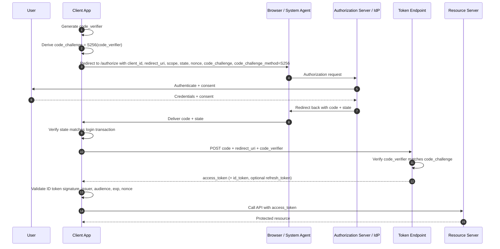
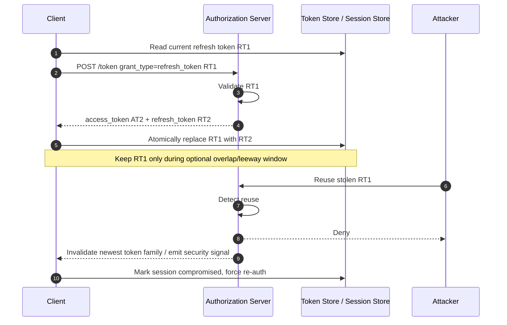
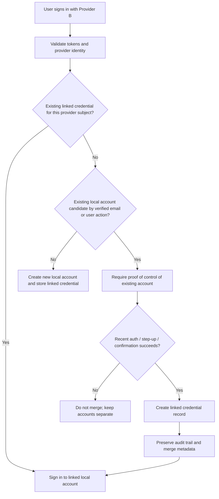

# Production-Grade Integration of Third-Party Identity Providers with OAuth 2.0 and OpenID Connect

This report assumes no specific programming language or framework, because none was specified. The guidance is therefore protocol-centric and deployment-centric rather than SDK-centric.

## Executive summary

The secure default for third-party sign-in in 2026 is the authorization code flow, with PKCE using `S256`, a transaction-bound `state` value, OIDC `nonce` validation when an ID token is involved, exact redirect URI registration, and a strong preference for external browser-based authentication instead of embedded webviews for native apps. PKCE exists specifically to mitigate authorization-code interception, and modern OAuth security guidance also emphasizes preventing code replay, keeping bearer tokens out of URLs, and avoiding insecure browser patterns. OIDC adds the identity layer and standardizes the ID token used to authenticate the user to the client. citeturn46view0turn47view3turn46view1turn46view2turn46view4turn47view2

Operationally, the biggest production failures are not usually crypto failures; they are configuration failures. The failure patterns repeat across providers: overly broad scopes, dev/test redirect URIs left in public clients, missing domain verification, consent-screen metadata that does not match the app’s real behavior, incomplete app-review artifacts, and unsafe account-linking logic that auto-merges users based only on email. Those failures matter because providers differ sharply in what “works for me in dev” means versus what is actually approved, trusted, and sustainable for public use. Google, Meta, and Microsoft have meaningful trust/verification gates for public or multitenant scenarios; Apple has a smaller “OAuth approval” surface but a strong platform-review overlay for App Store apps; GitHub and Okta add optional public-listing workflows; Auth0 and Amazon are more configuration-driven than review-driven for ordinary private apps. citeturn35view2turn35view0turn35view1turn35view4turn20search0turn45view0turn43view0turn39view3turn38view3turn44view0

If you only keep six rules in mind, keep these. First, separate “sign-in” scopes from “API” scopes and request the narrowest set possible, preferably incrementally. Second, treat every redirect URI as a high-risk configuration artifact and register only exact public production URIs in production clients. Third, never use the ID token as an API bearer token; it is for client-side identity assertions, not resource authorization. Fourth, issue refresh tokens only where offline continuity is required, rotate them where the provider supports it, and revoke them on logout, unlink, or suspected compromise. Fifth, key linked identities by provider and provider subject, using email only as a hint. Sixth, assume that each IdP has at least one provider-specific quirk that can silently break production if ignored. citeturn35view0turn35view3turn34view0turn27search8turn39view1turn41view5turn41view7turn47view2

## Protocol foundations and baseline defenses

At the standards level, the modern pattern is straightforward. OAuth 2.0 provides delegated authorization; OIDC layers authentication on top and returns an ID token so the client can verify who authenticated. PKCE adds a one-time proof of possession around the authorization code: the client generates a high-entropy `code_verifier`, derives an `S256` `code_challenge`, sends the challenge on the authorization request, and later proves possession of the verifier at the token endpoint. That blocks a stolen authorization code from being redeemed by an attacker who does not know the verifier. Native-app guidance also remains clear that authorization requests should use the system browser or other external user-agents, not embedded webviews. citeturn46view2turn47view3turn46view0turn46view1

`state` and `nonce` solve different problems and should not be collapsed into one mental bucket. `state` is the transaction-binding control that lets the client correlate the callback with the login attempt that initiated it, while OIDC `nonce` protects the OIDC layer by binding the ID token to the front-channel authentication request. Current OAuth security guidance explicitly notes that PKCE prevents authorization-code injection and replay against public clients, while OIDC `nonce` can detect authorization-code injection in OIDC flows if the client checks the nonce in the ID token before using any issued token. In other words: `state` is about the request/response transaction; `nonce` is about the authenticated token you get back. citeturn46view1turn47view2

Redirect URI validation is a first-class defense, not a clerical detail. Microsoft requires redirect URIs to be preregistered, generally HTTPS except for limited localhost cases, and case-sensitive on the path; GitHub requires the optional `redirect_uri` to match the registered callback by host and port exactly, with the path constrained to the configured callback subtree; Amazon requires exact allowed origins or return URLs and HTTPS for website callbacks; Google requires production apps to use domains you own and secure origins/redirects. The practical conclusion is simple: use separate clients per platform and usually per environment, and keep developer-only redirect URIs out of public production app registrations. citeturn34view0turn38view0turn44view1turn44view2turn35view3turn15search7

The diagram above intentionally reflects the hardened form of the authorization code flow: PKCE, transaction binding, and explicit ID-token validation before the application trusts the authenticated identity. That is the right baseline for browser, mobile, and most desktop integrations, even though some providers still retain older patterns for backward compatibility. citeturn46view0turn47view3turn46view2turn46view1

A concise threat-to-control map is useful in real deployments:

| Threat | Recommended control | Why it works | Sources |
|---|---|---|---|
| CSRF / unsolicited callback | Bind the authorization response to server- or client-side transaction state; verify the callback URI exactly matches the registered one. | Prevents the app from accepting a callback that does not belong to the active login transaction. | citeturn46view1turn34view0turn38view0 |
| Authorization-code theft or replay | PKCE with `S256`; one-time authorization codes. | A stolen code is useless without the correct verifier. | citeturn46view0turn47view3turn47view2 |
| OIDC code injection / token substitution | OIDC `nonce` validation before using any issued token. | The client detects that the ID token does not belong to the current browser session. | citeturn47view2 |
| Token leakage via URLs, history, referrers | Do not pass access tokens in URI query parameters; prefer authorization code and safer response modes such as `form_post` where supported. | Keeps bearer credentials out of browser history and other ambient channels. | citeturn47view2 |
| Credential theft in native apps | Use the system browser; do not embed webviews. | Prevents the host app from reading credentials, cookies, or hidden browser state. | citeturn46view1turn35view3 |
| Refresh-token replay | Refresh-token rotation with reuse detection; server-side revocation support. | A reused refresh token becomes a detectable compromise signal rather than a silent privilege extension. | citeturn39view1turn41view7turn46view3 |

## Scope minimization, redirect discipline, and token handling

The least-privilege rule is more than a policy slogan. Google’s verification guidance explicitly requires the least amount of access necessary and recommends finding narrower non-sensitive scopes to avoid extra review; Google’s consent-screen setup guidance repeats that users are more likely to grant clearly limited scopes. Microsoft consent guidance similarly advises developers to request the least-privilege permissions because users see and evaluate requested permissions directly in the consent prompt. GitHub’s OAuth guidance is similar in spirit: it encourages separate tokenized workflows so that a sign-in-only path is not forced to ask for repository scopes. citeturn35view0turn36view0turn35view3turn45view1turn38view0

A production sign-in integration should therefore separate identity from API data access. For a pure sign-in use case, request only `openid` and the smallest viable profile/email claims from the provider. Ask for API scopes only when the user enters a feature that truly needs them, and log which feature caused the prompt. This pattern reduces verification burden on providers such as Google and Meta, shrinks blast radius if a token leaks, and makes rejection during review less likely because the prompt better matches the user-visible behavior of the app. citeturn46view2turn35view0turn36view0turn21search3

Token handling should follow a strict role split. The access token is for APIs. The ID token is for the client to validate authentication and obtain standardized claims. Okta’s guidance puts this bluntly: use the access token to grant API access, not the ID token. Refresh tokens should be treated as durable credentials and only issued where background/offline continuity is truly required. Google documents `access_type=offline` as the mechanism for refresh-token issuance; Auth0 requires offline access to be enabled and warns that refresh tokens effectively allow a user to remain authenticated indefinitely unless bounded by expiration or revocation. citeturn27search8turn31search2turn31search5turn41view5

Where to store tokens depends on the client type, not on developer convenience:

| Client type | Recommended storage pattern | What to persist | What to avoid | Sources |
|---|---|---|---|---|
| Browser SPA | Keep tokens in browser memory; if the SDK supports it, isolate handling in Web Workers. Use rotated refresh tokens only if the UX requires it and the provider supports secure rotation. | Current access token, short-lived ID token if needed for local session state, rotated refresh token only when necessary. | Long-lived tokens in persistent web storage when avoidable; access tokens in URLs. | citeturn41view1turn41view5turn41view7turn47view2 |
| Native mobile | Use the system browser for auth and platform secure storage such as Android Keystore or iOS Keychain for tokens/refresh state. | Refresh token if the app needs silent renewal; access token only as long as needed. | Embedded webviews; plaintext local storage. | citeturn46view1turn12search25 |
| Server-rendered web app | Store provider tokens only on the server, encrypted at rest and access-controlled; expose only an application session to the browser. | Refresh token and any long-lived provider state; short-lived access token cache if needed. | Putting provider bearer tokens directly in front-channel browser state when a server session model is possible. | citeturn38view7 |
| Backend jobs / service components | Keep credentials in a secret manager or equivalent controlled store and rotate signing keys/secrets on compromise or planned maintenance. | Only machine-held credentials that are actually needed. | Reusing interactive-user tokens for server jobs. | citeturn42view4turn38view7 |

It is also useful to separate “provider-issued reality” from “your recommended policy.” Provider-issued reality is whatever comes in `exp` or `expires_in`; hard-coding assumptions is brittle. Policy is what you configure when you control token lifetimes, especially for your own APIs or your own broker layer. Published examples from current vendor docs illustrate the spread rather than a universal constant:

| Token class | Conservative production posture | Published examples in current docs |
|---|---|---|
| Access token | Keep short-lived. If you control the API, prefer minutes, not days. If you do not control it, honor `expires_in`/`exp` from the provider. | Microsoft access tokens default to a variable 60–90 minutes, averaging 75 minutes; Auth0 custom API access tokens default to 24 hours; Amazon LWA access tokens are valid for one hour; Meta short-lived user tokens are typically about one to two hours. citeturn34view3turn29search4turn44view4turn22search2 |
| ID token | Use only to establish the authenticated session and claims context; never as an API bearer token. | Microsoft ID tokens default to one hour; Auth0 ID tokens default to 10 hours. citeturn34view4turn29search5turn27search8 |
| Refresh token | Issue only when offline access is required; rotate on use where supported; apply idle and absolute expiry where configurable; revoke on logout/unlink/compromise. | Microsoft refresh tokens default to 24 hours for SPAs and 90 days otherwise; Auth0 rotation-enabled refresh tokens default to 30 days and can be configured up to one year; GitHub App user refresh tokens last six months; Google external apps in Testing can get 7-day refresh tokens; Amazon recommends at least 180 days or non-expiring refresh tokens for Alexa account linking. citeturn34view2turn41view6turn38view6turn35view4turn30search4 |

## Refresh-token rotation, revocation, and session lifecycle

Refresh-token rotation is one of the clearest places where modern guidance is better than legacy guidance. RFC 7009 standardizes revocation; providers such as Auth0 and Okta go further by making rotation and reuse detection explicit product features. Okta invalidates the prior refresh token and detects reuse automatically; Auth0 issues a new refresh token on each exchange when rotation is enabled, invalidates the predecessor, and exposes a configurable overlap window to account for retries and poor network conditions. The security point is that refresh-token theft should create a detectable state transition, not a silent second session. citeturn46view3turn39view1turn41view7turn41view6

Google, Microsoft, Apple, Meta, GitHub, and Amazon vary materially in lifecycle semantics. Google refresh tokens can be invalidated at any time and external-testing projects issue 7-day refresh tokens outside the basic OpenID/profile/email case; Microsoft publishes concrete refresh-token lifetimes for SPAs versus other clients; Apple provides a token revocation endpoint and expects tokens to be stored and transmitted securely but does not publish, in the retrieved stable pages here, a single concise “default refresh lifetime” the way Microsoft or Auth0 do; Meta’s common consumer login pattern does not revolve around refresh tokens at all, but rather short-lived and long-lived access tokens; GitHub App user access tokens can be configured to expire after eight hours, with six-month refresh tokens; Amazon LWA supports refresh-token exchange and one-hour access tokens. citeturn31search4turn35view4turn34view2turn32search3turn44view3turn22search2turn38view6turn44view4

The lifecycle policy that emerges from those differences is pragmatic. Rotate when the IdP supports rotation. Revoke on logout only if you want logout to actually sever provider-side delegated access rather than merely destroy the local session. Revoke immediately on account unlink, provider merge changes, suspicious reuse signals, or a credential incident. Store enough metadata to answer: which provider issued this credential, to which local account is it bound, when was it last used, when does it expire, and what scopes were granted. That metadata is what lets you do clean cutovers during re-consent, provider migration, or incident response. citeturn46view3turn39view1turn41view5turn32search3

That rotation model should be implemented atomically. If the application writes the new refresh token non-atomically, retries can accidentally trigger reuse-detection mechanisms or strand users. Auth0’s explicit overlap/leeway window and Okta’s documented reuse detection both exist because real networks are lossy; your storage and retry logic should assume that. citeturn41view6turn41view7turn39view1

## Identity linking, merging, and consent-screen design

Identity linking is where many otherwise competent OAuth integrations become brittle. The correct local data model is not “one user has one email.” It is “one local principal may have multiple external credentials,” and each external credential should be keyed by the provider plus the provider’s own stable subject/identifier for that account. Email should be treated as a hint, not as a sufficient merge key, because provider behavior is too heterogeneous. Apple can hide the user’s real email behind a private relay address and only returns the user object with name/email fields the first time the user authorizes the app; GitHub may require `user:email` or broader user scopes to return private email data; Meta treats email as a permissioned data item beyond `public_profile`; Amazon’s profile payload includes both `user_id` and profile data and explicitly recommends keeping the returned profile data on the server. citeturn32search5turn18search5turn17search18turn17search13turn21search1turn30search12

The safest merge policy therefore has three tiers. First, if an existing linked credential already matches the incoming provider key, sign the user in. Second, if there is no linked credential but there is an existing local account with a matching email, do not auto-merge solely on that basis; instead require proof of control over the existing account, such as a recent primary-session re-authentication or a confirmation through the preexisting factor. Third, only after the user proves control of both sides should the system create a durable linked-credential record. This is especially important when one provider can emit masked relay email, another may omit email unless special scopes are granted, and another may expose mutable or user-hidden email behaviors. The recommendation is a synthesis, but it follows directly from the provider behaviors above. citeturn32search5turn18search5turn21search1turn17search18turn30search12

Consent-screen design should mirror the same conservatism. The consent prompt should explain what the app is, why it needs the requested data, and what feature the request unlocks. Google’s OAuth setup and verification guidance is the clearest example: app name, support email, homepage, privacy policy, terms, authorized domains, and declared scopes are not decorative metadata; they are review artifacts and trust signals. Microsoft’s consent prompt similarly displays the app name, logo, permissions, and publisher verification state. GitHub Marketplace, Amazon Security Profiles, and Okta OIN publication also require supportable metadata such as privacy policy links, support links, and configuration documentation. citeturn36view0turn35view2turn45view1turn38view3turn44view0turn39view4

Operationally, the things that get reviewed and rejected are predictable. Review teams usually compare the consent screen, app metadata, privacy policy, scopes, and test instructions against what the application actually does. If those do not align, the app looks deceptive even when the code is sound. Production readiness therefore is not just “security config”; it is also documentary integrity. citeturn35view2turn15search11turn26search7turn38view5turn39view3

## Production comparison across major identity providers

In the matrix below, **Unspecified** means the requirement was not clearly stated in the cited official pages retrieved for this report.

| IdP | Public-production requirements | Dev to public-production gap | Token, lifetime, and security quirks | Sources |
|---|---|---|---|---|
| Google | OAuth consent screen required for all apps; external apps in public use need published consent configuration, authorized-domain verification, homepage/privacy-policy/terms metadata, and if scopes are sensitive or restricted, verification and possibly third-party security assessment. Production apps must use domains you own, and Google says production OAuth clients must not include test environments or redirect URIs only available to the dev team. | External apps can work in Testing with test users, but refresh tokens in Testing expire in 7 days unless only basic OpenID/profile/email scopes are requested. Brand verification typically takes 2–3 business days; sensitive-scope verification typically takes 3–5 business days. Common official review failures include wrong user type, leaving publishing status in Testing, and incomplete OAuth verification. | Google documents 100 refresh tokens per Google Account per client ID, invalidating the oldest when the limit is exceeded. Refresh tokens can be invalidated at any time. Treat `expires_in` or token claims as authoritative for access-token life, rather than hard-coding assumptions. | citeturn36view0turn35view2turn35view0turn35view1turn35view3turn35view4turn15search7turn15search11turn31search4 |
| Microsoft / Azure AD | Redirect URIs must be preregistered, generally HTTPS except for localhost cases, and path matching is case-sensitive. Multitenant apps can set a publisher domain by hosting `microsoft-identity-association.json` under `/.well-known/`; verified publishers display a blue badge. Redirect URI counts and query-parameter support vary by sign-in audience. | A multitenant app may sign in fine in the home tenant, but cross-tenant customer trust is materially different: newly registered multitenant apps that are not publisher-verified can trigger consent warnings or blocks when risk-based consent policy is active, and external-tenant scenarios may require explicit admin consent. Dev URIs are allowed, but Microsoft explicitly advises removing unnecessary development redirect URIs from production registrations. | Access tokens default to a variable 60–90 minutes; ID tokens default to one hour; refresh tokens default to 24 hours for SPAs and 90 days otherwise. A subtle quirk is that SPAs using MSAL.js require explicit grant of permissions in some admin-consent scenarios, or token acquisition fails. | citeturn34view0turn34view1turn34view2turn34view3turn34view4turn20search0turn45view0turn45view1 |
| Apple | Web Sign in with Apple requires an Apple Developer setup with a primary App ID, a Services ID, associated website domains/return URLs, and a private key for signing developer tokens. Apple says organizations can register up to 100 website URLs; individuals up to 10. If an App Store app uses a third-party or social login service for the primary account, App Review Guideline 4.8 requires an equivalent privacy-preserving alternative login option. | For web sign-in, the retrieved docs show configuration and platform-account requirements, not a broad “public OAuth review” gate like Google’s. For App Store apps, however, production readiness is inseparable from App Review. In practice, a setup can appear to work in development but still fail in production because of incorrect Services ID/App ID association, return URLs, or signing-key/client-secret configuration. Official timeline for a standalone public Sign in with Apple approval flow was unspecified in the retrieved docs. | Apple only returns the `user` object with profile data the first time the user authorizes the app, so applications must persist it immediately. Users may choose private relay email. Apple provides a token revocation endpoint, and permanent Apple Account deletion invalidates tokens and disables relay forwarding for associated apps. The retrieved stable Apple pages did not publish a single concise default refresh-token lifetime; treat token responses and revocation status as authoritative. | citeturn42view1turn42view4turn43view0turn43view1turn18search5turn32search3turn32search5turn32search15 |
| Facebook / Meta | In development mode, apps are limited to app-role users for testing. Before an app can be used by people without roles, Meta requires Live mode and App Review for permissions/features that require approval. Annual Data Use Checkup may also apply; business verification can be required for some access. | Meta’s platform is a classic example of “works in dev but not in public.” Authenticating with app-role testers in development mode does not mean public deployment is ready. Official FAQ material says the overall process can take up to several weeks, with permission review potentially taking several weeks and business verification typically taking a few days. | Meta recommends server-side `appsecret_proof` to protect API calls and exposes settings such as Require App Secret / App Secret Proof. For common Facebook Login flows, short-lived user access tokens are typically about 1–2 hours; long-lived user tokens are about 60 days. The model is not refresh-token-centric in the same way as Google/Microsoft/Auth0. | citeturn7search1turn7search7turn8search0turn26search7turn21search0turn21search6turn22search0turn22search2 |
| GitHub | Basic OAuth app registration can be created under a personal account or organization without the kind of consumer app-review gate seen at Google or Meta. If you want public distribution through GitHub Marketplace, listings need privacy policy, support contact, pricing, description, and review; publisher verification for organizations is specific to Marketplace publication and paid plans. | The dev/public split is smaller for ordinary OAuth login than for Google or Meta: a callback URL and scopes may work immediately. The major additional public-production step shows up if you want Marketplace listing or publisher verification, not merely basic OAuth login. GitHub explicitly advises considering GitHub Apps over OAuth apps for better security and finer permissions. | GitHub requires callback matching by host and port, with path constrained beneath the configured callback, and prefers `127.0.0.1` loopback patterns for native/desktop flows. GitHub Apps use short-lived tokens; user access tokens expire after 8 hours and refresh tokens after 6 months when expiration is enabled. GitHub’s public OIDC documentation in the retrieved set is aimed at Actions/workload identity and enterprise-managed users, so third-party end-user login is effectively an OAuth / GitHub App story rather than a generic consumer OIDC profile. | citeturn38view0turn38view1turn38view2turn38view3turn38view4turn38view5turn38view6turn17search0turn17search9 |
| Okta | For ordinary private OIDC use, production requirements are mostly tenant and app configuration: correct app type, redirect URIs, trusted origins, and any required authorization-server features. For public discoverability in the Okta Integration Network, the integration must support multi-tenancy and include required artifacts such as an app logo and a customer configuration guide. | Okta has a meaningful dev/public split if you are publishing to the OIN. Okta recommends separate dev, test, and production environments, using an Integrator Free Plan org for development/testing and not connecting the generated app instance in that org to production. For OIN publication, the OIN team reviews and QA-tests the integration and emails the expected date for the initial review finish. | Preview orgs expose Beta/EA features, whereas production orgs are distinct. Integrator Free Plan orgs include many developer features by default for testing, but custom authorization servers require API Access Management as a production add-on. Refresh-token rotation includes reuse detection. A related operational gotcha is that choosing the wrong app type can cause Okta to expect a client secret for a public client and break sign-in. | citeturn39view0turn39view1turn39view3turn39view4turn39view5turn39view6turn40view0turn40view2turn40view3 |
| Auth0 | Production requirements are mostly explicit allowlists and tenant hygiene: Allowed Callback URLs, Allowed Logout URLs, Allowed Web Origins, correct environment tagging, and preferably custom domains. Custom domains require verification through Auth0’s process. For social connections, Auth0 developer keys are for testing only, not production. | Auth0 is another place where dev success can be misleading. Social login may “work” with Auth0 developer keys in testing, but production should use your own provider credentials so the provider consent page shows your branding and SSO/callback behavior works properly. The retrieved official docs did not show a separate public app-review gate for ordinary private OIDC clients; the key dev→prod shift is tenant separation, production tagging, domain verification, and replacing developer keys. | Auth0 recommends storing browser tokens in memory, ideally via Web Workers. For custom APIs, access tokens default to 24 hours; ID tokens default to 10 hours. Refresh-token rotation is supported, enables reuse detection, defaults to 30 days when rotation uses expiring refresh tokens, and can be configured up to one year. Auth0 limits active refresh tokens to 200 per user per application. | citeturn41view0turn41view1turn41view2turn41view3turn41view4turn41view5turn41view6turn41view7turn41view9turn29search0turn29search1 |
| Amazon | Login with Amazon requires a Security Profile enabled for LWA, and the consent surface shows the application name, logo, and privacy-policy link from that profile. Websites must configure Allowed Origins or Allowed Return URLs; for websites, HTTPS is required for the secure patterns Amazon recommends. Amazon also requires developer identity verification for developer services generally. | In the retrieved docs, Amazon’s ordinary LWA production path is more configuration- and account-verification-driven than app-review-driven. A setup may work locally yet fail in public deployment because the origin/return-URL allowlist is wrong, HTTPS is missing, the security profile is incomplete, or the developer account has not completed identity verification. A distinct public OAuth review workflow for ordinary LWA sign-in was unspecified in the retrieved docs. | Amazon LWA access tokens are valid for one hour and refresh-token exchange is supported. For Alexa account linking, Amazon recommends access-token TTL of at least one hour and refresh-token TTL of at least 180 days or no expiry. Amazon’s profile guidance returns and recommends storing `user_id`, email, name, and related profile data on the server. | citeturn44view0turn44view1turn44view2turn44view3turn44view4turn44view5turn30search4turn30search12 |

## Recommended baseline configuration

What follows is the most defensible baseline configuration if you are integrating several IdPs at once and want one policy that survives provider variance:

| Setting | Recommended baseline |
|---|---|
| Flow | Use authorization code flow. For any public client, require PKCE with `S256`. For confidential web apps, keep the token exchange server-side and enable PKCE as defense in depth where supported. citeturn46view0turn47view3turn46view4 |
| OIDC usage | If you are authenticating the user, request OIDC and validate ID-token signature, issuer, audience, expiry, and `nonce` before establishing the local session. citeturn46view2turn47view2 |
| `state` handling | Bind each auth request to login-session state and reject callbacks that do not match the stored transaction. Keep the redirect URI used for the request with the same session data. citeturn46view1turn34view0 |
| Redirect URIs | Register exact production redirect URIs only. Separate clients per platform and usually per environment. Keep localhost/dev callbacks out of public production registrations. citeturn34view0turn35view3turn41view0turn44view1 |
| Scope policy | For sign-in, request only the minimum identity scopes. Add API scopes incrementally, at feature entry, with user-facing justification. citeturn35view0turn36view0turn45view1turn38view0 |
| Access tokens | Treat them as API-only bearer credentials; do not use the ID token as an access token. Keep lifetimes short when you control the API; otherwise trust `expires_in` / `exp`. citeturn27search8turn34view3turn44view4 |
| Refresh tokens | Issue only when offline continuity is required. Turn on rotation and reuse detection where the provider supports it. Use idle and absolute expiry where configurable. Revoke on logout if you want provider-side logout semantics, and always revoke on unlink or compromise. citeturn39view1turn41view5turn41view6turn41view7turn46view3 |
| Browser storage | Prefer in-memory storage and isolate token handling when possible. Persisting long-lived tokens in browser storage should be the exception, not the first design. citeturn41view1turn41view5 |
| Mobile storage | Use the system browser for auth and OS secure storage for any refresh token or persistent credential state. citeturn46view1turn12search25 |
| Server storage | Encrypt provider tokens at rest, restrict which subsystems can read them, and store refresh credentials separately from operational session state where feasible. citeturn38view7 |
| Identity linking | Store one linked-credential record per provider account. Key it by provider + provider subject/identifier. Use email only as a hint, and require proof of control before merging. citeturn32search5turn18search5turn17search18turn21search1turn30search12 |
| Consent metadata | Ensure app name, logo, privacy policy, homepage, support channel, and terms consistently describe the exact feature that is requesting access. Mismatch between metadata and behavior is a common review failure. citeturn35view2turn36view0turn15search11turn38view3turn44view0 |
| Monitoring | Log provider, client ID, redirect URI used, scopes granted, token-expiry timestamps, refresh-rotation events, revocations, and account-link/unlink events. This is essential for re-consent, incident response, and provider migration. The need is an operational inference from the token and revocation models documented above. citeturn46view3turn39view1turn41view5 |

The analytical bottom line is that a robust multi-IdP implementation looks less like “plug in OAuth” and more like “operate a small identity-security control plane.” The protocol core is standard, but the production surface is not. The winning design is one that standardizes your internal account model, local session policy, token lifecycle handling, and audit strategy, while explicitly isolating provider-specific differences—review gates, redirect semantics, token lifetimes, branding requirements, and consent quirks—behind configuration and operational runbooks rather than scattering them through application code. citeturn46view2turn46view4turn35view2turn45view0turn39view3turn41view2