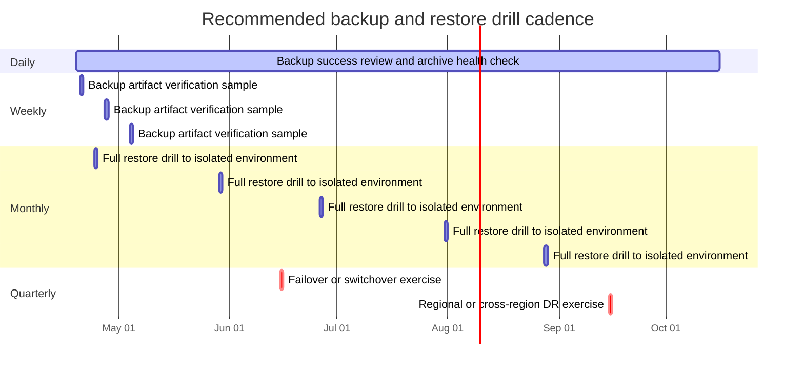
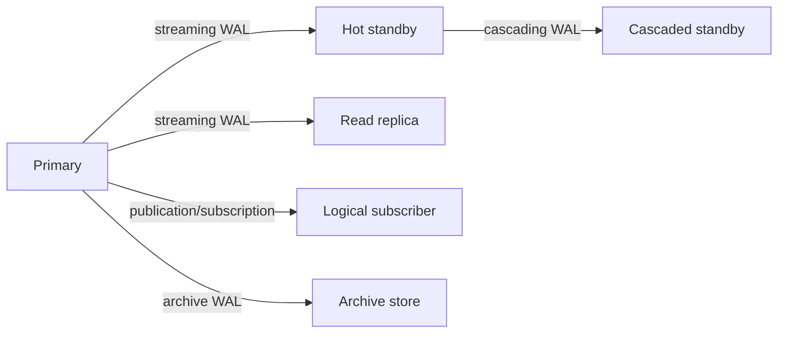
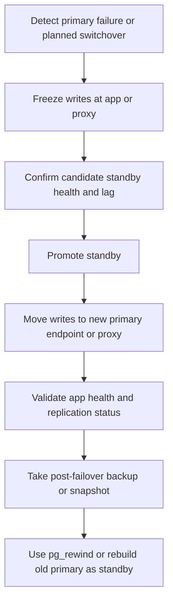

# Operating PostgreSQL Reliably in Production

## Executive summary

The shortest defensible answer is this: the best production PostgreSQL estates are boring on purpose. They use relational schema design for stable, high-value facts; they keep indexes tightly aligned to real query patterns; they treat `EXPLAIN`, statistics, autovacuum, and replication lag as first-class operating signals; they pool connections aggressively; and they prove recovery by restoring, not by hoping. Most avoidable PostgreSQL outages come from the same few failure modes: excessive connection churn, stale or missing statistics, autovacuum falling behind, WAL/replication slot retention surprises, unsafe DDL under load, and backups that were never restored in practice. citeturn18view5turn18view9turn18view7turn30view2turn20view5

This report prioritizes official documentation from the entity["organization","PostgreSQL Global Development Group","postgres maintainer org"] and managed-service guidance from entity["company","Amazon Web Services","cloud provider"], entity["company","Google Cloud","cloud provider"], and entity["company","Microsoft Azure","cloud provider"]. The consistent cross-source pattern is that reliable operations depend less on one magic parameter and more on disciplined operating habits: conservative schema changes, bounded pools, WAL-aware backup design, explicit failover procedures, and recurring restore and failover drills. citeturn18view0turn20view0turn20view4turn20view8

**Confidence: 91%.**

The highest-priority actions for most teams are: enable and use `pg_stat_statements`; turn on query IDs and useful logging; put PgBouncer or a managed proxy/pooler in front of the database; configure PITR with tested WAL archiving or verify the managed equivalent; monitor autovacuum health, archive failures, replication lag, and connection saturation; and require zero-downtime migration patterns such as `CREATE INDEX CONCURRENTLY`, `NOT VALID` plus `VALIDATE CONSTRAINT`, and batched backfills. citeturn19view3turn19view9turn19view8turn20view1turn18view7turn31view0turn19view16turn19view17

## Data model and access paths

### Schema design

**Best-practice recommendations**

Use normalized relational tables for stable entities, relationships, and invariants; use constraints aggressively; and use JSONB for flexible, sparse, or evolving attributes rather than for core relational facts. PostgreSQL’s own documentation explicitly recommends somewhat fixed JSON document structure even when flexibility is desired, because predictable structure makes querying and summarization easier. Likewise, arrays are “not sets”; if you are constantly searching inside arrays of IDs or tags, PostgreSQL’s documentation itself advises a separate table because it is easier to search and scales better. citeturn23view3turn34search10

Prefer native types over `text` or JSON-encoded values. Use `integer` as the default whole-number type, `bigint` only when the range requires it, `numeric` for exact values such as money or regulated calculations, and `double precision` only when inexact IEEE floating point is acceptable. Use `timestamptz` for application timestamps that cross time zones or require precise ordering across services, because PostgreSQL stores `timestamp with time zone` internally as UTC and renders it in the session time zone. For keys, prefer identity columns or UUIDs; if you use identity columns, still enforce uniqueness with `PRIMARY KEY` or `UNIQUE`, because identity generation alone does not guarantee uniqueness. Current PostgreSQL documentation also notes native UUIDv4 and UUIDv7 generation support in the current release line. citeturn27view0turn27view1turn27view3turn27view2

Use `NOT NULL`, `CHECK`, `UNIQUE`, `PRIMARY KEY`, and `FOREIGN KEY` constraints as your first integrity layer. PostgreSQL notes that `NOT NULL` is more efficient than an equivalent `CHECK (col IS NOT NULL)`. For foreign keys, remember a subtle but important operational behavior: the referenced side is indexed automatically because it must be unique, but PostgreSQL does **not** automatically index the referencing side, even though deletes or updates on the parent may otherwise require scanning the child table. In practice, most high-write OLTP schemas should index foreign-key columns unless the table is tiny or access patterns make that wasteful. citeturn25view0turn25view3

For JSON specifically, default to `jsonb`, not `json`, unless you truly need to preserve input formatting, object-key order, or duplicate keys exactly as received. PostgreSQL documents that `jsonb` is slower to ingest because it decomposes data on write, but faster to process and index; it does not preserve whitespace or key order, and it keeps only the last occurrence of duplicate keys. PostgreSQL also recommends keeping JSON documents to manageable size because updating JSON in a row locks the **whole row**, which increases contention for hot documents. citeturn18view3turn23view0turn23view1turn23view3

**Common pitfalls**

The common failure pattern is “schema optionality disguised as flexibility”: arrays used as sets, JSONB used for join keys or hot filter columns, timestamps stored without time zone semantics, and identity columns assumed to be unique without a real key constraint. Another common pitfall is adding foreign keys while forgetting to add an index on the referencing side, which shifts the pain to deletes and updates later. citeturn34search10turn25view3turn27view1turn27view3

**Concrete patterns**

If you need flexible payloads but fast joins and filters on a few hot attributes, extract them into generated or ordinary columns and index those paths instead of forcing every query through JSON expressions. Generated columns are built for exactly this kind of derivation. citeturn27view4turn23view3

```sql
ALTER TABLE events
  ADD COLUMN actor_id bigint GENERATED ALWAYS AS ((payload->>'actor_id')::bigint) STORED,
  ADD COLUMN occurred_at timestamptz GENERATED ALWAYS AS ((payload->>'occurred_at')::timestamptz) STORED;

CREATE INDEX CONCURRENTLY idx_events_actor_time
  ON events (actor_id, occurred_at DESC);
```

**Priority checklist**

- Model stable business entities relationally first; reserve JSONB for optional or fast-changing attributes. citeturn23view3
- Choose native types deliberately: `integer` by default, `bigint` for range, `numeric` for exactness, `timestamptz` for real-world event times. citeturn27view0turn27view1
- Pair identity or UUID keys with `PRIMARY KEY` or `UNIQUE`. citeturn27view3turn27view2
- Index most foreign-key columns on the referencing side. citeturn25view3
- Keep JSONB documents structurally predictable and reasonably small. citeturn23view3

### Partitioning and index strategy

**Best-practice recommendations**

Partition only when it solves a real operational problem: retention management, very large tables, localized scans, bulk detached archival, or skewed write/read windows. PostgreSQL states partitioning can provide benefits, but the practical gains depend on partition pruning and lifecycle operations, not on partitioning by itself. Partition pruning is driven by partition bounds, not by the existence of indexes on the partition key; whether each partition also needs an index depends on whether queries scan a small fraction or a large fraction of each partition. citeturn24view1turn24view2

Use time-range partitioning for append-mostly event data and detach older partitions for archival or deletion. PostgreSQL specifically documents `DETACH PARTITION CONCURRENTLY` and `ATTACH PARTITION` workflows that reduce lock severity on the parent compared with more brute-force operations. It also documents a key limitation: unique or primary-key constraints on a partitioned table must include **all** partition-key columns, because PostgreSQL cannot enforce uniqueness across partitions otherwise. Another subtle operational trap is statistics: autovacuum does not process partitioned parents if only children change, so parent-level statistics often require periodic manual `ANALYZE`. citeturn24view3turn24view4turn24view0turn19view19

Use the smallest set of indexes that match your real query workload. PostgreSQL’s index documentation is blunt: indexes speed reads but add overhead to writes, and multicolumn indexes should be used sparingly; indexes with more than three columns are rarely helpful unless access patterns are highly stylized. Partial indexes are specialized and powerful when you repeatedly access a hot subset. Expression indexes are the correct answer when you routinely filter or join on a deterministic transformation such as `lower(email)`. BRIN is intended for very large tables with columns naturally correlated with physical order; GIN is designed for composite items such as JSONB or arrays; and GIN cannot support index-only scans. citeturn18view4turn13search3turn19view0turn19view2turn13search1turn13search13

| Index option | Best use | Avoid when |
|---|---|---|
| B-tree | Default for equality, range, ordering, uniqueness | You are indexing composite/document structures |
| GIN | JSONB containment, arrays, full-text-like composite membership | You need cheap writes or index-only scans |
| BRIN | Huge append-mostly tables with physical correlation to time/ID | Data is randomly distributed |
| Partial index | Repeated access to a stable hot subset | Predicate is unstable or only rarely queried |
| Expression index | Deterministic function in predicates, e.g. `lower(email)` | Expression is rarely queried or highly volatile |
| Multicolumn index | A real repeated multi-column predicate/order pattern | “Just in case” indexing across many columns |

The table above is a synthesis of documented index behaviors and caveats from PostgreSQL’s index chapters. citeturn18view4turn19view0turn19view1turn19view2turn13search1turn13search13

**Common pitfalls**

The most expensive index mistakes are predictable: indexing every column “for safety,” using many broad multicolumn indexes, building parent-partition indexes in a way that causes unnecessary locks, and keeping indexes whose read benefit no longer exceeds their write and vacuum cost. Another subtle issue is index bloat: PostgreSQL documents `REINDEX` as a remedy for bloated indexes, and recommends the concurrent form when you need to avoid heavy locking. If a concurrent index build fails, PostgreSQL leaves an invalid index behind; that object still imposes update overhead until you drop it or rebuild it. citeturn13search3turn24view4turn9search2turn14search4

**Concrete patterns**

```sql
-- Partial index for the hot operational subset
CREATE INDEX CONCURRENTLY idx_orders_open_created_at
  ON orders (created_at DESC)
  WHERE status = 'open';

-- Expression index for case-insensitive lookup
CREATE INDEX CONCURRENTLY idx_users_lower_email
  ON users (lower(email));

-- Online index deflation
REINDEX INDEX CONCURRENTLY idx_users_lower_email;
```

For partitioned tables, PostgreSQL’s documented low-lock pattern is: create the parent index `ON ONLY`, build child indexes concurrently, then `ATTACH PARTITION` each child index. citeturn24view4turn19view17turn19view18

**Priority checklist**

- Partition only for retention, operational lifecycle, or very large-table locality. citeturn24view1turn24view2
- Ensure partitioned-table PK/UNIQUE constraints include the partition key. citeturn24view0
- Run manual parent `ANALYZE` for partition hierarchies when children change heavily. citeturn19view19
- Prefer one precise index over several speculative ones. citeturn18view4turn13search3
- Use `REINDEX CONCURRENTLY` or `pg_repack` for online bloat cleanup; treat failed concurrent builds as incidents to clean up immediately. citeturn9search2turn9search3turn14search4

## Plans, statistics, and query tuning

### EXPLAIN, statistics, and planner behavior

**Best-practice recommendations**

Read plans from the top level down, but diagnose performance from the bottom up: row estimates, actual row counts, loops, and the chosen scan/join nodes will tell you whether the planner understood the data. PostgreSQL’s EXPLAIN documentation is explicit that plan reading is part art and part estimation analysis. Use `EXPLAIN (ANALYZE, VERBOSE, WAL)` or at least `EXPLAIN ANALYZE`; the documented purpose of `ANALYZE` is to compare estimates to actuals. In current PostgreSQL documentation, `auto_explain` is the sanctioned way to log plans for slow statements automatically in larger systems. citeturn18view5turn15search1turn19view7

Treat planner statistics as production-critical data. PostgreSQL states plainly that inaccurate statistics lead to poor plans. Increase `default_statistics_target` or per-column statistics for skewed columns, and use `CREATE STATISTICS` for correlated columns or expressions. Extended statistics can materially improve cardinality estimates for correlated predicates and expression-based filters, but PostgreSQL notes an important limitation: extended statistics are not currently used for join selectivity estimation. citeturn18view9turn19view19turn18view6turn28view0

Use expression indexes when predicates apply functions to columns, and use expression or multivariate statistics when the issue is misestimation without an indexing problem. PostgreSQL explicitly notes that expression statistics can offer benefits similar to an expression index **without** index-maintenance overhead when the real problem is estimation accuracy, not access path choice. That distinction matters operationally because unnecessary indexes increase write latency, bloat, and autovacuum load. citeturn19view2turn28view0turn18view4

Enable query IDs if you want durable query-level observability. PostgreSQL documents that `compute_query_id` makes query identifiers available in `pg_stat_activity`, `EXPLAIN`, and logs, and that `pg_stat_statements` depends on query identifiers. citeturn19view9turn19view3turn30view1

**Common anti-patterns**

The most common anti-patterns are stale statistics, ignoring estimate-vs-actual mismatches, filtering on `lower(col)` or JSON expressions without a matching expression index or generated-column path, overusing giant multicolumn indexes, and forgetting to analyze partitioned parents. Another easy mistake is resetting cumulative statistics casually: PostgreSQL warns that `pg_stat_reset()` also resets counters autovacuum uses for triggering maintenance, which can in turn lead to table bloat or outdated statistics. citeturn18view9turn19view2turn13search3turn19view19turn9search8

**Concrete configuration**

```conf
compute_query_id = on
log_destination = 'stderr,jsonlog'
```

```sql
-- Correlated predicate statistics
CREATE STATISTICS st_orders_dep (dependencies, mcv)
ON customer_id, status
FROM orders;

ANALYZE orders;
```

```conf
# auto_explain: use sparingly in production and usually only for slow statements
auto_explain.log_min_duration = '250ms'
auto_explain.log_analyze = on
auto_explain.log_buffers = on
auto_explain.log_wal = on
auto_explain.log_timing = off
```

The parameters above are all documented knobs; `auto_explain.log_timing = off` is often a good production choice because PostgreSQL documents that timing collection can add noticeable overhead on some systems. citeturn19view8turn19view7turn15search8

**Priority checklist**

- Require `EXPLAIN ANALYZE` for every important tuning change. citeturn15search1
- Investigate every large estimate-vs-actual row mismatch before adding hardware. citeturn18view5turn28view0
- Add extended statistics for correlated predicates and expressions. citeturn18view6turn28view0
- Turn on `compute_query_id` and deploy `pg_stat_statements`. citeturn19view9turn19view3
- Never reset stats casually on a live production system. citeturn9search8

## Connections and pooling

### Pooling modes, pool sizing, and serverless patterns

**Best-practice recommendations**

Use a lightweight pooler or managed proxy in front of PostgreSQL for almost every production application. PostgreSQL backends are finite and expensive enough that the major cloud providers all push some form of connection management. Google Cloud recommends connection pooling and exponential backoff; Azure explicitly documents connection creation as process spawning overhead and recommends PgBouncer; AWS documents RDS Proxy as a way to share connections and preserve application connections across database failovers. citeturn20view4turn20view5turn20view8turn20view1

For PgBouncer modes, the rule is simple: prefer **transaction pooling** for stateless web workloads, **session pooling** when you need full session semantics, and almost never use **statement pooling** outside narrow special cases. PgBouncer’s own feature matrix says session pooling supports all PostgreSQL features, while transaction pooling intentionally breaks several session-scoped behaviors such as `SET/RESET`, `LISTEN`, SQL-level `PREPARE/DEALLOCATE`, `WITH HOLD` cursors, session-level advisory locks, and preserved temp-table semantics. PostgreSQL teams frequently get hurt by this not because transaction pooling is wrong, but because the application was written as if it had a sticky session. citeturn22view4turn22view5turn22view6

Since PgBouncer 1.21, transaction pooling can support **protocol-level named prepared statements** if `max_prepared_statements` is nonzero. That meaningfully narrows an older incompatibility, but it does **not** make SQL-level `PREPARE` compatible with transaction pooling, and many frameworks still need explicit “PgBouncer mode” settings. Treat prepared-statement support as version- and client-library-sensitive. citeturn18view16turn22view3turn22view5

Size pools from the database backward, not from the application outward. Azure’s current guidance is to start conservatively, often around 2–5 pooled server connections per vCore when using built-in PgBouncer, then tune from measured utilization. AWS recommends keeping at least 30% headroom in RDS Proxy connection settings above recent observed peak to avoid borrow latency during internal capacity changes. Cloud SQL samples intentionally use small pool sizes and emphasize that unreleased connections become leaks and bottlenecks. citeturn20view9turn20view2turn22view7turn20view5

For serverless and edge workloads, prefer provider-supported pooled endpoints or serverless-capable drivers over opening fresh TCP connections on every invocation. Several providers now expose dedicated serverless drivers or transaction-pooled endpoints for exactly this problem. The operational rule remains the same: short-lived workers should not create unbounded direct connections to PostgreSQL. citeturn4search9turn4search4

| Pooling mode | When to use | Major incompatibilities | Operational note |
|---|---|---|---|
| Session | Stateful apps, background workers, migration tools | Few; supports full PostgreSQL semantics | Lowest surprise, lowest multiplexing |
| Transaction | Stateless web APIs, most OLTP app traffic | `SET/RESET`, `LISTEN`, SQL-level `PREPARE`, session advisory locks, some temp table patterns | Best default for most app traffic |
| Statement | Rare special cases only | Multi-statement transactions disallowed | Highest multiplexing, highest surprise |

This comparison comes directly from PgBouncer’s documented pooling behavior and feature map. citeturn22view4turn22view5turn22view6

**Concrete configuration**

```ini
; pgbouncer.ini
max_client_conn = 2000
default_pool_size = 20
reserve_pool_size = 5
pool_mode = transaction
```

PgBouncer documents `max_client_conn`, `default_pool_size`, `reserve_pool_size`, and `pool_mode` as the core controls. It also documents that file-descriptor limits must be sized high enough to handle the theoretical maximum connection footprint. citeturn22view2turn22view1turn22view0

**Common pitfalls**

The recurring causes of pool-related outages are: application pools layered on top of PgBouncer without a real connection budget; transaction pooling used with session semantics such as `LISTEN/NOTIFY` assumptions or SQL-layer prepared statements; leaked connections that never return to the pool; and proxies sized to the application peak rather than the database’s safe working limit. citeturn22view5turn22view6turn20view5turn20view2

**Priority checklist**

- Put PgBouncer or a managed proxy between the app and PostgreSQL. citeturn20view1turn20view4turn20view8
- Default to transaction pooling for stateless OLTP traffic. citeturn22view4
- Inventory every feature that requires session affinity before enabling transaction pooling. citeturn22view5turn22view6
- Keep explicit headroom in pool sizing; do not run pools at the cliff edge. citeturn20view2turn20view9
- Monitor wait time, borrow latency, and leaked-connection patterns, not just raw connection count. citeturn20view5turn6search1

## Durability and recovery

### Backups, PITR, and restore drills

**Best-practice recommendations**

Use a backup design that matches your recovery objective. PostgreSQL documents three fundamentally different approaches: SQL dump, file-system level backup, and continuous archiving. For production OLTP applications where RPO matters, the baseline answer is **physical base backups plus continuous WAL archiving for PITR**. PostgreSQL explicitly states that successful recovery requires a continuous WAL sequence extending back at least to the start of the base backup, and that you should set up **and test** WAL archiving before relying on it. citeturn2search6turn18view7turn19view10

If you run a managed service, understand the service-specific restore model and limits. AWS recommends automated backups and scheduling backups during low write IOPS periods; Google Cloud documents that you must promote or delete replicas before restoring a primary or performing PITR on it; Azure distinguishes fast-restore points from log-replay restores and offers optional geo-redundant backup. AWS also supports cross-region replication of automated backups and transaction logs for additional DR protection. citeturn20view0turn20view6turn20view10turn20view13turn21view5

| Backup approach | Best use | Strengths | Weaknesses |
|---|---|---|---|
| `pg_dump` / logical dump | Small databases, schema portability, selective restores | Portable and granular | Slow for large DBs; no PITR |
| Physical base backup | Fast full-cluster recovery and replica seeding | Accurate cluster image; works with PITR | By itself gives coarse restore points |
| Base backup + WAL archiving | Production OLTP with RPO/RTO targets | PITR, replica seeding, forensic restores | Operationally unforgiving if WAL chain is broken |
| Managed automated backups | Teams using RDS/Cloud SQL/Azure managed Postgres | Lower operator burden, integrated restores | Service-specific limits and restore semantics |

This table is synthesized from PostgreSQL’s backup chapter and current managed-service restore guidance. citeturn2search6turn18view7turn19view10turn20view0turn20view6turn20view10turn20view13

**Concrete PITR setup example**

```conf
# postgresql.conf
wal_level = replica
archive_mode = on
archive_command = 'test ! -f /var/lib/postgresql/wal-archive/%f && cp %p /var/lib/postgresql/wal-archive/%f'
max_wal_senders = 10
hot_standby = on
```

```bash
# base backup
pg_basebackup -D /backups/base/2026-04-18 -Ft -X stream -c fast

# verify backup integrity against the backup manifest
pg_verifybackup /backups/base/2026-04-18
```

Those are the documented levers that make physical replication and PITR possible: `wal_level` must be `replica` or higher for continuous archiving/streaming replication; `pg_basebackup` is the standard online base-backup tool; `pg_verifybackup` verifies a `pg_basebackup` artifact against the backup manifest. PostgreSQL also documents `standby.signal` and `recovery.signal` file semantics for standby mode and targeted recovery. citeturn9search11turn19view10turn19view11turn32search9

**Step-by-step restore drill checklist**

1. Restore into an **isolated** environment, never into the live primary path. Use the latest full base backup plus WAL archive or the managed-service equivalent. citeturn18view7turn19view10  
2. Run `pg_verifybackup` against the base backup artifact **before** restore. citeturn19view11  
3. Place or extract the base backup into the target data directory. citeturn19view10  
4. Configure `restore_command` to fetch archived WAL, and set `recovery_target_time`, `recovery_target_name`, or another recovery target as needed. PostgreSQL also supports named restore points via `pg_create_restore_point()`. citeturn18view7turn16search3turn32search9  
5. Create `recovery.signal` for targeted recovery, or `standby.signal` if the target is a standby. citeturn32search9  
6. Start PostgreSQL and confirm WAL replay reaches the intended target. citeturn18view7turn32search9  
7. Verify **archive continuity** and archive health using `pg_stat_archiver` on the source environment as part of the drill review; failed archive attempts are not theoretical—they are your future restore failure. citeturn31view0  
8. Run **sentinel verification**: compare the restore target against a known restore point or a transaction inserted immediately before and after the target window. citeturn16search3turn18view7  
9. Run application invariants: row counts on critical tables, recent-order totals, unique-key checks, and a short synthetic read/write smoke test if the target is promoted.  
10. Record measured RTO, observed bottlenecks, and exact operator steps in the runbook, then fix the slowest step before the next drill. citeturn18view7turn20view0

**Verification methods**

The most reliable verification stack is layered: artifact verification (`pg_verifybackup`), WAL archive health (`pg_stat_archiver`), target-time verification via restore points or sentinel transactions, and application-level invariants after the restore. PostgreSQL’s own docs emphasize testing the full archiving and recovery procedure before trusting it. citeturn19view11turn31view0turn16search3turn18view7



That cadence is an operating recommendation inferred from PostgreSQL’s requirement to test archiving/recovery before relying on it and from managed-service DR guidance; monthly restore drills and quarterly failover drills are a practical minimum for serious production systems. citeturn18view7turn21view6turn20view3

### Replication, failover, switchover, and lag handling

**Best-practice recommendations**

Use physical streaming replication for HA and read scaling; use logical replication for selective replication, migrations, blue/green cutovers, mixed topology, or cross-version workflows. PostgreSQL’s physical replication docs describe primaries and standbys, while logical replication copies a table snapshot and then ongoing changes via publication/subscription. AWS documents the same basic distinction for blue/green deployments: physical replication by default, logical replication when major-version upgrade workflows require it. citeturn19view15turn19view13turn18view8turn21view3

Monitor lag on both the transport path and the apply path. PostgreSQL documents `pg_stat_replication` as the primary WAL-sender view and notes that large `pg_current_wal_lsn` versus `sent_lsn` deltas suggest primary pressure, while `sent_lsn` versus standby receive/apply positions suggest network or standby pressure. The lag-time columns are useful, but PostgreSQL also warns they represent recent commit-delay observations, not future catch-up predictions. On managed services, provider metrics can also be misleading during idle periods: AWS documents that read replica lag can show up to five minutes of apparent lag even when no transactions are happening, due to WAL segment switching. citeturn18view8turn30view2turn21view4

Control standby-vs-primary tradeoffs consciously. PostgreSQL documents `max_standby_streaming_delay` as the limit before canceling standby queries that block replay, and `hot_standby_feedback` as the knob that can reduce standby query cancels at the cost of primary bloat. That tradeoff is one of the classic hidden causes of outages: either analysts complain that replicas cancel long queries, or the primary bloats because replica feedback keeps dead tuples alive too long. Decide which side you value more per replica class. citeturn33view1turn33view0

Use replication slots carefully. PostgreSQL’s `pg_replication_slots` shows current slot state, and both PostgreSQL and AWS documentation warn that inactive slots can retain WAL and fill storage quickly. Logical slots are especially easy to forget during migrations and CDC experiments. citeturn19view14turn21view0

After failover, prefer `pg_rewind` over full rebuild when feasible. PostgreSQL documents `pg_rewind` as the standard tool for bringing the old primary back as a standby after timelines diverge. citeturn19view12

| Replication type | Primary use | Read scaling | Failover target | Cross-version / selective replication | Main risks |
|---|---|---|---|---|---|
| Physical streaming | HA, hot standby, full-cluster replicas | Yes | Yes | No | Lag, WAL retention, standby conflicts |
| Cascading physical | Fan-out and remote topologies | Yes | Yes | No | Lag propagation, more slot/WAL complexity |
| Logical replication | Migrations, selective tables, CDC, blue/green | Not general read scaling | Sometimes, with extra design | Yes / yes | Slot retention, object-level limitations, operational complexity |
| Synchronous physical | Low-RPO commits | Limited | Yes | No | Commit latency and availability coupling |

This table is synthesized from PostgreSQL’s physical and logical replication documentation plus current managed-service guidance. citeturn19view15turn19view13turn18view8turn21view0turn21view3



The topology above matches PostgreSQL’s documentation for streaming, cascading, and logical replication, plus WAL archiving for PITR. citeturn19view15turn18view8turn19view13turn18view7



The failover flow also reflects provider guidance: AWS emphasizes replica monitoring; Google Cloud recommends taking a backup of the new primary at the start of failover before clients resume; PostgreSQL documents `pg_rewind` for reintegrating the old primary. citeturn20view3turn21view6turn19view12

**Priority checklist**

- Default to physical streaming replication for HA. citeturn19view15turn18view8
- Use logical replication when you need selective replication or zero-downtime version/migration workflows. citeturn19view13turn21view3turn21view0
- Monitor slot retention, byte lag, and apply lag, not just a single “replica lag” metric. citeturn19view14turn30view2turn21view4
- Pick standby conflict behavior intentionally: query cancellation versus primary bloat. citeturn33view0turn33view1
- Rehearse switchover and failover, then use `pg_rewind` to shorten reintegration time. citeturn19view12turn21view6

## Maintenance, observability, and safe change

### Vacuum, bloat, monitoring, and online migrations

**Best-practice recommendations**

Treat autovacuum as part of the write path, not as janitorial background noise. PostgreSQL documents four core reasons vacuuming matters: reclaiming dead-row space, updating planner statistics, maintaining the visibility map for index-only scans, and preventing transaction-ID or multixact wraparound failures. The database that “causes outages” is often the one where autovacuum was left close to defaults despite a workload dominated by churn. citeturn29search9

Tune autovacuum per table, not only globally. PostgreSQL’s vacuum settings include thresholds, scale factors, worker count, and cost limits/delays, and the docs note that per-table storage parameters can override global defaults. That is usually the correct pattern: keep global defaults reasonable, then make high-churn tables far more aggressive. Also note PostgreSQL’s documented balancing behavior across workers: per-table custom autovacuum cost settings are not part of the normal worker balancing algorithm. citeturn19view5turn9search4turn29search17

For bloat control, prefer ordinary `VACUUM`, aggressive autovacuum tuning, and index rebuilds over disruptive heap rewrites. PostgreSQL explicitly documents `REINDEX` for bloated indexes and recommends the concurrent form when avoiding heavy locks matters. For online table and index rewrites, `pg_repack` is the standard extension: its documentation describes it as removing bloat from tables and indexes and optionally restoring clustered order with much less disruption than a full blocking rewrite. citeturn9search2turn9search5turn9search3

Monitor from four layers at once: query layer (`pg_stat_statements`, `pg_stat_activity`), storage/I/O layer (`pg_stat_io`, `pg_stat_wal`, `pg_stat_bgwriter`, `pg_stat_checkpointer`, `pg_stat_archiver`), table/index maintenance layer (`pg_stat_user_tables`, `pg_stat_all_indexes`, `pg_stat_progress_vacuum`), and replica/standby layer (`pg_stat_replication`, `pg_stat_database_conflicts`). PostgreSQL’s monitoring chapter exposes all of those views for a reason. citeturn19view3turn30view0turn30view3turn30view4turn31view2turn31view1turn31view0turn30view5turn30view2turn31view3

Use structured logging. PostgreSQL supports `stderr`, `csvlog`, `jsonlog`, `syslog`, and platform-specific logging targets. For modern observability stacks, `jsonlog` is the best default if your collector can ingest it. citeturn19view8

**A practical monitoring set**

The minimum live dashboard should include: active versus idle-in-transaction sessions; queries by total time and mean time from `pg_stat_statements`; WAL generation rate and WAL-buffer pressure from `pg_stat_wal`; archive success/failure counts from `pg_stat_archiver`; checkpoint `write_time` and `sync_time`; I/O timings from `pg_stat_io`; dead tuples and vacuum/analyze recency from table stats; replication lag and slot retention; and standby conflict counts. PostgreSQL documents each of those views directly. citeturn19view3turn30view1turn30view4turn31view0turn31view1turn30view3turn30view2turn31view3

**Starting alert thresholds**

These are operating recommendations, not PostgreSQL defaults: page someone if connection usage is above 80% of the safe server limit for more than a few minutes; if any archive failures occur or `last_archived_time` goes stale; if replica apply lag exceeds your RPO; if `idle in transaction` sessions persist beyond a few minutes on OLTP systems; if dead tuples or vacuum age on a hot table trend upward across multiple cycles; or if slot-retained WAL threatens disk headroom. These thresholds are synthesized from PostgreSQL’s documented metric semantics and cloud-provider headroom recommendations. citeturn31view0turn30view1turn30view2turn19view14turn20view2

**Safe migrations under load**

Use zero-downtime patterns by default. PostgreSQL documents several of the core building blocks:

- Add columns without a volatile default when possible; PostgreSQL warns that a volatile default can require a lengthy row update during `ALTER TABLE`. citeturn34search0
- Add `CHECK`, `NOT NULL`, and foreign-key constraints as `NOT VALID`, then `VALIDATE CONSTRAINT` later; PostgreSQL documents `VALIDATE CONSTRAINT` as taking `SHARE UPDATE EXCLUSIVE`, which is far gentler than many teams expect. citeturn19view16
- Build and drop indexes with `CONCURRENTLY` to avoid blocking writes. PostgreSQL documents both `CREATE INDEX CONCURRENTLY` and `DROP INDEX CONCURRENTLY`. citeturn19view17turn19view18
- For partition migrations, preload/transform data off-tree and use `ATTACH PARTITION` with matching `CHECK` constraints to avoid validation scans and larger locks. citeturn24view4
- Use `pg_repack` when you need an online table/index rewrite instead of a disruptive rewrite during peak load. citeturn9search3
- Set a low `lock_timeout` in migration sessions so bad lock interactions fail fast instead of freezing production. PostgreSQL documents `lock_timeout` as applying to both explicit and implicit lock acquisition attempts. citeturn14search10

A safe migration usually follows this shape: deploy backward-compatible code first, add nullable columns or shadow structures, dual-write or backfill in small batches, create indexes concurrently, validate constraints after the backfill settles, cut reads over, then remove old paths later. Some of that pattern is synthesis, but it is built from PostgreSQL’s documented low-lock DDL primitives. citeturn34search0turn19view16turn19view17turn19view18turn24view4

**Priority checklist**

- Tune autovacuum for hot tables, not just globally. citeturn19view5turn29search17
- Watch archive failures, slot-retained WAL, and idle-in-transaction sessions continuously. citeturn31view0turn19view14turn30view1
- Make `pg_stat_statements` and structured logs non-optional. citeturn19view3turn19view8
- Use `CREATE INDEX CONCURRENTLY`, `DROP INDEX CONCURRENTLY`, and `NOT VALID`/`VALIDATE CONSTRAINT` by default in production migration tooling. citeturn19view16turn19view17turn19view18
- Prefer `REINDEX CONCURRENTLY` or `pg_repack` over disruptive rewrites whenever possible. citeturn9search2turn9search3

## Security, extensions, and operating model

### Security posture, extension choices, and outage-resistant operations

**Best-practice recommendations**

Build security around roles and least privilege first. PostgreSQL’s role system is the security substrate; grant object privileges narrowly, revoke broadly granted access you do not want, and use `ALTER DEFAULT PRIVILEGES` so new objects do not silently widen your access surface. PostgreSQL also documents predefined roles such as `pg_read_all_data` and `pg_write_all_data`; use them carefully because they are broad and do not automatically solve tenant isolation. citeturn3search5turn3search3turn3search12turn3search10

Use Row-Level Security when your threat model requires policy enforcement inside the database, especially in multi-tenant systems. PostgreSQL documents RLS as policy-based per-user row filtering with default-deny behavior when enabled and no policy exists. It also documents the important caveat that table owners are typically not subject to row-security policies unless you force that behavior. In operational terms, that means you should keep application roles distinct from owner or migration roles. citeturn18view11turn3search14

Require encrypted connections. PostgreSQL documents `hostssl` in `pg_hba.conf`, SSL/TLS support in libpq, and client-certificate enforcement through `clientcert` on `hostssl` lines. In current docs, `ssl_min_protocol_version` defaults to TLS 1.2. For production, the practical baseline is: TLS everywhere, strict certificate validation from the client side where feasible, and no long-lived shared superuser passwords in applications. citeturn18view12turn18view13turn3search6turn2search7turn3search11

Rotate credentials and certificates operationally, not only cryptographically. For self-managed PostgreSQL that usually means short-lived secrets issued from a central secret manager or IAM layer, separate accounts for app, migration, analytics, and replication use, and scheduled rotation runbooks that are tested against poolers and replicas. That is partly an operating recommendation, but it follows directly from PostgreSQL’s role/auth layering and managed-service guidance around replicas and failover. citeturn18view12turn20view6turn21view4

**Useful extensions and when to use or avoid them**

| Extension | Use when | Avoid when | Operational note |
|---|---|---|---|
| `pg_stat_statements` | You need workload-level tuning and regression detection | Almost never | Foundational for production observability |
| `pg_repack` | You need online table/index bloat removal | You cannot meet its prerequisites or operational controls | Prefer over disruptive rewrites when possible |
| `pglogical` | Native logical replication is insufficient, especially for some migration or mixed-version workflows | Built-in logical replication already meets your needs | Extra flexibility, extra moving parts |
| `timescaledb` | Time-series or event workloads need automatic chunking, retention, compression-oriented features | Plain OLTP with no time-series shape | Hypertables automatically partition by time and optional dimensions |
| `citus` | One-node PostgreSQL no longer fits scale or tenant fan-out and you need horizontal sharding | Your workload depends heavily on single-node semantics and cross-shard pain would dominate | Distributed PostgreSQL increases operational complexity |

The descriptions of what these extensions fundamentally are come from their primary documentation: `pg_stat_statements` tracks planning/execution stats; `pg_repack` removes bloat online; `pglogical` is logical streaming replication using publish/subscribe; TimescaleDB hypertables automatically partition time-series data; and Citus horizontally scales PostgreSQL while preserving PostgreSQL compatibility. The use/avoid guidance is synthesis layered on top of those primary capabilities. citeturn19view3turn9search3turn10search0turn18view19turn18view18

**Operational practices that separate reliable PostgreSQL from outage-prone PostgreSQL**

The reliable PostgreSQL team has explicit runbooks for: primary failover, failed archive retries, replica lag escalation, slot/WAL retention emergencies, stuck `idle in transaction` sessions, autovacuum behind on hot tables, lock-tree diagnosis during migrations, and restore drills. They define RPO and RTO per service, and they measure those targets in drills. They also capacity-plan from the working set and WAL rate, not just from CPU averages; AWS explicitly recommends enough RAM for the working set and enough I/O to keep recovery from dragging after failures. citeturn17search6turn11search10turn20view0

They schedule maintenance windows for operations that remain disruptive even with good tooling: major version upgrades, storage reconfiguration, parameter-class changes that require restart, and the occasional truly blocking rewrite. They monitor replica health routinely, and after failover they take a fresh backup or snapshot of the new primary before reopening the system fully. Both Google Cloud and AWS document equivalents of those habits. citeturn20view3turn21view6turn20view0

They test schema changes on production-like data, run load tests against migration candidates, and require rollback or roll-forward plans. They also refuse magical thinking: backups are only real if restored, HA is only real if failover was rehearsed, and capacity plans are only real if they include WAL growth, checkpoint load, autovacuum I/O, and connection headroom. PostgreSQL’s docs and cloud-provider guidance all point in the same direction: the boring disciplines are what make the database dependable. citeturn18view7turn31view1turn30view4turn20view2

**Priority checklist**

- Separate owner, migration, application, analytics, and replication roles. citeturn3search5turn3search9
- Use RLS only with a clear role model; do not let owner roles leak into app traffic. citeturn18view11turn3search14
- Require TLS and use `hostssl` plus certificate validation where practical. citeturn18view12turn18view13turn3search6
- Standardize `pg_stat_statements`; add `pg_repack` only when you truly need online rewrites; adopt TimescaleDB or Citus only when the workload shape justifies it. citeturn19view3turn9search3turn18view19turn18view18
- Maintain and rehearse runbooks for failover, recovery, migrations, lag, locks, and autovacuum emergencies. citeturn18view7turn20view3turn21view6

## Final judgment

A production PostgreSQL system is trustworthy when its **data model is relational by default**, its **connection count is mediated**, its **plans are measured rather than guessed**, its **WAL is archived and restorable**, its **replicas are monitored as lagging systems rather than magical copies**, its **vacuum is tuned for the real write path**, and its **schema changes are designed around lock minimization**. If you implement only a handful of practices, make them these: `pg_stat_statements`, bounded connection pooling, tested PITR, tight migration discipline, autovacuum ownership, and recurring restore/failover drills. citeturn19view3turn20view1turn18view7turn19view16turn19view17turn29search9

The operational difference between “Postgres as a durable system of record” and “Postgres as an outage generator” is rarely hidden in a single parameter. It is visible in whether the team can restore yesterday’s backup today, fail over a replica without improvising, explain its biggest queries from `pg_stat_statements`, and run a migration with `lock_timeout` set and a rollback plan ready. citeturn19view3turn18view7turn14search10turn21view6