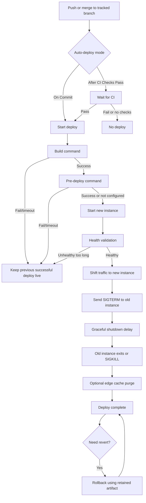
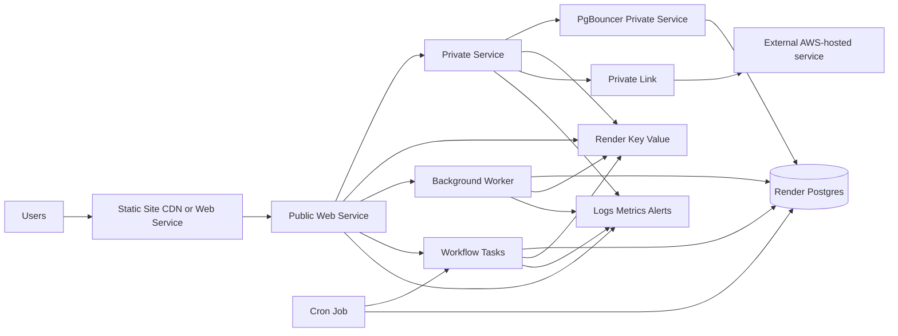

# Running Production Workloads on Render

## Executive summary

Render is a strong fit for production workloads when you lean into its opinionated strengths: split an application into the right service primitives, keep state in managed datastores instead of attached disks where possible, use private networking inside a region, treat `render.yaml` or Terraform as the control-plane source of truth, and externalize long-lived observability data to a dedicated provider. Its core platform story is built around automatic Git deploys, zero-downtime rolling redeploys, managed TLS, private service-to-service networking, managed Postgres, Redis-compatible Key Value, and progressively richer operational controls on paid tiers. Render explicitly warns that free instances are not for production use. citeturn21search8turn23view0turn28view0turn30view0turn18search1

The main strategic tradeoff is that Render favors a relatively simple “managed platform” model over a highly programmable traffic-routing model. The official docs reviewed here document automatic deploys, CI-gated deploys, deploy hooks, rollbacks, maintenance mode, health checks for web services, and preview systems, but they do **not** document native blue/green traffic splitting, canary routing, or customer-managed VPCs as first-class features. Where you need those patterns, the practical Render answer is usually a combination of preview environments, protected environments, specific-commit deploys, rollbacks, external monitoring, and careful service decomposition. For async compute, the newer Workflows product is promising, but it remains public beta and still has notable limits, including no built-in scheduler and no Blueprint support as of April 18, 2026. citeturn23view0turn24view0turn15search0turn31view0turn18search3

The production default I would recommend for most teams is this: public traffic enters through a web service or static site, internal RPC and queue consumers sit on private services and background workers, data lives in Render Postgres and Key Value, connection fan-out is controlled with PgBouncer, environments are separated with Projects and network isolation, all non-secret config is declared in Git, secrets are injected through scoped environment groups, deploys are gated on CI checks, and logs and metrics are streamed out for retention and alerting. That model aligns with the platform’s sharpest edges and minimizes long-term operational drag. citeturn13search9turn13search8turn29view2turn25view0turn18search2turn23view0turn32view5turn32view2

## Platform primitives and service selection

Render’s official documentation currently enumerates six service types for running code: web services, static sites, private services, background workers, cron jobs, and workflows. Docker is a runtime/deployment mode that applies to several of those service types rather than a separate service type, and “managed jobs” is not the current official label in the docs I reviewed; the closest adjacent primitives are **one-off jobs** and **Workflows**. citeturn21search4turn2search6turn21search15turn31view0

| Workload primitive | Description | Pros | Cons | Typical use cases | Cost and maintenance impact |
|---|---|---|---|---|---|
| Web service | Public HTTP service with custom domains, managed TLS, scaling, rollbacks, maintenance mode, and health checks. citeturn13search9turn24view0 | Best first-class support for internet-facing apps; zero-downtime redeploys; native HTTP features | Health checks are web-only; disks disable zero-downtime deploys | APIs, SSR apps, admin apps, public backends | Medium recurring spend; low ops burden if stateless |
| Static site | CDN-backed static hosting with managed TLS, redirects/rewrites, headers, and PR previews. citeturn9search5turn13search16 | Cheapest and simplest public surface; global CDN; atomic updates | No server-side compute; static sites do not emit runtime logs | Frontends, docs, marketing sites | Lowest maintenance and often lowest cost |
| Private service | Internal networked service reachable only inside Render’s private network. citeturn13search8turn28view0 | No public exposure; almost any protocol/port; good for internal dependencies | No public ingress; still requires long-running instances | Internal APIs, search nodes, data-plane services | Similar compute cost to web service; lower exposure, moderate ops |
| Background worker | Long-running internal process that cannot receive inbound traffic, public or private. citeturn16search6turn28view0 | Good fit for queue consumers; simple mental model | You manage the queueing system, retries, and concurrency semantics yourself | Queue consumers, async processors, stream consumers | Predictable always-on spend; app-level operational burden |
| Cron job | Scheduled job that runs on a cron expression in UTC; can use repo or prebuilt image; no persistent disk. citeturn1search7turn21search21 | Better than keeping a worker always on for periodic tasks; natural fit for backups and maintenance | No disk; image-backed jobs re-pull each run; long jobs are billed for runtime | Nightly maintenance, exports, scheduled syncs | Cost-efficient for infrequent work; operationally simple |
| Workflow | Public-beta durable task system with managed queuing, retries, timeout, task-level compute, and per-run billing. citeturn31view0turn31view1turn31view2 | Scale-to-zero economics; better than DIY worker fleets for distributed task graphs | Beta; no built-in scheduler; no Blueprint support; TypeScript/Python only | ETL, AI agents, fan-out/fan-in pipelines, durable async orchestration | Potentially lowest idle cost; higher product risk until GA |
| One-off job | Short-lived task using the latest successful build artifact and env snapshot of a base service; not a standalone service type. citeturn21search15turn17search7 | Excellent for ad hoc migrations, scripts, backfills, and admin tasks | No access to base-service disk; not a replacement for durable scheduling | Schema migrations, one-time backfills, operational tasks | Cheap and low-maintenance if used sparingly |
| Docker-based service | Image-based deployment mode for web/private/background/cron services, or Dockerfile builds with BuildKit. Not a separate service type. citeturn2search6turn20search14turn6search8 | Maximum runtime portability; better when native runtimes are unsuitable | More image maintenance; slower feedback if image hygiene is poor | Polyglot stacks, custom OS/runtime needs, legacy containers | Higher maintenance than native runtimes, but lower migration risk |

The most important production decision is whether a workload is **public HTTP**, **private networked**, **non-networked long-running**, **scheduled**, or **durable/distributed**. If it serves public traffic, use a web service or static site. If it must receive internal traffic but not public traffic, use a private service. If it should never receive inbound traffic, use a background worker or Workflow. If it runs on a schedule, prefer a cron job, or pair a cron job with a Workflow when you need both scheduling and durable orchestration. citeturn13search9turn13search8turn31view0turn1search7

A useful Render-specific rule is to avoid “forcing state” into service-local disks unless there is no better platform primitive. Persistent disks are encrypted and snapshotted, but they also prevent horizontal scaling and disable zero-downtime deploys for the attached service. That makes them reasonable for narrowly scoped internal stateful systems, but a poor default for production app state. citeturn4search3turn20search0turn20search1

## Configuration and environment management

For production, configuration discipline matters more on Render than many teams first expect, because the platform makes it very easy to change things in the dashboard. The strategic goal should be to separate **declarative infrastructure**, **shared environment configuration**, and **secret injection**, so that routine operations happen from Git and only truly secret or break-glass changes happen interactively. Render’s own IaC model, Blueprints, explicitly positions `render.yaml` as the single source of truth for interconnected services, databases, and environment groups. Its public REST API supports almost all dashboard functionality, and Render also provides an official Terraform provider for teams already standardized on Terraform. citeturn18search1turn21search5turn0search9

| Configuration model | Description | Pros | Cons | Typical use cases | Cost and maintenance impact |
|---|---|---|---|---|---|
| Dashboard-first | Services, env vars, secrets, scaling, and networking configured manually in the dashboard. citeturn18search2turn3search13 | Fastest onboarding; easiest discovery | Highest drift risk; weaker auditability; harder repeatability | Small teams, prototypes, emergency changes | Low initial effort, higher long-run maintenance |
| Blueprint `render.yaml` | Render-native IaC for services, databases, env groups, projects, previews, and more. citeturn18search1turn10search6turn0search5 | Best Render-native source of truth; good for multi-service apps | Secret handling requires care; some gaps remain, including Workflows support | Most production stacks on Render | Low long-term drift; moderate upfront discipline |
| Terraform provider | Official Terraform provider to manage Render alongside the rest of your estate. citeturn0search9 | Best for existing Terraform shops; policy integration; cross-cloud consistency | Another abstraction layer; provider coverage may lag newest features | Organizations already using Terraform broadly | Higher setup cost, lower multi-platform governance cost |
| API-driven automation | Render API for deploys, services, logs, metrics, domains, env groups, projects, and one-off jobs. citeturn21search5 | Flexible automation; ideal for custom pipelines and internal tooling | Easy to create snowflakes if not paired with declarative source control | CI/CD glue, release tooling, admin operations | Medium engineering cost; high leverage if standardized |
| Hybrid Git-declared with dashboard secret injection | Non-secret infra in Git; placeholder secret vars via `sync: false`; actual secret values populated in dashboard/env groups. citeturn18search0turn18search2 | Strong balance of reproducibility and secret hygiene | Requires process discipline; some manual secret steps remain | Recommended default for most production teams | Best overall maintenance tradeoff |

The key environment-management primitives are **environment variables**, **secret files**, **environment groups**, **projects/environments**, and **preview systems**. Environment groups are especially important because they let you distribute shared variables and secret files across multiple services, and they can be scoped to a single project environment. That is the simplest way to keep staging and production credentials from crossing. citeturn18search2turn25view0

The subtle but important catch is precedence and drift. Render explicitly warns that if multiple linked environment groups define the same variable, precedence is not guaranteed long-term; the current behavior favors the most recently created group, but Render says that behavior may change. Service-level variables always override environment-group values. That means a production-safe pattern is: **one environment group per concern**, **no duplicate keys across groups**, and **service-level overrides only for intentional exceptions**. citeturn18search2

A second drift risk appears when you mix protected environments and Blueprint-managed resources. Protected environments limit destructive changes for non-admins, but the docs explicitly say that if resources in a protected environment are managed via Blueprints, a non-admin can still modify those resources by publishing an update to the corresponding `render.yaml` file. The practical implication is that “protection” is partly a Git governance problem. If production is Blueprint-managed, protect the branch and require review there. citeturn25view0turn26view0

For previews, distinguish carefully between **service previews** and **preview environments**. Service previews are lightweight PR previews for a single web service or static site. Preview environments are multi-service, Blueprint-driven, high-fidelity copies of production that can include services, databases, and environment groups. Preview environments can override preview instance types, instance counts, and environment variables, and if a base service uses autoscaling, preview copies default to the base minimum instance count. That is exactly where you cut preview cost. citeturn22search0turn22search1turn19search2turn19search3

In monorepos, use `rootDir` and build filters aggressively. Render documents that root directories constrain autodeploys to changes under that subtree, and build filters control when deploys and previews should be created. That reduces wasted pipeline minutes, unnecessary preview environments, and unrelated redeploys. citeturn22search6turn22search16turn23view0

## Deploy lifecycle and release management

Render’s deploy system is built around a straightforward lifecycle: build, optional pre-deploy step, start a new instance, validate, switch traffic, and gracefully retire the old instance. Any command failure or timeout fails the deploy, and the previous successful version keeps running. Build, pre-deploy, and start commands have documented time limits of 120 minutes, 30 minutes, and 15 minutes respectively. Only one active build can run per service, and a newer build cancels the previous in-progress build for that same service. citeturn23view0turn6search21

The following release strategies are the ones that matter most on Render in practice. citeturn23view0turn24view0turn7search6turn15search0

| Deployment strategy | Description | Pros | Cons | Typical use cases | Cost and maintenance impact |
|---|---|---|---|---|---|
| Auto-deploy on commit | Deploy immediately on push/merge to linked branch. citeturn23view0 | Fastest throughput; simplest | Weakest release gate; bad fit for fragile prod repos | Low-risk services, fast-moving staging | Low process overhead, higher incident risk |
| Auto-deploy after CI checks pass | Deploy only after supported CI checks succeed. citeturn23view0 | Best production default; enforces test gate | Still not a canary; depends on reliable CI signal | Production branches, protected repos | Moderate process cost, best reliability tradeoff |
| Manual deploy of latest or specific commit | Deploy latest branch tip or an explicit commit SHA from history. Specific-commit deploy disables autodeploys. citeturn23view0turn9search10 | High operator control; valuable for incident response | More manual work; easier to diverge from branch tip | Controlled releases, hotfixes | Low infra cost, higher operator involvement |
| Deploy hooks or API-triggered releases | Trigger deploys through HTTP hooks or API calls; image-backed services can point to a new image tag/digest. citeturn6search2turn6search6turn23view0 | Best for external CI/CD orchestration and image pipelines | Requires secret handling and custom automation | GitHub Actions, release managers, image promotions | Higher engineering effort, strong automation flexibility |
| Clear build cache and deploy | Force a fresh build without prior artifacts. citeturn23view0turn9search2 | Correct fix for stale cache artifacts and changed build logic | Slower, more pipeline-minute consumption | Build tooling changes, stale asset problems | Slightly higher build cost, lower hidden-state risk |
| Rollback | Reuse recent build artifact to revert quickly; dashboard rollback disables autodeploys automatically. citeturn7search6 | Fastest recovery path for bad code deploys | Only works while artifact retained; not config-time travel | Incident mitigation | Minimal cost, high operational value |
| Service previews and preview environments | Temporary preview copies for single services or full stacks. citeturn22search0turn22search1turn19search2 | Safer change review and integration testing | Can become expensive if previews mirror prod too closely | PR validation, stakeholder review | Potentially large variable cost without right-sizing |
| Native zero-downtime rolling deploys | New instances start first, then Render switches traffic and gracefully retires old ones. citeturn23view0turn24view0 | Good availability baseline without extra tooling | Not the same as canary or blue/green; disks disable it | Most stateless app services | Strong default, low maintenance |

The best generic deploy pattern on Render is: **After CI Checks Pass** on protected production branches, **preview environments** for integration-heavy changes, a **pre-deploy command** reserved for idempotent setup such as schema migrations, and **rollbacks** as the primary incident-recovery primitive. If you need a full release orchestrator, use deploy hooks or the API rather than trying to approximate canary routing with manual domain gymnastics. citeturn23view0turn7search6turn32view4

Health checks deserve special emphasis because they are one of the most valuable built-in defenses against bad deploys. Render documents health checks only for web services. The endpoint is polled continuously and during deploys; a deploy is canceled if a new instance fails health checks for 15 consecutive minutes, a running instance is removed from routing after 15 seconds of continuous failure, and the service is restarted after 60 seconds of continuous failure. Production guidance: every web service should expose a cheap readiness endpoint that validates process health and operation-critical dependencies, and the endpoint should fail fast. citeturn24view0

For graceful shutdown, Render sends `SIGTERM`, waits 30 seconds by default, and then `SIGKILL`s if the process has not exited; the delay is configurable up to 300 seconds. Long-running worker tasks and WebSocket-style workloads should explicitly handle this signal. citeturn23view0turn20search13

On blue/green and canary releases, the official materials reviewed here do **not** document native traffic splitting or percentage-based rollouts. Treat those capabilities as **unspecified in the reviewed official docs**. The nearest native controls are zero-downtime rolling deploys, previews, maintenance mode, deploy specific commit, and rollback. citeturn23view0turn15search0

## Data and networking architecture

Render’s database story is strongest when you stay inside the managed product surface: Render Postgres for relational data and Render Key Value for caches and job queues. Paid Postgres includes point-in-time recovery and logical exports, with larger instances supporting read replicas and high availability. Key Value is Redis-compatible, and paid plans add disk-backed persistence. For most production apps, this is the lowest-ops path. citeturn30view0turn29view3

For Postgres, use the **internal URL** whenever the client is another Render service in the same region. The docs are clear that internal URLs minimize latency and use the private network. Co-locate services and datastores in the same region by default. External Postgres connections are slower because they traverse the public internet, and by default a Postgres instance is externally reachable from any IP with valid credentials unless you restrict it. That default should usually be tightened in production. citeturn30view0turn28view0

Postgres operations have a few important production-grade features and tradeoffs. PITR creates a **new** database instance at the chosen historical point, which is operationally strong because it lets you validate the recovered state before repointing clients. High availability requires eligible instance types, bills the standby at the same size as the primary, and failover occurs automatically when the primary is unavailable for 30 seconds. Read replicas reduce primary load but are asynchronous and therefore not appropriate for read-after-write consistency requirements. PgBouncer is the documented answer when connection counts approach instance limits, and on Render it is typically deployed as a private service. citeturn29view0turn29view1turn29view5turn29view2turn30view0

Credential rotation is also materially better than many small PaaS offerings. Render documents adding Postgres users and performing zero-downtime rotations; the practical pattern is to create a new user, update consumers, promote if needed, and then revoke or delete the old one. If you reference database connection strings in Blueprints, note that default-user changes propagate to those env vars on the next Blueprint sync. citeturn29view4turn18search7

For Key Value, the main production nuance is security posture. Internal connections are preferred and can be left unauthenticated by default, but that default is often too relaxed for regulated or multi-team environments. External access is not enabled by default for new instances, and internal auth can be turned on. For production, enable internal auth unless you have a strong reason not to, and keep the instance private to the region unless an external client actually needs it. citeturn29view3

If you need external databases or third-party stateful systems, Render’s best-supported networking options are **shared outbound regional CIDR ranges**, **private network access inside a region**, and **PrivateLink connections to AWS-hosted systems**. Official docs say outbound addresses are shared across all services in a region, and Render-native unique static egress IPs are not currently documented; the docs instead suggest a third-party static IP provider if you need unique egress. That is a meaningful architectural tradeoff for enterprises integrating with strict allowlists. citeturn28view2turn28view1

The internal networking model is simple: services in the same workspace and same region share a private network; web and private services get internal hostnames, Postgres and Key Value get internal URLs, and workers/cron jobs can send but not receive private traffic. Professional-tier workspaces and above can block cross-environment private connectivity, which is a strong default for separating staging from production. citeturn28view0turn25view0

Custom domains and managed TLS are straightforward for web services and static sites. Those two are the public ingress primitives. For HTTP-heavy public workloads, scaling multiple instances gives you built-in load balancing, and paid web services can optionally use edge caching for static assets served from the app itself. If you need a system that should never be reachable publicly, do not expose it as a web service—make it private. citeturn2search20turn20search17turn20search5turn15search8turn13search8

On firewalling, the most important distinction is **public ingress** versus **private network traffic**. Inbound IP rules apply only to public internet traffic. All workspaces can set them on managed datastores; Enterprise is required to set them on web services, static sites, environments, or workspaces. There is no corresponding “inbound IP rules” concept for private services, background workers, or cron jobs because those never receive public traffic. citeturn28view3

The major anti-pattern in this area is using persistent disks as the default persistence layer for application state. Render’s own docs are explicit: disks cannot scale across multiple instances, they disable zero-downtime deploys, they cannot be used from build/pre-deploy stages or from one-off jobs, and they should usually give way to managed Postgres or Key Value when those fit the need. citeturn20search0turn20search1turn4search3

## Observability, security, and governance

Render’s observability model is solid for platform metrics and logs, but you should not mistake that for a complete production observability stack. In-dashboard logs support search and filtering, and Professional workspaces add HTTP request logs for web services. In-dashboard metrics cover CPU, memory, disk, HTTP requests, latency on higher tiers, outbound bandwidth, and managed-database activity. Retention for both logs and metrics is finite: 7 days on Hobby, 14 on Professional, and 30 on Organization/Enterprise. That is enough for day-to-day operations, but not enough for longer investigations, compliance, or historical capacity analysis. citeturn32view0turn7search0turn32view1

The correct production posture is therefore to stream data outward. Render can stream logs to any TLS-enabled syslog endpoint and metrics to OpenTelemetry-compatible providers. The docs explicitly call out first-class guidance for providers including entity["company","Datadog","observability platform"] and entity["company","New Relic","observability platform"], along with several others. In the official sources I reviewed, I did **not** find a first-party native integration page for entity["company","Sentry","app monitoring"]; for Sentry-style error tracking, the practical approach is application-level SDK instrumentation rather than relying on a Render-native sink. citeturn32view5turn32view2turn17search2

A few integration limits matter. Metrics streams on Professional+ do not emit metrics for static sites, cron jobs, or one-off jobs. Log streams do not emit logs for static sites, and the official log-stream docs say workflow log-stream support is not yet available. Render Webhooks are valuable here because they let you push deploy, scaling, and service-state events into external incident tooling without polling the API. citeturn32view2turn32view5turn32view4

For operational alerting, Render supports workspace-level and service-level email and Slack notifications for failures and unhealthy services. That is useful as a baseline, but for serious production operations you usually want Render notifications to complement, not replace, your main alerting system. External alerting on streamed logs/metrics gives you better routing, deduplication, escalation, and retention. citeturn32view3turn32view2turn32view5

On security and compliance, Render documents SOC 2 Type 2, ISO 27001, HIPAA-enabled workspaces, GDPR-related documentation, audit logs on Organization/Enterprise, SAML SSO and SCIM on Enterprise, workspace role controls, secure-login enforcement such as 2FA, and a published shared-responsibility model. In the official sources reviewed here, PCI DSS availability is **unspecified**. That should matter if your compliance roadmap includes cardholder-data workloads. citeturn27view0turn27view1turn27view2turn17search5turn27view3

Role design is strong enough for most SaaS teams if you use it properly. Admins control the workspace and can mark environments protected. Developers can work broadly, while Contributors and Viewers narrow access to secrets and operations. Protected environments can block creation, deletion, shell access, secret access, and other destructive actions for non-admins. Combined with environment-level network isolation, that gives Render a credible platform story for production change control—provided your Git permissions are aligned with it. citeturn26view0turn25view0

At the infrastructure layer, Render documents encryption at rest and in transit for Postgres, encryption at rest and encrypted snapshots for persistent disks, managed TLS for web services and static sites, and platform-wide DDoS protection using entity["company","Cloudflare","network security"] infrastructure. Render’s shared-responsibility model is also explicit that customers remain responsible for protecting secrets, reviewing access, securing application-level configuration, handling endpoint security, and maintaining business continuity and disaster recovery plans. citeturn13search1turn4search3turn20search17turn13search0turn27view3

## Team workflows, cost controls, and recommended patterns

The best Render team workflow is to align human permissions, Git routes, and environment boundaries. Use Projects to separate staging and production, scope environment groups to those environments, block cross-environment private traffic on paid tiers, and mark production as protected. Then pair that with branch protection on the repo that owns `render.yaml`. Without that last step, production “protection” is incomplete, because Blueprint updates remain a legitimate mutation path. citeturn25view0turn26view0

Preview systems should be used selectively because they can quietly become one of the biggest long-term costs on the platform. Render’s preview environments can clone services, databases, and environment groups on every pull request. That is powerful, but expensive if you mirror production shapes. The docs support `previewPlan`, preview instance-count overrides, and preview-specific env var values. A pragmatic production pattern is to keep full-stack previews for schema-sensitive or integration-heavy changes, while using service previews for ordinary frontend or isolated service work. citeturn22search1turn19search2turn19search3turn22search0

Cost control on Render is mostly about avoiding unnecessary always-on compute and avoiding accidental multiplicative environments. Cron jobs are generally cheaper than idle workers for periodic work. Workflows can be cheaper than large worker fleets for bursty async work because billing is per task-run duration and “scales to zero,” but that comes with beta risk. Autoscaling reduces idle waste for variable traffic, while manual scaling offers more predictable bills. Managed Postgres HA doubles the compute footprint for the database role because the standby matches the primary and is billed accordingly. Read replicas and PgBouncer each add their own recurring cost, but usually buy back more reliability than they cost once concurrency grows. citeturn1search7turn31view1turn31view2turn19search0turn29view1turn29view5turn29view2

Render’s own plan structure also pushes teams toward paid tiers faster than beginners sometimes expect. Team members require Professional or above, and key production capabilities such as autoscaling, preview environments, the performance build pipeline, HTTP request logs, response latency metrics, metrics streaming, network-isolated environments, private links, webhooks, and longer retention windows are all tier-gated. That means “cheap compute” alone is not the right cost model; production maturity on Render usually implies some workspace-plan overhead as well. citeturn26view0turn8search5turn11search2turn32view2turn32view4turn7search2

A robust default architecture for a general production app on Render looks like this: a static site if the frontend is fully static, otherwise a web service; one or more private services for internal APIs or protocol-speaking components; background workers for continuous queue consumers unless the problem is better expressed as a durable Workflow; cron jobs for scheduled operations; Render Postgres plus Key Value over the private network; PgBouncer as a private service once database connection fan-out becomes meaningful; CI-gated deploys; health checks on every web service; and external log/metric streaming for retention and alerting. citeturn9search5turn13search9turn13search8turn31view0turn1search7turn30view0turn29view3turn29view2turn24view0turn32view2turn32view5

A higher-control pattern for regulated or enterprise teams is similar but adds protected production, network-isolated environments, restricted datastore ingress, SAML SSO/SCIM on Enterprise, audit-log export, PrivateLink for supported AWS-hosted providers, and elimination of all unnecessary external database access. In the official docs reviewed here, customer-managed VPCs and native static egress IPs are not documented as first-class features, so if those are hard requirements you should treat them as gaps or unspecified capabilities rather than assuming they exist. citeturn25view0turn28view3turn27view2turn17search5turn28view1turn28view2

The long-term maintenance hierarchy on Render is fairly clear. Lowest maintenance is: static site, stateless web service, private service, cron job, managed Postgres/Key Value, and Git-declared infra. Medium maintenance is: autoscaling, preview environments, external observability sinks, and PgBouncer. Highest maintenance and architectural risk are: service-local persistent disks for core state, dashboard-driven configuration without Git authority, and trying to emulate advanced release engineering patterns the platform does not natively document. citeturn20search0turn18search1turn23view0turn32view2turn32view5

The clearest Render-specific production advice, then, is simple: **stay stateless at the service layer, keep state in managed datastores, declare infra in Git, isolate environments, gate deploys with CI, use preview systems selectively, and stream observability data out of the platform early.** That is the path that best matches the documented platform surface and minimizes surprise as the system grows. citeturn18search1turn25view0turn23view0turn30view0turn32view2turn32view5