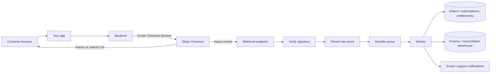
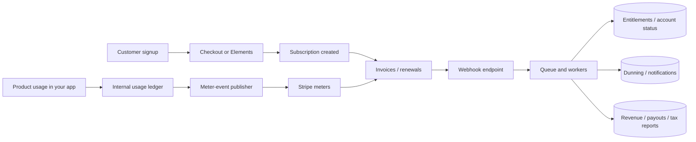
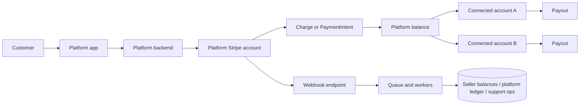

# Production Stripe Integration Best Practices

## Executive summary

For most production applications that charge real customers, the strongest default is to start with Checkout Sessions, then add Billing for recurring logic, Billing Portal for self-service, Tax for indirect-tax calculation, Radar for baseline fraud controls, official server SDKs on the backend, and webhooks as a durable asynchronous boundary. Stripe’s current documentation now explicitly recommends Checkout Sessions for most integrations and notes that choosing raw PaymentIntents means you must rebuild discount, tax, subscription, shipping, and currency-conversion logic yourself. citeturn19view0turn1search14turn3search2

Drop down to lower-level surfaces only when the product genuinely requires it. Use Elements or the Payment Element when you need substantial UI control but still want Stripe-hosted tokenization and broad payment-method coverage; use PaymentIntents only when you truly need to own the checkout state machine; use SetupIntents when you need to save credentials for future on-session or off-session charging without charging immediately. In production, the hardest incidents usually come less from rendering the payment form and more from webhook handling, idempotency, retries, reconciliation, and support workflows. Stripe documents at-least-once webhook delivery, no ordering guarantee, and idempotent POST semantics for safe retries; that is where the operational risk concentrates. citeturn1search1turn1search5turn20search2turn20search4turn17view0turn18view0

A sound production stance is to treat payments as a product-plus-ledger system, not as a frontend feature. That means a stable commercial catalog mapped to Products and Prices, a durable event-ingestion pipeline, explicit refund and dispute operations, automated payout and bank reconciliation, pinned API versions, restricted and rotated keys, and a test program that covers renewals, disputes, 3DS/SCA, webhook replay, and failure injection before go-live. citeturn28search6turn28search8turn16search1turn16search2turn0search20turn25view0turn26view0turn6search5turn6search17turn27search1

Minimizing PCI scope should be a first-order design goal. Stripe’s security and PCI guidance says Checkout, Elements, mobile SDKs, and Terminal SDKs send sensitive payment data directly to Stripe’s PCI-validated servers, which can materially reduce merchant PCI burden. But the exact SAQ path still depends on the surrounding implementation details of your payment page and environment, so compliance scope must be reviewed explicitly before launch rather than assumed from marketing labels like “hosted” or “embedded.” citeturn10search0turn10search3turn11search1turn11search4turn11search9

## Choosing the integration surface

The practical rule is simple: prefer the highest-level Stripe surface that still meets the product requirement. That ordering is deliberate because lower-level APIs buy more UI and orchestration control only by moving more tax, discounting, state management, failure handling, and reporting responsibility into your codebase. citeturn19view0turn10search3turn17view0

| Surface | Choose it when | Main trade-off |
|---|---|---|
| Checkout | Default web path for most one-time and subscription payments, especially when you want built-in tax, discounts, shipping, dynamic payment methods, and localized pricing behavior without rebuilding them yourself. | Highest leverage and lowest maintenance, but less bespoke UX control than a fully custom flow. citeturn19view0turn29search17 |
| Elements and Payment Element | You need substantial branding and layout control on web or mobile, but still want Stripe.js or mobile SDK tokenization and broad payment-method support. | More engineering than Checkout; you still own more orchestration and UI behavior. citeturn1search1turn1search5turn3search9turn3search12turn3search18 |
| PaymentIntents API | You truly need to own the checkout state machine, amount computation, and custom flow logic. | Maximum flexibility, but Stripe says you must manually implement logic that Checkout already covers for discounts, taxes, subscriptions, and currency behavior. citeturn19view0turn20search6 |
| SetupIntents API | You need to save a payment method for future use without charging now, or to prepare off-session charging correctly. | No charge is created; you must still manage consent, customer attachment, and follow-on charging logic. citeturn20search2turn20search1turn20search7 |
| Billing and Subscriptions API | You sell recurring access, need trials, prorations, dunning, schedules, or usage-based billing. | Recurring lifecycle automation is strong, but mis-modeled plans create downstream finance and support pain. citeturn1search2turn1search10turn7search3turn7search11turn6search14 |
| Invoicing | You run B2B or AR-style payment collection, need one-off invoices, payment terms, or a hosted invoice page. | Excellent for accounts-receivable flows, but invoice lifecycle and cash application become part of operations. citeturn21search2turn21search0turn21search4turn21search6 |
| Billing Portal | Customers need self-serve payment-method updates, invoice history, plan changes, cancellations, or retention offers. | Fast to deploy and powerful, but limited to the portal’s configurable UX boundaries. citeturn3search1turn3search5turn3search8turn3search17 |
| Connect | You are a platform, marketplace, or multi-party funds-flow business that must onboard third parties and route payouts. | Extra compliance, seller support, and funds-flow complexity; newer docs steer new integrations toward current Connect guidance rather than legacy connected-account-type decisioning alone. citeturn2search0turn2search3turn2search18turn2search6turn23search3 |
| Terminal | You need in-person card acceptance and want online and offline payments in one system. | Hardware, fleet, offline-mode, and regional operations add complexity. citeturn3search0turn3search4turn3search10turn3search13 |
| Issuing | You need to create and control cards for employees, users, contractors, or agents. | Powerful for card programs, but it is not a checkout surface for collecting customer payments. citeturn2search1turn2search4turn2search13 |
| Radar | You process enough risky volume that fraud, manual review, or dispute rates matter. | Built-in AI and rules are useful, but you must tune against false positives and operational review load. citeturn2search2turn2search8turn2search11turn2search14 |
| Tax | You have indirect-tax exposure across states or countries, or want tax on custom and even non-Stripe flows. | Tax calculation automates a large surface area, but registrations and remittance remain legal and operational responsibilities. citeturn24view0turn1search7turn5search17turn1search19 |
| Webhooks and event destinations | Always, because payment finality, disputes, renewals, and asynchronous methods cannot safely be driven from frontend redirects. | You must design for duplicates, retries, and out-of-order delivery. citeturn17view0turn6search6turn29search3 |
| Server SDKs | Always on the backend for authenticated Stripe API access. | Safer and lower-boilerplate than raw HTTP, but you still must pin versions and keep secrets off clients. citeturn3search2turn3search6turn25view0turn26view0 |
| Web and mobile SDKs | You need browser or native UX components for payment collection and authentication flows. | Use only publishable keys client-side; secret keys stay server-side. citeturn3search2turn3search9turn3search12turn3search18turn26view0 |

My recommendation hierarchy for most teams is: Checkout first, Elements second, PaymentIntents third. Then add SetupIntents, Billing, Portal, Tax, Radar, and webhooks as supporting layers; add Connect, Terminal, and Issuing only when the business model demands them. This pattern follows Stripe’s current product guidance and also minimizes the amount of critical financial state your application must own alone. citeturn19view0turn20search2turn24view0turn17view0

## Product and pricing architecture

Stripe’s product model is cleanest when you use Products to represent what you sell and Prices to represent the billing terms: amount, currency, cadence, and pricing structure. Stripe’s own pricing-model docs frame the model this way for flat-rate, per-seat, and usage-based scenarios, and the Price object is explicitly where unit cost, currency, and recurring interval live. That strongly supports a design where Stripe stores commercial terms, while your own application stores the contract, entitlements, and provisioning semantics. citeturn28search1turn28search3turn28search4turn28search6

A robust catalog design uses stable internal codes and maps them into Stripe with `lookup_key` and metadata rather than hard-coding human-edited dashboard names or scattering raw Price IDs throughout application logic. Stripe documents `lookup_key` as a stable retrieval hook and metadata as structured key-value storage on many objects. In practice, this means you should keep your own canonical `plan_code`, `contract_id`, `account_id`, and `order_id`, then copy those values into Stripe objects so that webhooks, reports, and support tooling can reliably join Stripe events back to your own system. That recommendation is analytical, but it follows directly from Stripe’s object responsibilities and metadata guidance. citeturn28search8turn28search2turn18view0

For one-time and recurring billing, treat “price changes” as new commercial terms, not silent edits to old agreements. Stripe separates products from prices specifically so you can change pricing without changing the underlying product model, which makes grandfathering older customers tractable. Operationally, the best practice is to create new Price objects for material pricing changes, keep legacy prices for existing contracts, and use subscription schedules when a change is supposed to happen at a future date rather than now. citeturn28search4turn28search6turn1search10turn7search12

For usage-based billing, Stripe’s current model is “meter plus meter events.” A meter defines how usage aggregates over the billing period, and meter events are the activity records you send from your system. The critical design implication is that your meter-event publisher should sit behind the authoritative usage system, not behind a user interface. Keep an append-only internal usage ledger even after you send usage to Stripe: Stripe meters are the billing basis, but your ledger is what lets you replay usage, explain invoices, and detect drift between product telemetry and billing state. citeturn7search3turn7search11turn0search14turn7search14

For discounts and promotions, separate the economic rule from the customer-facing code. Stripe’s docs distinguish coupons, which define the discount economics, from promotion codes, which are the user-facing aliases that map to coupons. That separation is worth preserving in your own design as well, because it lets marketing create or retire redemption codes without changing the actual commercial rule. For retention workflows, Billing Portal can even surface cancellation management and offer retention coupons directly. citeturn7search0turn3search8

For tiered pricing, choose intentionally between volume and graduated pricing before you launch. Stripe’s docs draw a clear distinction: volume pricing applies the final tier’s rate to all units, while graduated pricing prices each tier separately and sums them. Those two models can produce very different invoice totals at threshold boundaries, which means the choice is not merely technical but contractual and support-relevant. citeturn7search2turn7search10

For multi-currency, do not collapse presentment, settlement, and accounting currency into one field just because the happy path is domestic. Stripe supports charging in 135-plus currencies and distinguishes the customer-facing presentment currency from the merchant’s settlement currency; its revenue-recognition docs also show how FX differences arise when invoices finalize in one rate environment and are paid in another. The most durable pattern is to store all three: what the customer saw, what the bank eventually settled, and what your GL uses as functional currency. That becomes important for FX on refunds, disputes, and revenue reporting. citeturn7search13turn7search1turn14search5turn7search22

## Reference architectures and event handling

The most important architectural principle is to keep user experience separate from financial finality. Stripe’s own Checkout fulfillment docs say webhooks are required for fulfillment because a customer may pay successfully and never load your success page. That means your application should treat frontend redirects as UX only and webhooks as the source of truth for durable side effects such as order fulfillment, access grant, seat activation, renewal, refunds, and dispute handling. citeturn29search1turn29search3turn17view0

### Default web pattern



This is the right baseline when the business goal is reliable money movement more than a custom checkout animation. The critical control is that access is granted only after the worker processes the relevant success event, not after the browser lands on a success page. For subscription businesses that require paid activation, `invoice.paid` is usually the cleanest trigger for access because it encodes actual payment success rather than merely object creation. citeturn19view0turn29search3turn21search1turn17view0

### Usage-based subscription pattern



The design goal here is to keep metering, invoicing, and entitlement changes loosely coupled but audit-friendly. Usage should originate from a backend event source you trust, not from the browser. Renewals, dunning, and payment failure handling should be webhook-driven, because Stripe’s recurring-payment lifecycle and Smart Retry behavior are asynchronous by nature. citeturn7search11turn7search14turn6search14turn6search18

### Marketplace or platform pattern



For multi-party flows, charge-type selection must follow the funds-flow truth, not developer convenience. Direct charges fit cases where the customer is transacting directly with the connected account; destination charges fit one-seller platform flows where the platform collects and immediately transfers; separate charges and transfers fit split-cart or multi-recipient flows. A particularly important production rule from Stripe’s Connect docs: when using separate charges and transfers with asynchronous payment methods, wait for `charge.succeeded` before creating transfers, because failed async payments do not automatically retract transfers after the fact. citeturn23search2turn23search4turn23search1turn23search8

### Webhook and idempotency pattern

Stripe’s webhook docs say three things that should drive your design: Stripe retries failed deliveries for up to three days in live mode, webhook event order is not guaranteed, and endpoints may receive duplicate events or even distinct Event objects that represent the same logical object change. Its API error-handling docs add a fourth: POST retries are safe only when the exact same idempotency key and parameters are reused, and 500 responses should be treated as indeterminate rather than blindly recreated with a new key. The durable pattern is therefore queue-first, dedupe-first, and side-effect-second. I recommend keeping dedupe records for at least 35 days so that you cover Stripe’s documented 30-day CLI resend window with margin. That retention horizon is an engineering inference from Stripe’s retry and resend behavior. citeturn17view0turn18view0

```text
HTTP POST /stripe/webhook(raw_body, headers):
    event = verify_signature(raw_body, headers["Stripe-Signature"], active_secrets)

    begin transaction
        if webhook_receipts.exists(event_id = event.id):
            commit
            return 200

        insert webhook_receipts(
            event_id = event.id,
            event_type = event.type,
            object_id = event.data.object.id,
            received_at = now(),
            raw_payload = raw_body
        )

        enqueue("stripe-events", {event_id: event.id})
    commit

    return 200
```

```text
worker handleStripeEvent(event_id):
    receipt = db.getWebhookReceipt(event_id)
    event = parse(receipt.raw_payload)

    logical_key = event.type + ":" + event.data.object.id

    if side_effects.exists(logical_key):
        return

    // Fetch latest state if ordering matters or if the event payload is incomplete
    stripe_object = maybeFetchLatestObject(event)

    switch event.type:
        case "checkout.session.completed":
            recordSuccessfulCheckout(stripe_object)
        case "invoice.paid":
            activateSubscriptionPeriod(stripe_object)
        case "invoice.payment_failed":
           markPastDueAndNotify(stripe_object)
        case "charge.refunded":
            applyRefundJournal(stripe_object)
        case "charge.dispute.created":
            openDisputeCase(stripe_object)

    recordSideEffect(logical_key, event.id)
```

```text
// Outbound Stripe API mutation pattern
operation_id = "order:" + order_id + ":create_payment_intent:v1"

stripe.paymentIntents.create(
    params = {..., metadata: {order_id: order_id, operation_id: operation_id}},
    options = {idempotencyKey: operation_id}
)

// On network failure: retry with the SAME key and SAME parameters
// On 500: mark outcome indeterminate, inspect logs/webhooks, and reconcile before reissuing
```

Two implementation details matter in practice. First, Stripe explicitly recommends logging processed `event.id` values, and for logical duplicates it recommends using the combination of `data.object.id` and `event.type`. Second, metadata is extremely useful as the join key when Stripe later reconciles an indeterminate request and emits a webhook for an object your original API response never returned cleanly. citeturn17view0turn18view0turn28search2

## Finance operations, tax, and fraud

Your internal financial system should anchor on Stripe balance transactions, not on whatever sequence of charges, refunds, invoices, and payouts happens to be easiest to query on a given day. Stripe’s Sigma and reporting docs describe balance transactions as a ledger-style, immutable record of the money moving into and out of your Stripe balance. That makes them the right primitive for operational reconciliation, support investigation, payout explanation, and GL posting. citeturn16search1turn16search4

A production reconciliation stack should have at least three layers. First, transaction-level ingestion based on balance transactions and webhook facts. Second, scheduled reporting using the Reports API for balance summaries and payout-reconciliation files. Third, a warehouse sink, usually via Data Pipeline or an equivalent export, so finance can close books without scraping the Dashboard. If you use Stripe Revenue Recognition, Stripe also supports mapping its default accounts to your chart of accounts and generating trial-balance-style outputs. The operating rhythm I recommend is a daily three-way match of Stripe transaction ledger to payout report to bank deposit, and a monthly close that includes FX review for multi-currency flows. citeturn16search2turn0search1turn0search10turn0search20turn16search3turn14search0turn14search2

Refunds and disputes deserve dedicated workflows, not generic “reverse payment” buttons. Stripe’s refund docs note that you can cancel some payments before completion at no cost, or refund all or part after success, but original processing fees are not returned. Stripe’s dispute docs note that a dispute debits the disputed amount plus a dispute fee from your Stripe account, and you usually have only one opportunity to submit evidence. On Connect, the funds-flow consequences depend on charge type: for destination charges you can reverse the connected-account transfer during refund creation, while for separate charges and transfers you must explicitly reconcile transfers because refunding the charge does not itself unwind associated transfers. citeturn8search4turn8search11turn8search3turn8search6turn8search0turn8search5turn23search1

The best operational pattern is to maintain a dispute case file keyed to the underlying payment, with shipment or service evidence, IP and device context where appropriate, customer communication, refund history, and any contract বা cancellation evidence pre-indexed by payment ID. Stripe organizes dispute reasons into categories because evidence standards differ by claim type; your ops process should mirror that and never build one “submit everything” template. citeturn8search10turn8search6

For tax, the correct mental model is not “calculate a rate,” but “complete the compliance cycle.” Stripe’s Tax docs frame that cycle as monitoring obligations, registering, calculating and collecting, then reporting, filing, and remitting. Stripe Tax can calculate taxes in no-code flows such as Checkout, Billing, and Invoicing, and the Tax API can also be used in fully custom flows or even with non-Stripe processors. Stripe also has filing partners, but the legal obligation to register and remit still sits with you or your chosen filing provider. citeturn24view0turn1search7turn5search17

Tax quality depends heavily on input quality. Stripe Tax uses business address, registrations, product tax codes, customer location, and customer status to determine rates. That means your production design should make customer location collection and product tax-code maintenance explicit product requirements, not optional form fields. Stripe’s own tax reporting docs also note that some reports have limitations and final filing figures can vary from raw transaction summaries, so finance should not treat dashboard exports as a substitute for tax review. citeturn24view0turn5search14turn1search19

For fraud, I would treat Radar as a baseline control plane rather than an optional add-on. Stripe says Radar evaluates transactions in real time using AI risk scoring and built-in rules, and it supports custom rules, lists, and review workflows. The best operating pattern is usually to start with built-in protections, then add a small number of explicit allow, review, and block rules tied to observed false positives or known abuse patterns, rather than building an elaborate static ruleset on day one. That keeps your fraud system adaptive while letting support and risk teams reason about exceptional cases. citeturn2search2turn2search8turn2search11turn2search14

## Security, compliance, and data governance

On PCI scope, the first principle is to keep cardholder data out of your systems whenever you can. Stripe’s integration security and PCI guidance says Checkout, Elements, mobile SDKs, and Terminal SDKs are tokenized methods that send sensitive payment data directly to Stripe’s PCI-validated servers. That can significantly reduce merchant PCI burden. But scope questions should still be framed through the actual PCI SAQ eligibility criteria, not through vendor shorthand. The official SAQ A docs say SAQ A is for merchants whose account-data functions are completely outsourced to PCI DSS–validated third parties and who do not store, process, or transmit account data electronically on their own systems, while SAQ A-EP is for e-commerce merchants whose sites do not receive account data but do affect the security of the payment transaction or the integrity of the payment page. citeturn10search0turn10search3turn11search1turn11search4

A useful caution here is that “hosted versus embedded” is too crude a compliance test. The 2025 PCI SSC clarification around SAQ A eligibility for e-commerce merchants with embedded third-party payment forms shows that scope depends on the exact architecture, not just the UI feel. The right production practice is to choose the lowest-scope design that still meets product goals, then validate the resulting SAQ path with your acquirer or a QSA before launch. citeturn11search2turn11search7turn11search0

For SCA and PSD2, design for authentication from the start rather than bolting it on later. Official EU guidance states that strong customer authentication under PSD2 came into force on September 14, 2019, and Stripe’s docs say SCA affects many online customer-initiated payments for businesses in the entity["place","European Economic Area","eu region"] that accept payments from EEA customers, with similar treatment in Europe and the UK in Stripe’s payment-authentication guidance. Stripe’s docs also note that you can authenticate a card when saving it and mark subsequent charges appropriately as merchant-initiated transactions, which is the right shape for compliant off-session billing. Hosted surfaces such as the Hosted Invoice Page also help because Stripe handles 3DS flows for the customer directly. citeturn4search2turn4search5turn12search1turn12search2turn12search5turn21search4

On data residency, the public-document answer is narrower than many teams want. Stripe’s privacy and DPA materials describe privacy commitments and data-transfer mechanisms, but the DPA also explicitly says personal data may be transferred to Stripe, LLC in the entity["country","United States","north america"] and to affiliates and subprocessors in other jurisdictions as necessary to provide services. Whether a given product and region combination can satisfy a strict in-region residency requirement is therefore **UNKNOWN** from the public materials I reviewed alone. If strict residency or data-boundary guarantees are a hard requirement, treat them as a legal and procurement workstream and confirm them contractually for each product you plan to use. citeturn13search1turn13search3turn13search5

For key management, Stripe’s own guidance is unequivocal: never put secret keys in source code or client applications; use a secrets vault or environment variables; prefer restricted keys over broad secrets; audit request logs; restrict keys to stable IPs where possible; and rotate keys periodically, including as an incident-response drill. The same stance should apply to webhook signing secrets. Stripe documents secret rotation with overlap windows and recommends periodic rolling. citeturn26view0turn6search0turn6search4turn17view0

Versioning also needs to be governed, not ad hoc. Stripe’s versioning docs say webhook events use the endpoint’s API version when set, otherwise the account default, and newer official SDK versions pin to specific API-version families. Operationally, that means one thing: pin your SDK versions, pin your webhook endpoint versions, test upgrades in Workbench or sandboxes, and treat every API-version upgrade as a planned rollout with regression coverage and replay testing, not as a casual dependency bump. citeturn25view0turn6search7

## Testing, monitoring, and operating model

Stripe’s current testing posture is broader than simple “test mode plus a few test cards.” Its docs distinguish test mode from sandboxes and recommend sandboxes for stronger environment isolation and access control. It also supports test cards for success, decline, fraud, refunds, disputes, and 3DS; the CLI can trigger webhook events and run fixtures; and test clocks let you simulate subscription time passage without waiting for real renewal cycles. In other words, Stripe gives you the raw tools to build a real testing ladder: unit, integration, sandbox, end-to-end, and time-travel tests. Most teams underuse that ladder. citeturn6search5turn6search17turn27search1turn27search0turn27search12turn6search1

A rigorous production program should go beyond positive-path tests. Because Stripe documents duplicate webhooks, no ordering guarantees, manual resend, and indeterminate 500 behavior, a mature suite should deliberately inject duplicate and out-of-order webhook deliveries, API network timeouts, 429 backoff scenarios, worker crashes after partial side effects, and queue backlogs during renewal bursts. That “chaos testing” recommendation is an engineering inference from Stripe’s documented delivery semantics and from operators who work on webhook reliability at scale, but it is exactly the kind of testing that reduces late-night incidents. citeturn17view0turn18view0turn9search1turn9search13

Observability should focus on business state as well as technical state. Stripe Workbench exposes errors, recent requests, webhooks, and health insights, but you also need application-level dashboards for authorization rate, payment-success lag, `requires_action` rates, webhook backlog age, undelivered-event count, renewal failure rate, refund latency, dispute rate, payout mismatch count, tax calculation failures, and unusual key usage. When a payments system fails, the first question is rarely “did the endpoint 500”; it is usually “which customers were told they paid, which orders were fulfilled, and which funds made it to the bank.” citeturn6search7turn6search11turn6search19turn17view0turn16search10

### Go-live checklist

- **Environment control**: separate dev, staging, and preproduction sandboxes; live mode used only for final launch certification; live and test webhook endpoints configured separately; SDK and webhook endpoint API versions pinned intentionally. citeturn6search5turn25view0turn17view0  
- **Secrets and access**: live secret keys only in a vault or tightly controlled environment variables; restricted keys created for subsystems and third parties; IP restrictions enabled where feasible; a documented key-rotation drill completed before launch. citeturn26view0turn6search0turn6search4  
- **Catalog and commercial readiness**: live Products, Prices, coupons, promotion codes, currencies, tax behavior, and customer-portal settings configured; lookup keys and metadata mappings verified from Stripe objects back to your own contract and account records. citeturn28search6turn7search0turn7search13turn24view0turn3search5turn28search8turn28search2  
- **Event pipeline readiness**: signature verification implemented; webhook endpoint returns fast 2xx responses; raw events persisted; dedupe and logical-idempotency protections in place; replay or backfill tooling tested. citeturn17view0turn18view0  
- **Failure-path readiness**: success, decline, fraud, refund, dispute, and 3DS test cases executed; CLI webhook triggers and replay paths exercised; subscription renewals, failed renewals, and dunning simulated with test clocks. citeturn27search1turn27search0turn6search1turn6search14turn6search18  
- **Finance readiness**: balance-transaction ingestion running; Reports API jobs or equivalent exports running; payout-to-bank matching tested; GL mapping defined if using revenue-recognition outputs; support can explain a payout from transaction facts. citeturn16search1turn16search2turn0search20turn14search0turn14search2  
- **Customer operations readiness**: refund policy, dispute evidence process, cancellation rules, and support macros documented; Billing Portal or equivalent self-service flows tested; retention and refund authorities clearly assigned. citeturn8search1turn8search6turn3search8turn3search17  
- **Compliance readiness**: PCI scope and SAQ path reviewed; SCA flows confirmed for in-scope customers and off-session renewals; tax registrations and filing ownership confirmed. citeturn11search1turn11search4turn12search2turn24view0  

### Operational runbooks

- **Webhook backlog or delivery failures** — Alarm on failed deliveries, rising retry backlog, or queue age. First response: confirm endpoint health, TLS, signature verification, and queue saturation; return fast 2xx once validated; then use Stripe’s event-delivery views and, if needed, the documented undelivered-event processing flow to drain backlog safely. citeturn17view0turn6search6  
- **Duplicate or out-of-order side effects** — Symptoms are duplicate fulfillment, double emails, or access state flipping unexpectedly. First response: halt downstream side effects, verify dedupe tables keyed by `event.id`, confirm logical-idempotency keyed by object ID plus event type, and replay only after verifying current Stripe object state. citeturn17view0turn18view0  
- **Indeterminate API mutation after network fault or 500** — Do not blindly create a new payment or subscription. Reuse the original idempotency key for network failures; for 500s, mark the result indeterminate, inspect request logs and metadata, wait for related webhooks or retrieve object state, then reconcile before issuing a new mutation. citeturn18view0turn26view0  
- **Renewal failures or dunning spike** — Watch `invoice.payment_failed`, retry behavior, and changes in renewal-success rate. First response: identify whether failures are payment-method-specific, regulatory-authentication-specific, or product-change-specific; verify SCA/off-session handling; then coordinate customer notification, retry settings, and support messaging. citeturn6search14turn6search18turn12search2  
- **Payout mismatch or unexplained bank deposit** — Reconcile from balance transactions to payout-reconciliation report to bank deposit; do not start from gross charge totals. If FX is involved, inspect presentment versus settlement. Escalate only after you can identify the exact balance transactions inside the payout. citeturn16search1turn0search1turn0search20turn14search5  
- **Refund or dispute incident** — Open the case keyed to the payment ID, collect the exact reason category, and assemble evidence before submission because Stripe forwards one response bundle to the issuer. On Connect, also verify whether transfers or application fees must be reversed separately. citeturn8search3turn8search6turn8search10turn8search0  
- **Key exposure or suspected compromise** — Rotate the affected key immediately, shorten any overlap window, review API request logs for unfamiliar IPs or API usage, and expand the rotation scope if exposure boundaries are unclear. Stripe’s key-handling guidance treats exposure as potential compromise. citeturn26view0  
- **Tax misconfiguration or registration gap** — Stop treating tax errors as a checkout nuisance. Verify business address, registration coverage, customer location capture, and product tax codes; then re-run calculations and confirm reporting or filing impact with finance or tax counsel. citeturn24view0turn5search14turn5search17  

The organizational patterns that most reduce firefighting are operational rather than algorithmic: narrow ownership for payments platform, finance reconciliation, and support; feature-flag rollout for new payment methods and pricing; scheduled replay drills for webhooks and reports; and deliberate API-version upgrades instead of incidental ones. Stripe’s own payment-method configuration and A/B-testing surfaces support controlled rollout, and secondary engineering write-ups consistently point to idempotency, replayability, and end-to-end testing as the difference between “integrated” and “production-ready.” citeturn19view0turn25view0turn9search1turn9search5

## Prioritized sources

Primary sources should dominate any final design decision. Secondary engineering blogs are most useful for operational interpretation and failure-pattern thinking, not for overriding official docs.

1. **Stripe official documentation** — the most important source family for this topic: online payments and integration choice, Billing, Invoicing, Portal, Connect, Terminal, Issuing, Radar, Tax, webhooks, reporting, versioning, SDKs, and key management. citeturn19view0turn17view0turn24view0turn16search2turn25view0turn26view0  
2. **entity["organization","PCI Security Standards Council","standards body"]** — official SAQ A, SAQ A-EP, merchant resources, and eligibility clarification material for determining your actual PCI scope. citeturn11search1turn11search4turn11search12turn11search2  
3. **entity["organization","European Commission","eu executive"]** — official PSD2 and SCA legal and explanatory guidance, especially for entry into force and regulatory framing. citeturn4search2turn4search5turn4search20  
4. **entity["organization","European Banking Authority","eu regulator"]** — RTS and Q&A clarifications on SCA and exemption handling. citeturn4search1turn4search10turn4search7  
5. **Stripe engineering and developer blog material** — especially the official idempotency article and Stripe’s webhook-scale guidance for rate-limit-friendly event handling. citeturn9search0turn9search13  
6. **entity["company","Hookdeck","webhook platform"]** — strong secondary source on webhook reliability, queue-first architecture, retries, duplicates, and observability. citeturn9search1turn9search4  
7. **entity["company","Shopify","commerce platform"]** engineering blog — useful secondary source for idempotency design in payment systems. citeturn9search6  
8. **entity["company","Stigg","saas billing software"]** engineering blog — useful secondary source for Stripe-specific webhook lessons and the operational value of end-to-end tests. citeturn9search2turn9search5