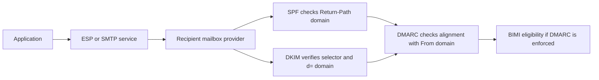
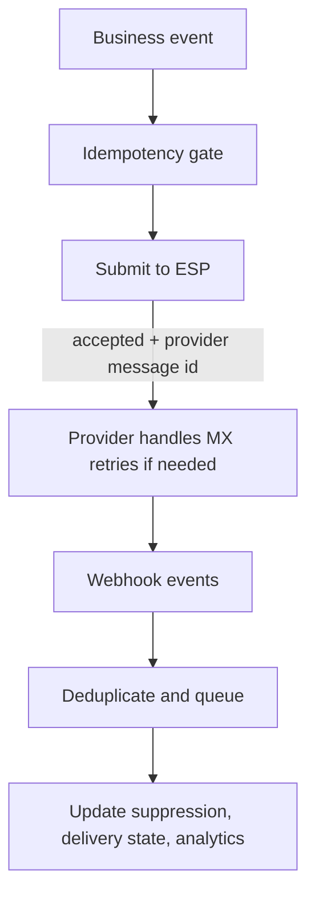

# Production Transactional Email from a Production Application

## Executive summary

The best transactional-email architecture is mostly independent of provider choice. The highest-leverage controls are: a dedicated sending namespace, correct authentication with aligned SPF/DKIM/DMARC, strict separation of transactional from marketing traffic, aggressive handling of bounces and complaints, and closed-loop monitoring with mailbox-provider telemetry plus provider event feeds. The mailbox providers that matter most make this explicit: authentication, low spam rates, DMARC alignment, forward/reverse DNS, and sender-controlled reputation are baseline requirements, not optional optimizations. citeturn27view2turn28view0turn28view1

For most teams, domain reputation and complaint behavior matter at least as much as IP reputation. Dedicated IPs are useful when you need isolation, predictable scaling, or recipient allowlisting, but they are not a deliverability silver bullet; both AWS and provider documentation are clear that shared IPs are often the better default for low-volume or irregular traffic, while dedicated IPs require warm-up and consistency. citeturn22view2turn19view3turn21view2

The cleanest production setup is usually a transactional subdomain such as `tx.example.com` or `notify.example.com`, with a provider-specific return-path/tracking namespace beneath it, separate from marketing mail. That design reduces blast radius, keeps operational ownership clearer, and makes DMARC/BIMI/testing easier to reason about. If you need stronger organizational or provider separation, delegate the subdomain with `NS` records so the sending zone can be managed independently. citeturn19view1turn20view1turn22view1turn7search0

Cross-provider deliverability comparison, done rigorously, is partly **UNKNOWN** in public because the market does not publish a standardized, recipient-normalized inbox-placement benchmark across all major mailbox providers. Official sources do, however, reveal meaningful differences in operational model. On that basis: SES is strongest on raw cost/flexibility if you can operate it well; Postmark is strongest on transactional specialization and guardrails; SendGrid has the broadest mature platform surface; Mailgun is a strong middle ground with optional deliverability tooling; Resend has the best modern developer ergonomics but a shorter public operating history in the reviewed sources. citeturn22view0turn20view1turn21view1turn23view3turn16view0

**Confidence:** High on architectural and compliance best practices. Moderate on provider-to-provider “deliverability reputation” because apples-to-apples public metrics are not consistently published.

## Domain authentication and DNS architecture

Email authentication has four distinct jobs. SPF authorizes infrastructure for the envelope sender but is fragile under forwarding and hard-limited to 10 DNS-lookup-causing terms. DKIM cryptographically signs content and associates responsibility with a signing domain and selector. DMARC is the policy and reporting layer that checks whether an authenticated SPF or DKIM identifier aligns with the visible `From:` domain. BIMI sits on top of DMARC enforcement to allow brand-logo display at participating mailbox providers. citeturn25view0turn25view1turn25view2turn27view0turn27view1

A sound configuration sequence is straightforward. First, choose a sending subdomain such as `tx.example.com` and keep it stable. Second, publish **one** SPF record for that domain and keep it under the 10-lookup limit; do not create multiple SPF TXT records. Third, enable DKIM with provider-issued selectors and, where possible, use 2048-bit keys; Gmail explicitly recommends 2048-bit keys when supported. Fourth, publish DMARC with reporting enabled, normally starting at `p=none` while you discover all legitimate sources, then move to `quarantine` or `reject` once coverage is complete. Fifth, only after DMARC is enforced should you consider BIMI and VMC/CMC work. citeturn27view2turn25view0turn19view1turn27view0turn27view1

A practical DMARC rollout normally looks like this: `p=none; rua=...` for discovery, then `p=quarantine`, then `p=reject`; decide whether `adkim`/`aspf` should remain relaxed or move to strict only after you understand all third-party senders. Relaxed alignment is accepted by major receivers and is often the operationally sane default at first, especially if subdomains or multiple services sign on your behalf. citeturn25view2turn26search15turn28view0turn27view2

Selector strategy deserves more rigor than it usually gets. Use separate DKIM selectors per provider or per traffic class, name them predictably, and keep at least two live during rotation. A format like `resend-2026q2`, `postmark-2026q2`, or `tx-2026q2` is usually better than opaque vendor defaults because it makes incident response and decommissioning easier. The common industry recommendation is to rotate DKIM keys about every six months, although that is an operational control, not a protocol requirement; Google and Microsoft documentation also emphasize selector-based key rotation rather than “in place” replacement. citeturn26search0turn26search1turn26search2

For TTLs, the protocol does not require any specific value, so this is an operational recommendation: use a low TTL such as 300–900 seconds during rollout or rotation, then raise stable records to something like 1–24 hours once the zone has settled. The key point is not the precise number but the deployment behavior: publish new DKIM selectors before signing with them, leave old selectors in place until old mail has aged out, and never cut traffic over before propagation and validation complete.

Common pitfalls are predictable. SPF fails because people exceed the 10-lookup limit or create multiple SPF records. DMARC fails because the visible `From:` domain does not align with the authenticated SPF return-path or the DKIM `d=` domain. BIMI disappoints because teams assume a valid record guarantees logo display everywhere, while the BIMI Group and Google both stress recipient-specific criteria and certificate requirements. Forwarding can also break SPF even when your record is correct, which is why DKIM and DMARC alignment matter more than SPF alone for real-world deliverability. citeturn25view0turn25view2turn27view0turn27view1turn27view2

Testing should happen before, during, and after cutover. At minimum, validate DNS directly, inspect message headers in real seed inboxes, confirm DMARC aggregate reports are arriving, and use independent DNS/authentication tools to catch syntax and propagation errors. Google Postmaster Tools, MXToolbox, dmarcian, and simple preflight spam checks such as Mail-Tester are useful in combination because they each answer a different question. citeturn27view3turn15search2turn15search3turn15search8

## Reputation and namespace strategy

Mailbox providers increasingly treat reputation as a property of the sender’s total behavior, not merely of a single IP. Google’s guidance ties acceptance to authentication, alignment, PTR/rDNS, TLS, low spam rates, and blocklist hygiene; Microsoft’s SNDS is explicit that “reputation is always the responsibility of the sender”; Yahoo recommends keeping spam complaints below 0.3% and separating mail streams by IP or DKIM domain. That makes the primary reputation unit, in practice, your authenticated sending identity and the user feedback attached to it. citeturn27view2turn28view1turn28view0

That is why subdomain strategy matters. Use a separate transactional subdomain when you want clear intent, cleaner reporting, and insulation from future marketing or bulk traffic. Use a completely separate domain only when you specifically need hard legal, organizational, or reputational separation and are willing to warm an entirely new identity. In most cases, `tx.example.com` is better than buying `example-mail.com`, because it preserves brand continuity while still isolating traffic. Resend explicitly recommends subdomains for reputation isolation, and Postmark and SES both support traffic separation patterns that assume this design. citeturn19view1turn20view1turn22view1

If two teams or two providers need true DNS autonomy, delegate the subdomain with `NS` records. Operationally, that means the parent domain can keep web and corporate mail stable while the email team or ESP controls only the sending zone. That reduces change risk and makes provider migration safer because you can move the delegated zone without disturbing unrelated DNS. citeturn7search0turn7search4

Shared versus dedicated IP choice should follow volume and consistency, not intuition. SES says shared IPs are best for low volume and irregular sending, while dedicated IPs make sense when you want isolated reputation and can maintain consistent sending. Resend says much the same and explicitly warns that dedicated IPs can hurt low-volume, inconsistent, or brand-new senders. Postmark sells fully managed dedicated IPs only to higher-volume accounts and routes transactional and broadcast traffic on separate infrastructure regardless. citeturn22view2turn19view3turn20view0turn20view1

Warm-up should be treated as both an IP and a domain exercise. New dedicated IPs need gradual volume growth, but so do newly introduced subdomains and major traffic shifts. Send your highest-engagement, lowest-risk transactional events first, then expand. SendGrid and SES both document automated dedicated-IP warm-up; if you bypass those controls with sudden traffic spikes, you are effectively training mailbox providers to distrust you. citeturn21view2turn8search2turn8search14

TLS and MX considerations are frequently misunderstood. If you own the sending infrastructure or static dedicated IPs, keep forward-confirmed reverse DNS correct because both Google and Yahoo call it out. If the subdomain also receives mail, consider publishing MTA-STS and TLS-RPT so receiving infrastructure is protected and observable. For BIMI, logo and certificate assets must be hosted over HTTPS, and Google recommends TLS 1.2 or later. For a pure send-only visible `From:` subdomain, an MX record is not automatically required; what matters is whether you receive mail there or whether your provider’s custom return-path design requires additional DNS. citeturn27view2turn28view0turn7search3turn7search7turn27view1turn19view1

## Monitoring and feedback loops

Deliverability monitoring should be built around a small set of decisive metrics. Track acceptance rate, SMTP deferral rate, hard-bounce rate, complaint rate, delivery latency, authentication failure rate, suppression growth, unsubscribe rate for any non-transactional mail, and mailbox-provider telemetry from Gmail and Microsoft. If you only track “sent” and “opened,” you are blind to the metrics that actually damage reputation. Amazon SES’s reputation dashboard exposes bounce and complaint health; Google Postmaster Tools exposes spam rate, authentication, delivery errors, and other diagnostics; Microsoft SNDS provides IP-level reputation data and JMRP complaint reports. citeturn22view3turn27view3turn28view1turn28view2

A good operating rhythm is to separate **core production metrics** from **diagnostic tests**. Production metrics come from your ESP events, mailbox-provider dashboards, and complaints/bounces. Diagnostic tests come from seed-list inbox placement, blocklist checks, template rendering checks, and DNS/auth validation. Seed tests are useful because they give you a controlled environment across major mailbox providers before you risk customer-impacting changes, but they should be treated as directional rather than absolute truth. GlockApps, MXToolbox, dmarcian, and Mail-Tester are all useful in that diagnostic layer. citeturn15search1turn15search10turn15search11turn15search8

Feedback loops should be considered mandatory wherever available. Yahoo’s CFL is explicitly recommended for all DKIM domains and tied to complaint-rate control; Microsoft’s SNDS/JMRP pairs IP reputation with spam-report visibility; Gmail offers Postmaster diagnostics and API access for qualified senders. Complaint data should flow directly into your suppression system, not merely into dashboards. citeturn28view0turn28view1turn28view3

Inbox placement testing belongs in change management, not just troubleshooting. Use it when you change providers, add a new subdomain, enable a new DKIM selector, alter tracking domains, or materially rewrite a high-volume template. Run pre-change tests, then compare against real delivery metrics and mailbox-provider dashboards over the next several days. That catches both formatting errors and reputation regressions. citeturn15search1turn27view3turn28view1

## Failure handling and application reliability

The most important reliability distinction is between **submission** and **delivery**. Your application’s retry logic should govern only the act of handing a message to the provider. Once the provider has accepted the message and returned its message ID, mailbox-side retry behavior belongs to the provider’s MTA, not to your application. Mailgun, for example, explicitly distinguishes `temporary_fail` events that it will retry from `permanent_fail` events that it will not retry. Mixing these layers is how teams create duplicate sends. citeturn23view1turn10search4

Hard bounces and complaints should usually trigger immediate suppression. Soft bounces should usually not. A hard bounce means the address is invalid or permanently undeliverable; a complaint means the recipient has actively told a mailbox provider the mail is unwanted. A temporary failure or deferral deserves bounded patience and classification logic, not permanent suppression on first occurrence. This is also why you should store provider reason codes and enhanced SMTP status codes rather than only a boolean `bounced=true`. citeturn10search4turn23view1turn22view3

Suppression lists should be designed as first-class infrastructure, not as a feature tucked into templates. Store at least: normalized address, scope, reason, source system, provider, first seen, last seen, evidence reference, and reversibility policy. Keep separate reasons for hard bounce, complaint, manual block, legal objection, unsubscribe, and temporary quarantine. Sync suppressions both ways if you are multi-provider or run both product mail and CRM mail, otherwise one system will keep harming the reputation of another. Postmark, Resend, SES, and Mailgun all expose suppression or bounce/complaint mechanics precisely because they are central to sender health. citeturn20view2turn19view0turn22view1turn23view3

For retention, distinguish between **content data** and **compliance state**. Under GDPR principles, personal data should be kept no longer than necessary, but you may still need minimal suppression evidence to honor objections, avoid re-mailing, and defend compliance decisions. In practice, that often means short retention for event payloads and message content, but longer retention for a minimized suppression record or salted hash plus lawful-basis metadata. The precise schedule is jurisdiction- and risk-dependent, so document it explicitly. citeturn31search8turn31search1turn32search0turn32search2

Idempotency should exist at the application boundary even if your provider does not offer a native idempotent send API. Use an idempotency key derived from the business event, recipient, and template version, persist it before send, and store the provider message ID on success. On retried requests, return the prior result instead of re-sending. The emerging HTTP `Idempotency-Key` pattern exists precisely to make non-idempotent operations such as `POST` fault-tolerant. A useful retention window is typically aligned to the business event’s replay risk, often 24–72 hours for transactional mail. citeturn10search2turn10search6

Webhook consumers should be built for at-least-once delivery, replays, and partial outages. Verify signatures against the raw request body, acknowledge quickly with `2xx`, enqueue internally, and do state changes asynchronously. Resend requires raw-body verification for signed webhooks. SendGrid recommends Signed Event Webhooks or OAuth and warns against placing PII in categories/unique arguments. Mailgun signs events with HMAC-SHA256 over timestamp and token and recommends replay defenses. Postmark documents retry behavior and basic protections such as firewall rules and basic auth. citeturn24search0turn21view3turn23view2turn20view3turn24search5turn24search2

Do not assume ordering. Treat event timestamps and provider event IDs as facts, but make downstream state transitions monotonic: for example, `delivered` should not be overwritten later by a stale `processed` event if events arrive out of order. When state truly matters, periodically reconcile against the provider’s message or event API instead of trusting webhook order alone.

## Templates and content operations

Template management should follow software-delivery discipline. Keep source templates in version control, assign immutable template identifiers and explicit `template_version` metadata at send time, and store rendered snapshots or hashes for high-risk flows such as receipts, password resets, and legal notices. Provider-side template editors are convenient, but they should not become your sole source of truth. Postmark’s template APIs, validation, and preview tooling illustrate the right direction even if you do not use Postmark itself. citeturn20view2turn14search11turn14search15

Localization works better when copy is externalized from layout. Put strings, currencies, date formats, and legal snippets in locale resources; keep layout shared unless regional legal or cultural requirements truly differ; and define a clear fallback chain so missing translations fail safely. The practical goal is to avoid cloning entire templates per language, because cloned templates drift and become untestable. That is an engineering recommendation rather than a protocol rule, but it is consistently the more maintainable model at scale.

Personalization should be deterministic and privacy-aware. Use only data you are prepared to expose to the recipient and to downstream systems. This matters in webhook/event platforms too: SendGrid explicitly warns that categories and unique arguments should not contain PII and may be retained long-term. The same principle generalizes across providers: metadata used for routing and analytics should be non-sensitive, stable, and minimal. citeturn21view3

Accessibility is not optional for transactional mail. Follow WCAG principles as far as email-client constraints permit: meaningful reading order, real text rather than text-in-images, descriptive alt text, sufficient contrast, understandable link text, and a plain-text alternative for critical flows. W3C remains the governing baseline, and the U.S. Section 508 guidance is a useful operational adjunct for email authoring and remediation. Google’s BIMI guidance even recommends using the SVG `<desc>` element for accessibility when publishing brand assets. citeturn14search0turn14search8turn14search12turn27view1

Testing should happen at four levels: render tests, data-binding tests, deliverability preflight, and live canaries. Render tests catch broken HTML/CSS. Data-binding tests catch missing variables. Deliverability preflight catches DNS/auth/header problems. Live canaries catch real-world latency and inbox-placement regressions after deployment. That combination is far stronger than relying on open-rate changes after customers have already been affected. citeturn15search1turn15search10turn27view3

## Regulatory requirements

Jurisdiction is unspecified, so the correct approach is to separate **service/transactional** mail from **commercial/marketing** mail at the template and policy level and then apply the strictest rules that plausibly apply to your recipient base. The legal mistake that causes the most trouble is mixing promotional content into operational email and assuming the result is still “transactional.” In the U.S., the FTC and the eCFR’s CAN-SPAM rules make primary purpose decisive: if the subject line or body presentation makes the message look promotional, it can be treated as commercial even if it contains transactional content. citeturn29view0turn29view1

Under CAN-SPAM, commercial email needs accurate header information, truthful subject lines, a physical postal address, and a clear opt-out mechanism. Pure transactional or relationship messages are mostly exempt from those commercial-email obligations, but they still cannot use false or misleading routing information. Practical implication: password resets, receipts, security alerts, and billing notices should not carry promotional banners unless you are comfortable treating them as commercial mail. citeturn29view0turn29view1

In the EU and UK, the governing picture is broader. GDPR requires a lawful basis for processing personal data and gives individuals rights such as access, correction, erasure, and objection; storage must be limited to what is necessary. Separately, ePrivacy/PECR rules govern electronic direct marketing and typically require consent for marketing email to individuals, subject to limited exceptions such as the UK “soft opt-in” for existing customers. Practical implication: transactional mail may often rely on contract necessity or legitimate interest, but marketing mail usually needs separate consent analysis and suppression discipline. citeturn32search19turn31search8turn31search1turn29view2turn32search2

Canada’s CASL is stricter than many U.S. teams expect. The official guidance reduces it to four core requirements: obtain consent, provide identification/contact information, include an unsubscribe mechanism, and keep records. If you mail Canadians at meaningful scale, your suppression and consent-audit design should assume CASL from the start. Australia’s Spam Act is similar in structure: consent, sender identification, and easy unsubscribe. citeturn30search13turn30search1turn30search0turn29view4

California’s CCPA/CPRA is not an anti-spam regime, but it matters operationally because email addresses, event logs, and potentially email contents can be personal information. You therefore need disclosure, deletion/correction handling where applicable, and careful control over which email-event metadata is stored and shared. citeturn29view5

The most practical compliance controls are operational, not legalistic. Classify every template as transactional, mixed, or marketing. Block marketing components from transactional templates in code. Preserve consent and unsubscribe evidence. Apply suppression at send time across all systems. Publish a retention schedule for events, content, and suppressions. Review open/click tracking and “engagement profiling” for regional consent implications before enabling them globally. None of this is glamorous, but it is what survives audits and complaint spikes. citeturn29view0turn29view2turn31search8turn32search2

## Provider comparison and migration

A rigorous caveat first: provider-wide deliverability “reputation” is only partly observable from public data. Gmail, Yahoo, and Microsoft all emphasize sender behavior, complaint rates, authentication, and reputation of your own identities. Public status pages and SLAs measure infrastructure reliability, not inbox placement. So the table below should be read as an operations-and-product comparison, not as a scientific ranking of inboxing performance. citeturn27view2turn28view0turn28view1

| Provider | Reliability | Deliverability posture | Developer experience | Pricing model | Lock-in |
|---|---|---|---|---|---|
| entity["company","Resend","email platform"] | Strong recent public status: Jan–Apr 2026 status page reports 99.99% email-sending uptime, 99.96% API, 100% webhooks/events. citeturn16view0 | Good defaults for modern app teams: subdomain guidance, automatic suppression, managed dedicated IP pools; provider docs explicitly say domain history and feedback matter more than IP alone. citeturn19view1turn19view3 | Excellent modern DX: REST, SMTP, official SDKs, signed webhooks, React Email integration. citeturn19view0turn19view2 | Tiered monthly plans; free tier with 100/day; dedicated IP add-on $30/month on Scale. citeturn19view0 | **Medium**. Standard protocols are available, but React Email, broadcast/audience abstractions, and webhook schema add migration work. |
| entity["organization","Postmark","email service"] | Reliability posture is oriented around transactional specialization; public status page and incident history are visible, but the reviewed public sources surface status rather than a numeric self-serve SLA. citeturn16view1turn20view1 | Strongest architectural guardrails for transactional mail in this group: separate transactional and broadcast streams, separate infrastructure/IP ranges. citeturn20view1turn20view2 | Excellent docs and APIs, including webhooks, templates, suppressions, and message streams. citeturn20view2turn20view3 | Tiered monthly plans with overages billed at cycle end; dedicated IPs start at $50/IP/month for high-volume senders; DMARC monitoring sold separately. citeturn20view0 | **Low to medium**. Easier migration than more feature-dense suites, but Message Streams, template APIs, suppression semantics, and webhook payloads still need mapping. |
| entity["company","SendGrid","email api"] | Mature platform and public Twilio API SLA coverage for Mail Send; status page shows recent live incidents, including mail-send delays on April 18, 2026. citeturn18view1turn16view2 | Broad, capable platform with automated IP warm-up, but because it spans transactional and marketing use cases, separation discipline is more your responsibility than the product’s default guardrail. citeturn21view2turn21view1 | Very broad SDK/docs footprint and mature webhook/event model. citeturn21view1turn21view3 | Volume-based plans with free self-serve entry and add-ons; details vary by product surface and scale. citeturn21view0 | **Medium to high**. Categories, event schema, identity and suppression features, and broader platform coupling create more exit work than simpler transactional-first tools. |
| SES from entity["company","Amazon Web Services","cloud platform"] | Public SLA is clear: 99.9% monthly regional uptime for SES under the AWS User Engagement SLA. citeturn18view2 | Operationally powerful rather than opinionated: configuration sets, event destinations, reputation metrics, dedicated IP pools, and managed dedicated IPs let you build strong isolation and monitoring if you operate them well. citeturn22view1turn22view2turn22view3 | Best fit for teams already fluent in AWS; flexible but higher ops burden than the others. citeturn22view1turn22view3 | Pure pay-as-you-go is the clearest and usually cheapest raw model here; free tier of 3,000 message charges/month for 12 months for new customers, then $0.10/1,000 outbound emails before add-ons. citeturn22view0 | **Medium to high**. Protocol lock-in is low, but heavy use of IAM/SNS/CloudWatch/Firehose/config sets creates real platform coupling. |
| entity["company","Mailgun","email platform"] | Public SLA is clear: 99.99% availability for API, SMTP, and outbound delivery services; official status page is the source of incident detail. citeturn18view0turn16view3 | Strong middle ground: dedicated IPs, automated warm-up, suppression management, and paid inbox-placement/reputation monitoring through Optimize. citeturn23view3 | Strong developer platform with HTTP API, SMTP, SDKs, account/domain webhooks, and broad docs. citeturn23view0turn23view1 | Tiered plans; free/basic/foundation/scale structure; deliverability products often sold separately. citeturn23view3 | **Medium**. Standard protocols help portability, but routes, Optimize tooling, webhook payloads, and subaccount/account-level constructs add migration effort. |

The decision rule is therefore simpler than most vendor comparisons imply. Choose Postmark if your workload is overwhelmingly transactional and you want the strongest platform-enforced separation. Choose SES if you want the most control and the best raw economics and already have AWS operational maturity. Choose SendGrid if you need a broad, enterprise-mature platform spanning transactional and marketing capabilities. Choose Mailgun if you want a developer-focused sending platform with optional deliverability tooling. Choose Resend if modern API ergonomics, React Email, and low-friction integration matter more than the additional public operating history and enterprise-control surface the older vendors have accumulated. citeturn20view1turn22view0turn21view1turn23view0turn19view0

A provider migration should be treated as an identity-and-event migration, not just an SMTP swap. The safest pattern is: provision the new subdomain and auth, mirror templates and webhooks, import suppressions, start with low-risk transactional flows, warm gradually, watch Gmail/Microsoft/Yahoo telemetry, then move the rest. Domain and IP warming guidance from AWS, IP warm-up guidance from SendGrid, and provider auth/webhook documentation all point in the same direction: gradual, observable, reversible cutovers beat “big bang” switches. citeturn8search14turn21view2turn19view1turn24search0turn24search5turn24search2

```mermaid
flowchart LR
    A[Inventory current setup] --> B[Provision new sending subdomain]
    B --> C[Add SPF DKIM DMARC and validate]
    C --> D[Mirror templates webhooks suppressions]
    D --> E[Run sandbox and seed tests]
    E --> F[Warm low-risk transactional flows]
    F --> G[Monitor GPT SNDS complaints bounces]
    G --> H[Cut over remaining streams]
    H --> I[Export audit data and decommission old provider]
```

A practical migration checklist is short but unforgiving. Inventory domains, return-paths, tracking domains, templates, event schemas, suppressions, and per-stream rate limits. Stand up the new provider on a **new or delegated transactional subdomain**, not on your production root. Keep SPF within limits and do not remove old DKIM selectors until old mail and caches have drained. Import suppression lists before first send. Build a webhook adapter layer so internal systems do not care which provider emitted the event. Start with a low-volume, highly engaged transactional stream. Monitor Postmaster Tools, SNDS/JMRP, complaints, hard bounces, and delivery latency daily during cutover. Keep rollback live until the new sender identity is clearly stable. citeturn25view0turn27view3turn28view1turn19view1turn24search0turn24search5turn24search2